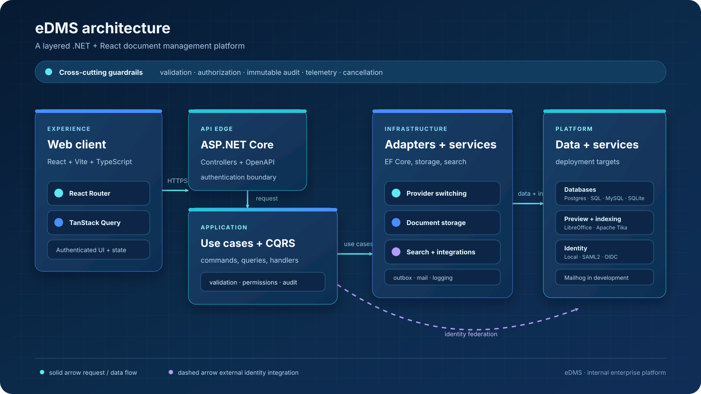

<p align="center">
  
</p>

<h1 align="center">eDMS</h1>

<p align="center">
  <strong>Secure, SharePoint-style document management for internal teams.</strong><br>
  Sites, libraries, folders, document control, permissions, search, and auditability in a modern .NET and React stack.
</p>

<p align="center">
  <a href="doc/functional-spec.md">Functional specification</a> ·
  <a href="doc/technical-design-spec.md">Technical design</a> ·
  <a href="doc/ImplementationPlan%20V1.2.md">Implementation plan</a> ·
  <a href="doc/cqrs-dispatcher-evaluation.html">MediatR alternatives evaluation</a>
</p>

<p align="center">
  
  
  
  
</p>

> eDMS is an internal enterprise document management system. It intentionally supports authenticated organization-wide collaboration and excludes anonymous or external sharing.

## Why eDMS?

eDMS brings the document-control capabilities teams expect from a SharePoint-style library into a focused, self-hosted application:

- **Control:** versioning, check-out/check-in, restore, recycle bin, and immutable audit history.
- **Governance:** granular site, library, folder, document, and group permissions enforced on the server.
- **Findability:** required metadata, content types, full-text indexing for PDF/Office files, and permission-aware search.
- **Operational fit:** local authentication or SAML2/OIDC federation, provider-switchable databases, and Docker-based development.

## Current status

| Area | Status |
|---|---|
| Delivery | Phase 1 through Phase 4 complete: M0–M31 |
| Authentication | Local database auth plus SAML2/OIDC federation, JIT provisioning, and SSO enforcement |
| Document experience | Sites, libraries, folders, upload, preview, versioning, check-out/check-in, move/copy, sharing, and restore |
| Governance | Required metadata, content types, permission filtering, immutable audit trail, notifications, and alerts |
| Quality | Backend/frontend tests, coverage gates, Playwright acceptance coverage, accessibility checks, responsive checks, and performance sign-off |

## Capabilities

| Capability group | Included |
|---|---|
| Document control | Version history, check-out/check-in, restore, recycle bin, upload/download, move/copy, and Office preview |
| Content and search | Content types, required metadata, PDF/Office text indexing, permission-aware search, Favorites, Recent, and saved Views |
| Permissions | Sites, libraries, folders, documents, groups, inheritance, break inheritance, and server-authoritative authorization |
| Collaboration | Authenticated organization-wide share links, notifications, alert preferences, and bulk metadata editing |
| Federation | SAML2 and OIDC login paths, one-time handoff exchange, JIT provisioning, and SSO enforcement |
| Operations | PostgreSQL, SQL Server, MySQL, or SQLite; Docker Compose; Mailhog; LibreOffice preview; and Apache Tika extraction |

## Architecture

<p align="center">
  
</p>

The diagram separates the request path from infrastructure integrations and keeps the security and governance behaviors visible across the application boundary.

The solution is deliberately layered:

```text
server/
├── src/eDMS.Domain/                 # entities and domain rules
├── src/eDMS.Application/            # use cases, contracts, validators, behaviors
├── src/eDMS.Infrastructure/         # EF Core, storage, auth, search, integrations
├── src/eDMS.Infrastructure.Migrations.*
└── src/eDMS.Api/                    # ASP.NET Core controllers and composition root

client/
└── src/                             # React routes, features, components, stores, and API clients
```

## Technology stack

| Layer | Technology |
|---|---|
| Frontend | React, Vite, strict TypeScript, React Router, shadcn/ui, Tailwind CSS 4, TanStack Query |
| Backend | .NET 10, ASP.NET Core Web API controllers, Entity Framework Core |
| Application | MediatR, FluentValidation, Mapster, Serilog |
| Database | PostgreSQL in production; SQL Server, MySQL, and SQLite provider support |
| Authentication | Local database authentication plus SAML2/OIDC federation |
| Document services | LibreOffice preview conversion and Apache Tika text extraction |
| Local orchestration | Docker Compose, Mailhog, health checks, and bounded service resources |

## Quick start

### Docker Compose

The fastest way to run the complete local stack is:

```bash
docker compose up -d
```

The stack starts PostgreSQL, Mailhog, the LibreOffice preview converter, Apache Tika, the API, and the web app.

- Web app: `http://localhost:5173`
- API: `http://localhost:5080`
- Development administrator: `admin@edms.local`
- Temporary password: `ChangeMe123!`

The seeded credentials are for local development only. Change them immediately in any environment that is not disposable.

### Bare-metal development

Requirements: .NET 10 SDK and Node.js 20+. No database installation is required for local development; SQLite is the default.

1. Copy `.env.example` and provide development-only values as needed.
2. Start the API:

   ```bash
   cd server
   dotnet run --project src/eDMS.Api
   ```

3. In another terminal, install and start the client:

   ```bash
   cd client
   npm install
   ```

   Bash:

   ```bash
   export VITE_API_BASE_URL=http://localhost:5188/api/v1
   npm run dev
   ```

   PowerShell:

   ```powershell
   $env:VITE_API_BASE_URL = 'http://localhost:5188/api/v1'
   npm run dev
   ```

4. Open the Vite URL and sign in with the seeded development administrator.

Set `Database__Provider` to `Postgres`, `SqlServer`, `MySql`, or `Sqlite` and provide the matching `ConnectionStrings__Default` value when using another provider. Keep JWT keys, SMTP settings, and seed credentials outside source control.

## Quality checks

Run the checks relevant to the area you change before opening a pull request:

```bash
# Backend
dotnet build server/eDMS.sln
dotnet test server/eDMS.sln
dotnet test server/eDMS.sln --collect:"XPlat Code Coverage" --settings server/coverlet.runsettings

# Frontend
cd client
npm run build
npm test
npm run test:coverage
npm run lint

# End-to-end acceptance coverage
npx playwright test
```

The Playwright suite covers authentication, browsing, document lifecycle, permissions, search, sharing, admin surfaces, accessibility, and responsive layouts against the real API.

## Repository map

| Path | Purpose |
|---|---|
| [`doc/`](doc/) | Product requirements, technical design, implementation plans, reviews, and decision reports |
| [`prototype(html)/`](prototype%28html%29/) | Clickable vanilla HTML/CSS/JS UX reference; not production frontend code |
| [`Prototype(React)/`](Prototype%28React%29/) | React prototype using the application stack |
| [`server/`](server/) | .NET solution, migrations, and backend tests |
| [`client/`](client/) | React/Vite application and frontend tests |
| [`.github/workflows/`](.github/workflows/) | Continuous integration and delivery workflows |
| [`docker-compose.yml`](docker-compose.yml) | Complete local development stack |

## Documentation

- [Functional specification](doc/functional-spec.md) — requirements, data model, API surface, and roadmap.
- [Technical design specification](doc/technical-design-spec.md) — architecture, schema DDL, class design, and deployment.
- [Implementation Plan V1.2](doc/ImplementationPlan%20V1.2.md) — completed Phase 3 and Phase 4 milestone record.
- [MediatR alternatives evaluation](doc/cqrs-dispatcher-evaluation.html) — comparative evaluation of mediator, dispatcher, and message-bus options.
- [Agent working guide](AGENTS.md) — repository conventions and non-negotiable engineering rules.

## Security and scope principles

- Authorization is server-authoritative; UI visibility is never the security boundary.
- The audit log is immutable and must not be updated or deleted.
- Access tokens remain in memory; refresh tokens are hashed and delivered through secure cookies.
- File types are sniffed server-side from magic bytes rather than trusting client headers.
- Migrations are explicit deployment steps outside local development.
- Anonymous and external sharing are intentionally out of scope.

## Contributing

Changes should remain aligned with the functional and technical specifications. New or changed use cases should include validation, authorization coverage where applicable, and tests at the appropriate layer. Use Conventional Commits and include the relevant `FR-*` or `ADR-*` reference for architectural or requirement changes.

Before submitting a change, verify the dependency direction, run the relevant backend and frontend quality gates, and keep secrets out of commits. See [AGENTS.md](AGENTS.md) for the complete contribution workflow.

## Out of scope

Real-time co-authoring, desktop sync, mobile apps, workflow/approval engines, e-signatures, retention/legal hold/eDiscovery, anonymous or external sharing, wiki/lists/news/Teams integration, and multi-tenant SaaS concerns are not part of the current product scope.

## Usage note

eDMS is developed for internal enterprise use. Review the repository’s organizational distribution and security policies before deploying it outside the intended environment.
