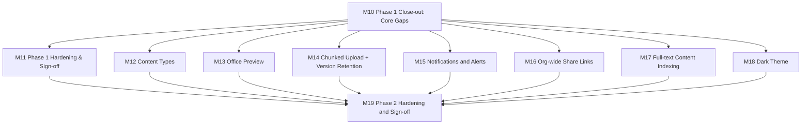

# eDMS — Implementation Plan (Next Phase)

| | |
|---|---|
| **Version** | 1.1 |
| **Status** | **Superseded by [`ImplementationPlan V1.2.md`](ImplementationPlan%20V1.2.md) as of 2026-08-17.** Kept as a historical snapshot of Phase 1 close-out (M10/M11) and Phase 2 (M12–M19) planning and status — every milestone in this file finished `Done`, verified against actual source, before it was superseded; do not update in place. Phase 3 (federation) is planned in V1.2 — check there for current status, not here. |
| **Date** | 2026-08-16 |
| **Audience** | AI coding agents (OpenCode + DeepSeek, Claude Code, or any other tool) implementing eDMS |
| **Companion documents** | `functional-spec.md` (what/why), `technical-design-spec.md` (how), `AGENTS.md` (repo rules & navigation), [`ImplementationPlan V1.0.md`](ImplementationPlan%20V1.0.md) (archived — Phase 1's original plan, historical reference only) |

## 1. Purpose & Relationship to Other Docs

V1.0 sequenced Phase 1 (M0–M9) from an empty repository to a working MVP. At handoff (2026-08-16), Phase 1 was **substantially but not completely built** — three milestones (M0, M1, M7) were genuinely `Done`; the other seven each had real, verified gaps (see §3 below). This document is not a from-scratch replan: it is the same living-plan mechanism V1.0 established, continued.

This plan does two things, in order:

1. **M10–M11** close out every task V1.0 left open, so Phase 1 actually reaches the state its own `Done` bar required ("every task in a milestone is `Done` *and* its Demo-able outcome is actually true" — V1.0 §2).
2. **M12–M19** implement Phase 2 (FS §15) — the enhancements layer on top of a finished Phase 1 — task by task, at the same granularity V1.0 used for Phase 1.

Phase 3 (SAML2/OIDC federation) is left as a backlog placeholder at the end (§9), for the same reason V1.0 gave for not detailing Phase 2/3 early: detailed task planning for work that hasn't started tends to go stale, and Phase 2 learnings will likely reshape some of it.

**This document is self-contained.** You should not need to open `ImplementationPlan V1.0.md` to work from this plan — §3 below carries forward everything from it that's still relevant. Open V1.0 only if you want the original Phase 1 task-by-task history.

## 2. How to Use This Plan

Same conventions V1.0 established — unchanged because they worked:

- **Start here every session.** Find the first task whose `Status` is not `Done` and whose `Depends on` tasks are all `Done`. That is your next task.
- **Update the Status column in the same commit that completes the task.** Valid values: `Not Started` (default), `In Progress`, `Done`, `Blocked` (+ a one-line reason in the Task cell).
- **Don't start a task whose dependencies aren't `Done`.**
- **If this file's Status looks stale, trust the repository over the file** — fix the file, then proceed. Every status in §3 and every "Not Started" below was verified against actual source files at time of writing (file paths, not vibes), not copied from commit messages or the previous plan's own claims — the previous plan turned out to be accurate when checked this way, so the same discipline is worth repeating each session rather than assumed to hold forever.
- **One task, one commit (or a small tight series), referencing the task ID** — e.g. `feat: real permission CTE + Testcontainers test (M10.1)`.
- **A milestone is "done" only when every task in it is `Done` *and* its Demo-able outcome is actually true.**
- Every task links back to `FR-*` IDs and/or `TDS §*` sections — read those before implementing, per `AGENTS.md` §2.

## 3. Current State Snapshot (as of 2026-08-16)

Verified directly against `server/` and `client/` source — not inferred from V1.0's labels alone. Every row below cites what was actually found.

### 3.1 Phase 1 milestones (V1.0's M0–M9)

| Milestone | Status | Open items — carried into this plan |
|---|---|---|
| M0 Bootstrap | **Done** | — |
| M1 Identity, Auth, Audit & Permission skeleton | **Done** | — |
| M2 Sites, Groups & Permission Resolver | Done (closed out by M10.1/M10.10/M10.11) | Resolver is a C# ancestor walk, not the SQL recursive CTE TDS §6.3 specifies, and has no Testcontainers-backed test (→ **M10.1**). Site Home has no manage-access dialog (→ **M10.10**). Admin Groups page is read-only — no create/edit/manage-members UI, even though the backend (`GroupsController.cs`) and API client (`features/groups/api.ts`'s `addGroupMember`/`removeGroupMember`) already support it (→ **M10.11**). |
| M3 Libraries, Folders, Documents | Done (closed out by M10.2/M10.6/M10.12) | No Move/Copy endpoints anywhere — not in `DocumentsController.cs`, not even in the `IDocumentService` interface (→ **M10.2**). No document details panel exists at all — `sheet.tsx` is a scaffolded shadcn primitive with zero usages (→ **M10.6**). `library.tsx` is a static table: no grid/list toggle, no column sort, no multi-select/bulk actions (→ **M10.12**). |
| M4 Versioning & Check-out/in | Done (closed out by M10.7) | Versions tab doesn't exist anywhere in `client/src` (→ **M10.7**). Backend (`GET .../versions`, restore, checkout/checkin/discard) already works. |
| M5 Item Permissions & Sharing | Done (closed out by M10.8/M10.9) | Permissions tab doesn't exist (→ **M10.8**). Share dialog doesn't exist — zero matches for "Share" anywhere in `client/src` (→ **M10.9**). Backend for both already works. |
| M6 Recycle Bin | Done (closed out by M10.13) | `recycle-bin.tsx` is a **single-line placeholder** (`return <h1>Recycle Bin</h1>;` — no imports, no hooks, no API calls at all) despite `RecycleBinController.cs` having working `GET`/`POST`/`DELETE` endpoints (→ **M10.13**). |
| M7 Search | **Done** | — |
| M8 Admin Center, Audit Log, Storage Report | Done (closed out by M10.3/M10.14/M10.15/M10.16) | `AdminController.cs` has 3 endpoints, all `GET` — no `PUT`/`PATCH` for settings, and `IAdminService` doesn't even declare a write method (→ **M10.3**). Move/Copy have no audit callsite because the endpoints don't exist yet (→ **M10.4**, depends on M10.2). Admin Settings/Audit Log/Storage Report pages **do not exist at all** — not even as stub files or routes (→ **M10.14, M10.15, M10.16**). |
| M9 Hardening & Phase 1 Sign-off | In Progress (closed out by M11) | No validator-coverage test (→ **M11.1**). No perf/load test on the permission CTE (→ **M11.2**, depends on M10.1 existing first). No accessibility tooling or systematic pass — only incidental ad hoc `aria-label`s (→ **M11.4**). No responsive-verification artifacts (→ **M11.5**). No `deploy-staging.yml`/`deploy-prod.yml` — only `ci.yml` exists; TDS §11.3 describes the deploy workflows but they were never created (→ **M11.6**). |

### 3.2 Newly discovered — not in V1.0 at all

**Frontend data-fetching deviates from TDS §7.4.** `@tanstack/react-query` is installed (`client/package.json`) and TDS §7.4 mandates it as the one pattern for all server-state, with a hierarchical query-key factory so mutation-driven cache invalidation is exhaustive. In the actual code, **every single page** (`home.tsx`, `site-home.tsx`, `library.tsx`, `search.tsx`, `profile.tsx`, `admin/users.tsx`, `admin/groups.tsx`, `admin/sites.tsx`, and the `recycle-bin.tsx` placeholder) fetches data with raw `useEffect`/`useState` instead. Left alone, every new page this plan adds would most likely copy that same wrong pattern by example. Addressed by **M10.5** (establish the pattern) and **M10.17** (migrate the pages M10's other tasks don't already touch for other reasons).

### 3.3 What this means for sequencing

M10 is the highest-density milestone in this plan — it is not new scope, it is Phase 1's own unfinished scope, verified. Nothing in M12+ (Phase 2) should start against a page this plan is about to rebuild anyway (e.g. don't add Content Type columns to a document-details panel that doesn't exist yet — build **M10.6** first).

## 4. Guiding Principles

Carried forward from V1.0 §3 — still correct:

1. **Vertical slices over horizontal layers.**
2. **Backend before its corresponding frontend, but not all backend before any frontend.**
3. **Tests land with the code, not after it.**
4. **Default to Phase 1 completion, then Phase 2 (FS §15) — in that order.** Don't pull Phase 3 (FR-AUTH-09/10/11, SSO) forward.
5. **The prototype is a UX reference, never a code source.** Note: the prototype has no pages for most of Phase 2 (content types, notifications, org-wide links) — where no prototype page exists, follow shadcn/Tailwind conventions per `AGENTS.md` §12 and match the visual language of the pages that do exist, rather than inventing a divergent style.
6. **When in doubt, re-read `AGENTS.md` §7 (Non-Negotiable Rules)** before writing code, not after review flags it.

New for this phase:

7. **Verify before trusting any status label — including this file's.** Every claim in §3 was checked by reading the actual file, not by trusting a commit message or the prior plan. A `grep`/`Read` before starting a task costs seconds and prevents redoing finished work or building on a wrong assumption.
8. **Small, explicit steps.** This plan is written to be executed by agents with less context capacity than the one that wrote it (OpenCode + DeepSeek, per the intended audience). Tasks are deliberately kept small, and reference concrete current file paths wherever those files already exist. If a task still feels too large to finish confidently in one sitting, split it further — don't cut test coverage or acceptance criteria to make it fit.
9. **Record architecturally significant decisions as new ADRs.** Several Phase 2 tasks below require a real design decision TDS doesn't already make (data shape, protocol, tool choice). Each is flagged with the ADR number it should become (ADR-8 onward, continuing TDS §2.4's table) — don't leave the decision implicit in code only.
10. **No anonymous access, ever — restated because M16 makes it tempting to forget.** "Org-wide" share links (FR-PERM-07) still require authentication; they are a link that skips the per-user ACL entry, not a link that skips login. This is FS §2.2/§16 assumption 4, non-negotiable per `AGENTS.md` §7 rule 8.

## 5. Milestone Overview

M12–M18 have no dependency on each other beyond M10 and may be worked in any order, or in parallel by separate sessions, once M10 is `Done` — same "fan out, converge on the hardening milestone" shape V1.0 used for M4/M6/M7 converging on M9.

| Milestone | Goal | Demo-able outcome | Status |
|---|---|---|---|
| [M10](#m10--phase-1-close-out-core-gaps) | Finish everything V1.0 left open | Every document has a working details panel (Properties/Versions/Permissions tabs) and share dialog; admin has working Settings/Audit Log/Storage Report pages; recycle bin actually restores/purges from the UI — all via TanStack Query, not placeholders | Done |
| [M11](#m11--phase-1-hardening--sign-off-close-out) | Actually satisfy FS §15's Phase 1 checklist | Validator coverage is complete, the permission CTE has a documented perf profile at 20-level nesting, an accessibility + responsive pass is done, and a staging deploy has been run at least once | Done |
| [M12](#m12--content-types--custom-metadata-columns) | Content Types & typed columns | Admin defines a Content Type with a required column on a Library; upload/check-in in that Library blocks completion until it's filled | Done |
| [M13](#m13--office-preview) | In-browser Office preview | Opening a .docx/.xlsx/.pptx shows a PDF-converted preview, no download required | Done |
| [M14](#m14--chunked-upload--minor-version-retention) | Large-file resilience + version hygiene | A >100MB upload resumes after a network interruption; a Library with a minor-version cap auto-trims old minors on check-in | Done |
| [M15](#m15--notifications--alerts) | Notifications/alerts ("Follow") | Sharing a document emails + in-app-notifies the recipient; following a folder delivers a digest at the configured frequency | Done |
| [M16](#m16--org-wide-share-links) | Non-anonymous org-wide links | A generated link opens for any authenticated internal user without an individual ACL entry; revoking it blocks further access | Done |
| [M17](#m17--full-text-content-indexing) | Search inside PDF/Office content | A phrase that only appears in a PDF's body text (not name/title/description) is found by search | Done |
| [M18](#m18--dark-theme) | Light/dark theme | Toggling dark mode re-themes the whole app and the choice persists across reloads | Done |
| [M19](#m19--phase-2-hardening--sign-off) | Phase 2 sign-off | FS §15 Phase 2 checklist fully satisfied; same staging→production path M11 proved, re-run for Phase 2's additions | Done |

## 6. Detailed Milestones — Phase 1 Close-out

Columns match V1.0: **Track** — `BE` backend, `FE` frontend, `INF` infra/tooling, `DOC` documentation. **Size** — `S` small/mechanical, `M` moderate, `L` complex/high-stakes.

### M10 — Phase 1 Close-out: Core Gaps

| Status | ID | Track | Task | Depends on | Size | Refs |
|---|---|---|---|---|---|---|
| Done | M10.1 | BE | Replace the C# ancestor-walk in `server/src/eDMS.Infrastructure/Security/PermissionResolver.cs` with the SQL recursive CTE TDS §6.3 specifies (`FromSqlInterpolated`, not LINQ traversal); add a Testcontainers.PostgreSql-backed integration test in `server/tests/eDMS.IntegrationTests` proving it (the package is already referenced — just unused). Keep the existing `IMemoryCache` 30s-TTL layer in front of it. | — | L | TDS §5.3, §6.3, §12.1/§12.3 — **highest-risk task in this plan, same as V1.0's M2.5 callout: don't mark `Done` without a unique-ACL-at-each-level test, an additive-across-groups test, and the real-Postgres CTE test** |
| Done | M10.2 | BE | Document Move + Copy: add `MoveAsync`/`CopyAsync` to `IDocumentService`, corresponding endpoints in `DocumentsController.cs`. Copy duplicates current version content under a new `Document`/`DocumentVersion` row (new `StorageKey`); Move updates `FolderId`/`LibraryId` in place and re-checks destination permission. | M10.1 | M | FR-DOC-04/05/06/07, TDS §5.4 |
| Done | M10.3 | BE | `PUT /admin/settings`: add a write method to `IAdminService` and wire it to `AdminController.cs` (currently 3 `GET`-only endpoints). Persist whatever settings FR-ADMIN-04 lists (site-creation restriction flag, recycle-bin retention, file-size limit, etc. — cross-check current `GET /admin/settings`'s response shape for the exact field set). | — | S | FR-ADMIN-04 |
| Done | M10.4 | BE | Audit logging callsites for Move and Copy (the audit-coverage parameterized test already exists per V1.0's M8.2 but has nothing to assert against for these two actions since the endpoints didn't exist). | M10.2 | S | FR-AUDIT-01, TDS §12.3 |
| Done | M10.5 | FE | TanStack Query foundation: wrap the app in `QueryClientProvider`, add `lib/queryKeys.ts` as the single hierarchical query-key factory (TDS §7.4 — e.g. `queryKeys.documents.detail(id)`, `queryKeys.libraries.list(siteId, libraryId, folderId)`), and migrate `home.tsx` to `useQuery` as the reference example every later task follows. | — | M | TDS §7.4 — **fixes the drift in §3.2; every FE task below must build on this, not on the old `useEffect`/`useState` pattern** |
| Done | M10.6 | FE | Document Details Sheet: shell + Properties tab, composed from the already-scaffolded `components/ui/sheet.tsx` and `tabs.tsx` primitives (currently unused). Opens from a row in `library.tsx`; shows Title/Description/Tags backed by the existing metadata API (V1.0 M3.6). | M10.5, M3.9 (done) | M | mirror `prototype(html)` doc-sheet Properties tab |
| Done | M10.7 | FE | Versions tab inside the Sheet: history table, restore button, check-out/in controls. Backend already works (`GET .../versions`, restore, checkout/checkin/discard-checkout). | M10.6 | M | mirror `prototype(html)` doc-sheet Versions tab |
| Done | M10.8 | FE | Permissions tab inside the Sheet: inherited-view, break-inheritance flow, grant/revoke UI. Backend already works (`PermissionsController.cs`). | M10.6, M10.1 | M | mirror `prototype(html)` `permissionsTabHtml` pattern |
| Done | M10.9 | FE | Share dialog (`components/ui/dialog.tsx` is scaffolded, unused). Backend already works (`POST .../share`). | M10.5 | S | mirror `prototype(html)/library.html` share dialog |
| Done | M10.10 | FE | Manage-access dialog on Site Home (`site-home.tsx`); convert that page's existing data-fetching to TanStack Query while touching it. | M10.5 | S | mirror `prototype(html)/site-home.html` |
| Done | M10.11 | FE | Admin Groups: create/edit group + add/remove member UI in `admin/groups.tsx` (currently a bare read-only `<table>`). Backend and API client already support this (`GroupsController.cs`, `features/groups/api.ts`'s `addGroupMember`/`removeGroupMember`) — this is pure frontend wiring, not new backend work. | M10.5 | S | FR-ADMIN-02, mirror `prototype(html)/admin-groups.html` |
| Done | M10.12 | FE | Library browser (`library.tsx`, currently a static table): grid/list toggle, column sort, multi-select + bulk delete/download. Convert to TanStack Query while rewriting. | M10.5, M10.2 | M | FR-UI-02, FR-DOC-11 |
| Done | M10.13 | FE | Recycle Bin page: replace the one-line placeholder in `recycle-bin.tsx` with real list/restore/permanent-delete wired to `RecycleBinController.cs` (already works), via TanStack Query. | M10.5 | S | mirror `prototype(html)/recycle-bin.html` |
| Done | M10.14 | FE | Admin Settings page (`pages/admin/settings.tsx` + route — neither exists yet). | M10.5, M10.3 | S | mirror `prototype(html)/admin-settings.html` |
| Done | M10.15 | FE | Admin Audit Log page (`pages/admin/audit-log.tsx` + route — neither exists yet): filters, CSV export. Backend already works (`GET /sites/{id}/audit-log`). | M10.5 | M | mirror `prototype(html)/admin-audit-log.html` |
| Done | M10.16 | FE | Admin Storage Report page (`pages/admin/storage.tsx` + route — neither exists yet). Backend already works (`GET /admin/storage`). | M10.5 | M | FR-ADMIN-06, mirror `prototype(html)/admin-storage.html` |
| Done | M10.17 | FE | Migrate the pages no other M10 task already touches — `search.tsx`, `profile.tsx`, `admin/users.tsx`, `admin/sites.tsx` — to TanStack Query, closing out the drift noted in §3.2. | M10.5 | S | TDS §7.4 |
| Done | M10.18 | INF | Multi-provider database support (**user-requested new scope, not a V1.0 leftover**): `Database:Provider` config key (Postgres/SqlServer/MySql/Sqlite), **SQLite as the local-Development default**, one migrations assembly per provider (`eDMS.Infrastructure.Migrations.*`), provider-conditional schema (citext/jsonb Postgres-only, NOCASE email + `DateTimeOffsetToBinaryConverter` on SQLite), ILIKE → portable `ToLower().Contains()`, dev SQLite file anchored to API content root. Recorded as **ADR-8** (TDS §2.4). | — | L | ADR-8, TDS §6.4 |
| Done | M10.19 | Both | **Coverage enforcement (user-requested new scope)**: ≥90% line coverage on backend real-code assemblies (coverlet `server/coverlet.runsettings`, migrations/generated files excluded; currently 96.9%) and on frontend `src` (Vitest thresholds; currently 100%), enforced in CI (`ci.yml`). Added 130+ backend tests (per-controller endpoint suites, direct service tests, resolver hierarchy, seeder/JWT edge paths) and 120 frontend component/API tests. The push also exposed and fixed 5 real production bugs — unhandled promise rejections on failed API calls in `search.tsx`, `home.tsx`, `forgot-password.tsx`, `site-home.tsx`, and `auth-context.tsx` logout. | M10.18 | L | TDS §12 |

> **M10.1 carries the same risk profile V1.0 flagged for its M2.5.** It backs every authorization decision the system makes. Don't mark it `Done` without the specific tests TDS §12.1/§12.3 call for, run against a real Postgres container, not `UseInMemoryDatabase`.

### M11 — Phase 1 Hardening & Sign-off Close-out

| Status | ID | Track | Task | Depends on | Size | Refs |
|---|---|---|---|---|---|---|
| Done | M11.1 | BE | Validator-coverage audit: a test asserting every MediatR command/query has a registered FluentValidation validator (none exists today — zero hits for `Validator` under `server/tests/`), covering M10's new commands too. | M10.1, M10.2, M10.3, M10.4 | M | TDS §5.2, §10.2 |
| Done | M11.2 | BE | Load/perf check on the permission CTE at FR-FLD-06's 20-level nesting cap with realistic group sizes; record the result (numbers, not just "passed") somewhere durable (e.g. a short note in TDS §14.1 or a perf-test report checked into the repo). | M10.1 | M | TDS §14.1 (open risk) |
| Done | M11.3 | Both | Extend the Playwright E2E suite (V1.0's M9.3 covered login→browse→upload→download→check-out/in→share→search, written before M10's UI existed) to also cover: move/copy, the Versions/Permissions tabs, the share dialog, recycle-bin restore, and the three new admin pages. | M10.6–M10.16 | M | TDS §12.2 |
| Done | M11.4 | FE | Accessibility pass — keyboard navigation, contrast, ARIA on icon-only controls (WCAG 2.1 AA). No tooling exists yet (no `axe`/`pa11y`/`jest-axe`); add one and fix what it finds across all pages, including M10's new ones. | M10.6–M10.16 | M | FS §7 NFR |
| Done | M11.5 | FE | Responsive/mobile verification against the breakpoints already proven in `prototype(html)`, across all pages including M10's new ones. | M10.6–M10.16 | S | FS §7 NFR |
| Done | M11.6 | INF | Staging deploy dry run: author `deploy-staging.yml` per TDS §11.3 (migration step as its own job, before the new API image rolls out — never auto-migrate on boot), and actually run it once against a real or ephemeral staging target. | M9.1 (done) | M | TDS §11.1, §11.3 |
| Done | M11.7 | DOC | Update `AGENTS.md`'s repository-state table and `README.md` to reflect true Phase 1 completion; this is the point where Phase 1 is actually, verifiably done. | M11.1–M11.6 | S | — |

## 7. Detailed Milestones — Phase 2 (FS §15)

Two FS §15 Phase 2 items were already pulled into Phase 1 by V1.0 §7 and are done or in flight there, not repeated here: **FR-DOC-11** (bulk actions → M10.12 above) and **FR-AUDIT-05 / FR-ADMIN-06** (CSV export, storage dashboard → V1.0's M8.3/8.5/8.6, closed out by M10.15/M10.16 above). Everything else below is net-new Phase 2 scope, in FS §15's order.

### M12 — Content Types & Custom Metadata Columns

FS §8.2 already sketches `ContentType`/`ColumnDefinition` — use those shapes as the starting point, don't redesign from scratch.

| Status | ID | Track | Task | Depends on | Size | Refs |
|---|---|---|---|---|---|---|
| Done | M12.1 | BE | `ContentType` + `ColumnDefinition` entities/migration per FS §8.2's sketch. | M10 (all) | M | FR-META-03, FS §8.2 |
| Done | M12.2 | BE | Content Type CRUD (admin, per-Library) + a column-value storage design for `Document` (e.g. a `jsonb` bag vs. a separate values table) — **this is a real design decision FS doesn't make for you; record it as ADR-9 in TDS §2.4 before implementing.** | M12.1 | L | FR-META-03 |
| Done | M12.3 | BE | Enforce required columns: block upload/check-in completion until required columns are filled. | M12.2 | M | FR-META-04 |
| Done | M12.4 | FE | Admin UI to define Content Types/Columns per Library (no prototype reference — follow shadcn conventions per `AGENTS.md` §12 and match the visual language of the other admin pages). | M12.2, M10.5 | M | FR-META-03 |
| Done | M12.5 | FE | Content Type column editor as a new section in the Document Details Sheet's Properties tab, with required-field validation surfaced at upload time. | M12.3, M10.6 | M | FR-META-04 |

### M13 — Office Preview

| Status | ID | Track | Task | Depends on | Size | Refs |
|---|---|---|---|---|---|---|
| Done | M13.1 | INF | Add a LibreOffice-headless (or equivalent) conversion service to `docker-compose.yml` as its own container — this is a heavyweight native dependency, not a NuGet package; don't shell out to a binary installed ad hoc inside the API container. | M10 (all) | M | FR-DOC-10 |
| Done | M13.2 | BE | `IOfficeConversionService` behind an interface, mirroring the `IFileStorageProvider` abstraction pattern (ADR-6) — implementation calls the M13.1 container to convert docx/xlsx/pptx → PDF; extend the existing preview endpoint (V1.0's M3.7) to use it for Office content types. Record the conversion approach as **ADR-11** in TDS §2.4. | M13.1 | L | FR-DOC-10, TDS §5.4 |
| Done | M13.3 | FE | Wire Office file types into the existing preview UI path inside the Document Details Sheet. | M13.2, M10.6 | S | FR-DOC-10 |

### M14 — Chunked Upload & Minor-Version Retention

| Status | ID | Track | Task | Depends on | Size | Refs |
|---|---|---|---|---|---|---|
| Done | M14.1 | BE | Chunked/resumable upload for files >100MB, alongside (not replacing) the existing single-stream path for smaller files. Record the protocol choice (custom session-based endpoint vs. an existing standard like the tus protocol) as **ADR-10** in TDS §2.4. | M10 (all) | L | FR-DOC-12 |
| Done | M14.2 | FE | Upload dialog support for resumable progress against M14.1. | M14.1, M10.5 | M | FR-DOC-12 |
| Done | M14.3 | BE | Minor-version retention cap: optional per-Library setting that auto-trims oldest minor versions on check-in (majors never auto-trimmed). | M4.1 (done) | S | FR-VER-09 |
| Done | M14.4 | FE | Expose the minor-version-cap setting in Library settings UI. | M14.3 | S | FR-VER-09 |

### M15 — Notifications & Alerts

FS §8.2 sketches `AlertSubscription` (the "Follow" record) but not a delivered-notification/inbox entity — that's a real gap to fill, not an oversight to work around.

| Status | ID | Track | Task | Depends on | Size | Refs |
|---|---|---|---|---|---|---|
| Done | M15.1 | BE | `AlertSubscription` entity/migration per FS §8.2 + Follow/Unfollow endpoints (Folder/Document). | M10 (all) | M | FR-NOTIF-02 |
| Done | M15.2 | BE | A persisted notification/inbox entity (not in FS §8.2 — design it) generated when a followed item changes or an item is shared with a user. Record the schema and the fan-out approach (on-write vs. on-read) as **ADR-12** in TDS §2.4. | M15.1, M5.3 (done) | M | FR-NOTIF-04 |
| Done | M15.3 | BE | Email notification on share (FR-NOTIF-01) — extend the existing `IEmailSender` usage from V1.0's M5.3, don't build a second email path. | M5.3 (done) | S | FR-NOTIF-01 |
| Done | M15.4 | BE | Digest scheduling background service (Immediate/Daily/Weekly per subscription), mirroring `RecycleBinPurgeService`'s existing background-job pattern. | M15.2 | M | FR-NOTIF-03, TDS §5.8 |
| Done | M15.5 | FE | Notification bell in the AppShell topbar + notification list. | M15.2, M10.5 | M | FR-NOTIF-04 |
| Done | M15.6 | FE | Follow/unfollow control in the Document Details Sheet + a Preferences section (on `profile.tsx` or a new page) to manage/unsubscribe from alerts. | M15.1, M10.6 | M | FR-NOTIF-05 |

### M16 — Org-wide Share Links

FS §8.2 already sketches `ShareLink` — use that shape.

| Status | ID | Track | Task | Depends on | Size | Refs |
|---|---|---|---|---|---|---|
| Done | M16.1 | BE | `ShareLink` entity/migration per FS §8.2 + generate/revoke endpoints. `RequiresAuthentication` is always `true` — **no anonymous resolution path, ever** (guiding principle 10 above; FS §2.2/§16 assumption 4). | M10 (all) | M | FR-PERM-07, FS §8.2 |
| Done | M16.2 | FE | "Get link" option inside the Share dialog (M10.9): generate/copy/revoke a `ShareLink` with optional expiry. | M16.1, M10.9 | S | FR-PERM-07, mirror `prototype(html)/library.html` share dialog |

### M17 — Full-text Content Indexing

| Status | ID | Track | Task | Depends on | Size | Refs |
|---|---|---|---|---|---|---|
| Done | M17.1 | BE | Text-extraction for PDF/Office content (Apache Tika or iText — pick one and record it, plus the sync-inline-vs-background-async choice, as **ADR-13** in TDS §2.4), feeding into `search_vector` alongside the existing name/title/description indexing (V1.0's M7.1). If the tool needs its own server process (e.g. `tika-server`), add it to `docker-compose.yml` as its own container, same pattern as M13.1 — don't shell out from inside the API process. | M10 (all), M7.1 (done) | L | FR-SRCH-07 |
| Done | M17.2 | BE | Background re-index job so large-file extraction doesn't block the upload request, mirroring `RecycleBinPurgeService`'s existing pattern. | M17.1 | M | TDS §5.8 |

### M18 — Dark Theme

FS §16's roadmap scopes this as light/dark only (FR-UI-08). The original `prototype(html)` build went further (four named themes, `THEME_META` in `assets/app.js`) — that's a UX-exploration artifact, not the committed Phase 2 scope; don't pull the extra themes forward without recording why, per `AGENTS.md` §11 rule 2.

| Status | ID | Track | Task | Depends on | Size | Refs |
|---|---|---|---|---|---|---|
| Done | M18.1 | FE | Wire `next-themes` (already an installed dependency — currently only incidentally imported by the generated `sonner.tsx`, not actually driving app theming) as a real app-wide `ThemeProvider`; add a light/dark toggle in the AppShell topbar plus a persisted preference, mirroring `prototype(html)`'s quick-toggle interaction pattern (`quickToggleTheme()` in `assets/app.js`) without porting its 4-theme scope. | M10 (all) | M | FR-UI-08 |

> Low external risk, orthogonal to the other Phase 2 milestones — fine to do earlier if a session wants a fast, visible win, but doing it after M12–M17's new components exist means less rework re-checking dark-mode contrast on components that don't exist yet.

### M19 — Phase 2 Hardening & Sign-off

| Status | ID | Track | Task | Depends on | Size | Refs |
|---|---|---|---|---|---|---|
| Done | M19.1 | Both | Extend the Playwright E2E suite to cover Phase 2 flows: content types + required-column enforcement, Office preview, chunked upload, notifications, share links, search-in-content, dark-mode toggle. | M11 (all), M12–M18 | L | TDS §12.2 |
| Done | M19.2 | FE | Accessibility re-pass on all Phase 2 UI. | M12–M18 | M | FS §7 NFR |
| Done | M19.3 | FE | Responsive/mobile re-verification on all Phase 2 UI. | M12–M18 | S | FS §7 NFR |
| Done | M19.4 | BE | Validator-coverage re-audit including every Phase 2 command/query. | M12–M18 | S | TDS §5.2 |
| Done | M19.5 | INF | Update `docker-compose.yml` and the M11.6 deploy workflows for the new containers M13/M17 added (LibreOffice, text-extraction service) — resource sizing notes, health checks. | M11.6, M13.1, M17.1 | S | TDS §11 |
| Done | M19.6 | DOC | Update `AGENTS.md`/`README.md` to reflect Phase 2 completion; confirm FS §15 Phase 2 checklist is fully satisfied. | M19.1–M19.5 | S | FS §15 |

## 8. Sequencing Risks

Distinct from TDS §14.1's technical risks — these are about order and handoff across many independent, stateless agent sessions.

| Risk | Impact | Mitigation |
|---|---|---|
| M10.5 (TanStack Query foundation) lands, but a later task reverts to raw `useEffect`/`useState` out of habit or by copying an unmigrated page | The drift this plan set out to fix (§3.2) recurs and compounds | Every FE task in §6/§7 that touches a page is written to require the M10.5 pattern — treat that as non-negotiable per-task, not a one-time setup step to forget about |
| M10.1's real CTE resolver changes authorization behavior at the edges (e.g. a caching or tie-breaking difference vs. the C# walk it replaces) | Silent authorization regression — the most expensive bug class to find later | Don't mark M10.1 `Done` without the specific tests called out in its row; run the full existing permission test suite before and after and diff the results, not just "new tests pass" |
| M13 (Office preview) and M17 (content indexing) each add a heavyweight native/JVM dependency | Implemented as an ad hoc shell-out from inside the API process, it's fragile and hard to deploy/scale, and couples the API's lifecycle to a heavyweight binary | Both go behind their own interface and run as a separate container, mirroring the `IFileStorageProvider` abstraction (ADR-6) already established — this is called out explicitly in M13.1/M13.2 and M17.1 |
| A session marks a task `Done` without the tests implied by its acceptance criteria | Later milestones build on a false foundation | "Tests exist and pass" is part of every task's definition of done (guiding principle 3), not a separate M11/M19-only concern |
| Two sessions work on overlapping tasks without checking `Depends on` | Merge conflicts, or a session builds against a stubbed dependency that changes underneath it | Check the Status column *and* recent git log before starting |
| This file's Status drifts from reality over many sessions | Wasted work re-doing or second-guessing already-finished tasks | "Trust the repo over the file" (§2) — fix the file, don't work around the discrepancy silently |
| A future session edits the archived `ImplementationPlan V1.0.md` instead of this file, or spins up yet another plan variant without updating `AGENTS.md`/`README.md`'s pointers | The same fragmentation this session just cleaned up (three files referencing a plan that had moved) repeats | Only the file that `AGENTS.md`'s repository-state table currently points to is ever "the active plan." Confirm that pointer before trusting any `ImplementationPlan*.md` file's contents — and if this file is ever superseded by a V1.2, repeat the same archive-and-repoint procedure (freeze this file with a superseded notice + history row, update `AGENTS.md`/`README.md`, carry forward a verified current-state snapshot the way §3 does here) |

## 9. Phase 3 Backlog (placeholder)

Not broken into tasks yet, same rationale V1.0 gave for not detailing Phase 2 early — expand into milestone tables (M20+) once Phase 2 (M10–M19) is `Done`.

| Phase | FR groups | Rough scope |
|---|---|---|
| P3 | `FR-AUTH-09/10/11` (SAML2/OIDC federation, SSO-enforcement) | See FS §15 Phase 3. TDS §5.5 already describes JIT-provisioning into the same `ApplicationUser`/token-issuance path (ADR-4), so the SPA's auth handling shouldn't need to change when this lands — the access/refresh token contract stays the same regardless of how the user authenticated. |

## 10. Document History

| Version | Date | Change |
|---|---|---|
| 1.1 | 2026-08-16 | Next-phase plan. M10/M11 close out everything Phase 1 (V1.0's M0–M9) left unfinished, verified against actual repo content rather than assumed from V1.0's own labels (§3). M12–M18 detail Phase 2 (FS §15) task by task; M19 is Phase 2 hardening/sign-off. Phase 3 (SAML2/OIDC) left as a backlog placeholder. Also folds in one item V1.0 never tracked: frontend data-fetching had drifted from TDS §7.4 (TanStack Query installed but unused everywhere) — addressed by M10.5/M10.17. |
