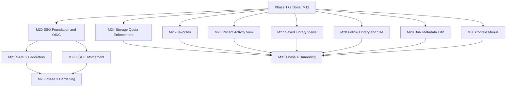

# eDMS — Implementation Plan (Phase 3: Federation & Phase 4: Daily-Use Enhancements)

| | |
|---|---|
| **Version** | 1.2 |
| **Status** | Active — update in place as work lands |
| **Date** | 2026-08-17 |
| **Audience** | AI coding agents (OpenCode + DeepSeek, Claude Code, or any other tool) implementing eDMS |
| **Companion documents** | `functional-spec.md` v1.1 (what/why — bumped 2026-08-17 for Phase 4, see FS §18), `technical-design-spec.md` (how), `AGENTS.md` (repo rules & navigation), [`ImplementationPlan V1.1.md`](ImplementationPlan%20V1.1.md) (superseded — Phase 2's plan, historical reference only), [`ImplementationPlan V1.0.md`](ImplementationPlan%20V1.0.md) (archived — Phase 1's original plan, historical reference only) |

## 1. Purpose & Relationship to Other Docs

V1.1 closed out Phase 1's remaining gaps (M10–M11) and then implemented Phase 2 in full (M12–M19). Every milestone in V1.1 is marked `Done`, spot-checked against actual source rather than assumed (§3 records what was found).

This document now plans **two independent phases**:

- **Phase 3 — Federation** (M20–M23): FR-AUTH-09/10/11, SAML2/OIDC/SSO-enforcement. This was the whole of this document when it was first written on 2026-08-17, and its content (§7) is unchanged from that version.
- **Phase 4 — SharePoint-parity daily-use enhancements** (M24–M31): added the same day, after a follow-up request to compare eDMS against SharePoint Online's document-library feature set and fold in what's genuinely valuable for everyday use. §4 is the full comparison and scope reasoning; §8 is the resulting milestone detail. M30 (right-click/long-press context menus) was added slightly later the same day, from a direct follow-up question rather than the comparison pass itself — see §4.5's note.

**These two phases don't depend on each other.** Nothing in Phase 4 touches authentication, and nothing in Phase 3 touches the document/library surfaces Phase 4 extends — both branch directly from "Phase 1+2 done" (§6's dependency graph shows this). Work them in either order, or in parallel across two sessions. If your organization doesn't need SSO yet, there's no reason to wait on Phase 3 before picking up Phase 4's more immediately visible wins, or vice versa.

**Why Phase 4 exists at all, and why it isn't scope creep:** `AGENTS.md` rule 9 says don't build ahead of the roadmap, and FS §2.2 lists real non-goals. Both still hold. Phase 4 isn't an exception to either — every FR it adds first passed through two filters (§4.1): not already covered by Phase 1–3, and not already excluded by FS §2.2. Features that failed the second filter are named and explained in §4.3, not quietly dropped and not quietly added either. FS itself was updated first (v1.1, 2026-08-17) with the new FR IDs before this plan was written against them — the plan follows the spec, same as every phase before it; it doesn't invent scope FS doesn't already contain.

**This document is self-contained.** You shouldn't need to open V1.0 or V1.1 to work from either phase here — §3 carries forward what's still relevant from them. Open the earlier plans only for Phase 1/2's task-by-task history.

**The archive-and-repoint already happened.** Mirroring exactly how V1.0 was marked superseded the moment V1.1 was created (compare `ImplementationPlan V1.0.md`'s header — dated the same day as V1.1, not the day Phase 1's leftover work actually finished), `ImplementationPlan V1.1.md`'s header was updated to "Superseded by V1.2" and `AGENTS.md`/`README.md` were repointed to this file when this document was first created, not deferred to Phase 3's sign-off. Don't be confused that the pointers already lead here while most tasks below still read `Not Started` — that's expected. M23.7 and M31.6 later update those files' *prose* (not their pointers) as each phase actually finishes.

## 2. How to Use This Plan

Unchanged from V1.0/V1.1 — the conventions worked for two phases, keep using them:

- **Start here every session.** Find the first task whose `Status` is not `Done` and whose `Depends on` tasks are all `Done`. That is your next task. With two independent phases now in this file, that may be a Phase 3 task or a Phase 4 task depending on what's already landed — check both §7 and §8.
- **Update the Status column in the same commit that completes the task.** Valid values: `Not Started` (default), `In Progress`, `Done`, `Blocked` (+ a one-line reason in the Task cell).
- **Don't start a task whose dependencies aren't `Done`.**
- **If this file's Status looks stale, trust the repository over the file** — fix the file, then proceed.
- **One task, one commit (or a small tight series), referencing the task ID** — e.g. `feat: OIDC JIT provisioning + handoff-code exchange (M20.1)`.
- **A milestone is "done" only when every task in it is `Done` *and* its Demo-able outcome is actually true.**
- Every task links back to `FR-*` IDs and/or `TDS §*` sections — read those before implementing, per `AGENTS.md` §2.
- **Read the ADR before writing the corresponding code.** Six tasks across both phases (M20.1, M20.2, M20.3, M21.1, M22.1, M27.1) each require recording a new ADR (ADR-14–19) *before* the implementation it governs, not after — each resolves a real ambiguity FS/TDS leave open.

## 3. Current State Snapshot (as of 2026-08-17)

Verified directly against `server/` and `client/` source, the same discipline V1.1 §3 used — not inferred from README/AGENTS.md's own claims alone. This section covers Phase 3's federation-specific starting point; Phase 4's comparison-specific verification (what's already built vs. genuinely missing) lives in §4 instead, since it's tightly coupled to that analysis.

### 3.1 Phase 1 + Phase 2 — confirmed done

`README.md` and `AGENTS.md` both state Phase 2 (M0–M19) is complete. Spot-checks confirm it: `AuthController.cs`, `AdminController.cs`/`IAdminService.cs`, `AdminUsersController.cs`/`IUserManagementService.cs`, `docker-compose.yml` (6 services: postgres, mailhog, office-converter, text-extractor, api, web), and TDS §2.4's ADR table (ends at **ADR-13**) all match what V1.1 §10's history row claims was built. No open Phase 1/2 items were found. This plan's new ADRs are therefore **ADR-14** onward (Phase 3 used 14–18; Phase 4 uses 19).

### 3.2 What already exists for Phase 3 — don't rebuild it

Phase 1 deliberately reserved room for federation so Phase 3 wouldn't need a data-model rewrite. Confirmed still true today:

| Already in place | Where | Notes |
|---|---|---|
| `AuthProvider` enum with `Local`/`Saml`/`Oidc` values | `server/src/eDMS.Domain/AuthProvider.cs` | Only `Local` is ever assigned today — `Saml`/`Oidc` are unused until this plan |
| `ApplicationUser.AuthProvider` / `.ExternalId` columns | `server/src/eDMS.Domain/ApplicationUser.cs` | `ExternalId` is nullable, currently always null |
| `ITokenService.IssueTokenPairAsync` | `server/src/eDMS.Application/Common/Interfaces/ITokenService.cs` | TDS §5.5's explicit design intent: SSO must call this **same** method local login uses — don't build a parallel token-issuance path |
| `IAuthService` (`LoginAsync`, `RefreshAsync`, `RevokeRefreshTokenAsync`, `GetCurrentUserAsync`, password reset) | `server/src/eDMS.Application/Auth/IAuthService.cs` | This plan **extends** this interface with one new method (M20.1) rather than introducing a second auth service |
| `RefreshTokenCookie` helper (`.Append`/`.Clear`) | `server/src/eDMS.Api/Auth/` | Reused as-is by the new SSO exchange endpoint — same cookie, same rotation semantics |
| `AppSetting` key/value admin store + `IAdminService`/`AdminSettingsDto` | `server/src/eDMS.Domain/AppSetting.cs`, `server/src/eDMS.Application/Admin/IAdminService.cs` | Extended, not replaced, by M22.1 |
| Admin Settings / Admin Users pages | `client/src/pages/admin/settings.tsx`, `client/src/pages/admin/users.tsx` | Extended, not replaced, by M22.2 |
| `login.tsx` + `auth-context.tsx` | `client/src/pages/login.tsx`, `client/src/features/auth/auth-context.tsx` | Extended, not replaced, by M20.4 |

Zero hits for `Saml`/`Oidc`/`SSO` package references or endpoints anywhere in `server/` or `client/` beyond the reserved enum/columns above. No SAML or OIDC NuGet package is referenced in any `.csproj`. No `/auth/sso/*` route exists. Neither `prototype(html)/` nor `Prototype(React)/` has any SSO/federated-login page to mirror — this is genuinely new UI territory; follow shadcn conventions and match `login.tsx`'s existing visual language instead.

### 3.3 A note on this codebase's actual Application-layer shape

TDS §3.1/§5.2 illustrates one MediatR command/handler class per use case, with business logic inline in the handler. The real codebase uses MediatR the same way for cross-cutting concerns (`IMediator` is injected into controllers, e.g. `DocumentsController.cs`; 44+ files implement `IRequestHandler`) but consolidates business logic into per-aggregate service interfaces underneath the handlers — `IDocumentService`, `IAuthService`, `IAdminService`, `IUserManagementService`, `INotificationService`, each one interface with many methods, rather than one file per method. This doesn't contradict ADR-2 (MediatR pipeline behaviors are the actual architectural commitment, and they're intact); it's a reasonable internal layering choice the earlier plans' tasks already worked with correctly by checking real interfaces before writing task text, rather than assuming TDS's illustrative sketch was literal. Do the same for every task below — verify the nearest existing analogous handler/service before extending it, since "sounds like TDS §5.2's example" and "matches what's actually in the file" aren't always the same thing.

### 3.4 Noted, not in scope for this plan

`.github/workflows/` currently has `ci.yml` and `deploy-staging.yml` only — TDS §11.3 describes a third workflow (`deploy-prod.yml`) that was never created; this predates this plan (V1.1's M11.6 scoped itself to staging only) and isn't blocking either phase's work. Flagged for awareness, not a task here.

## 4. SharePoint Online Comparison & Phase 4 Scope Decision

This is the analysis behind Phase 4 (§8) — what SharePoint Online offers that eDMS doesn't yet, sorted into what's worth building, what's already excluded on purpose, and what's a closer call left for an explicit decision.

### 4.1 Method

Every SharePoint Online document-library feature considered went through two filters, in order:

1. **Already covered by Phase 1–3?** If yes, it's not a gap — listed in §4.2 for completeness, not re-specified.
2. **Already excluded by FS §2.2's non-goals?** If yes, it's out regardless of how useful it might be — listed in §4.3 with the specific non-goal it hits, not silently reconsidered.

Only what clears both filters became a Phase 4 candidate (§4.5). Two items that cleared filter 2 only partially or arguably are called out separately (§4.6) rather than forced through. This is deliberately a narrower bar than "everything SharePoint has" — matching `AGENTS.md` rule 9's "don't build ahead of the roadmap" instead of treating the comparison as a blank check.

Sourced from direct verification against `server/`/`client/` (§4.4, §4.5's "Verified gap" column) plus a current check of SharePoint Online's document-library feature set — see Sources at the end of this document for what was checked and when, since a feature-parity comparison is only as good as its currency.

### 4.2 Already covered by Phase 1–3 — not a gap

Sites/Libraries/Folders/Documents, versioning, check-out/check-in, item-level permissions with inheritance breaking, internal Share + org-wide links (Phase 2), Recycle Bin, full audit log + activity tabs, content types + required columns (Phase 2), Office preview (Phase 2), bulk delete/move/zip-download (Phase 2), chunked upload (Phase 2), email + in-app notifications/alerts for Folder/Document (Phase 2), full-text content indexing (Phase 2), CSV audit export (Phase 2), storage usage dashboard — reporting only, see §4.4 (Phase 2), dark theme (Phase 2), SAML2/OIDC/SSO-enforcement (Phase 3, this document). Responsive layout down to tablet width already covers "usable on a phone/tablet" (FR-UI-07) without a native app.

### 4.3 Deliberately excluded — named, not silently reconsidered

Everything below is a real SharePoint Online capability. None of it is recommended, because each hits a specific FS §2.2 non-goal:

| SharePoint capability | Non-goal it hits |
|---|---|
| Real-time co-authoring (Office Online simultaneous editing) | "Real-time co-authoring / simultaneous multi-user editing" |
| OneDrive-style desktop sync client, mobile native apps | "Desktop sync client... or mobile native apps" |
| Power Automate approval workflows, multi-stage/branching workflows | "Workflow/approval engine... e-signature" |
| Microsoft Purview retention labels, legal hold, DLP, eDiscovery | "Retention labels, legal hold, DLP, compliance/eDiscovery tooling" |
| Anonymous "anyone with the link", external/guest (B2B) sharing | "Anonymous or external... sharing of any kind" |
| Wiki pages, Lists, News, Teams/Viva integration | "Wiki pages, lists, news, Teams/Slack integration, intranet portal features" |

One more came up in the comparison that isn't on FS §2.2's original list at all: **Copilot-driven search, summarization, and drafting**, now a headline SharePoint investment area. This isn't excluded by a document-management non-goal — it's excluded because it isn't a document-library feature in the first place. It's a separate LLM-integration architecture (model calls, prompt/agent infrastructure, a whole new class of data-handling and cost concerns) that FS §3's tech stack never included and TDS never designed around. Treating "add AI features" as a roadmap line item the way "add saved views" is would understate what it actually requires — it's a from-scratch architecture decision, not a Phase 4 task, and isn't recommended as either.

### 4.4 A gap found along the way — not a new idea, unfinished old scope

`FavoriteItem` was sketched in FS §8.2 from this document's first draft, tagged P2, right next to `AlertSubscription`. Direct search of `server/src/eDMS.Domain/` confirms `AlertSubscription.cs` exists (built, per Phase 2's M15) but **no `FavoriteItem.cs` exists anywhere** — and neither does any FR-* requirement for it anywhere in FS §6. Phase 2 didn't drop this; there was never an FR to build it from, because §6 and §8.2 had drifted out of sync in the original spec. FS v1.1 (§18) now closes that gap with FR-UI-11. It's included in §4.5 below, not treated as new scope, because it already had a committed data-model shape — it just never had a requirement or a UI.

Also verified while checking this: `StorageQuotaBytes`/`StorageUsedBytes` are stored, editable (FR-SITE-03), and displayed (the M10.16 storage dashboard), but a repo-wide search of `eDMS.Application` for both fields turns up only Site CRUD (`SiteDto.cs`, `UpdateSiteHandler.cs`, `ListSitesHandler.cs`, `GetSiteHandler.cs`) — never the document-upload path. A Site's quota is currently decorative: nothing stops an upload once a Site is over quota. This one has an FR (FR-SITE-03 implies the field matters), just no enforcement — genuinely closer to a bug than new scope, and included in §4.5 for the same reason as Favorites.

### 4.5 New Phase 4 scope

Seven FRs, added to FS v1.1 §6/§15 before this plan was written against them — six from the comparison pass itself, one (FR-UI-12) from a direct follow-up question afterward, run through the same two filters (§4.1) rather than added on a different, looser standard just because it arrived differently:

| FR | Feature | Why it matters daily | Verified gap |
|---|---|---|---|
| FR-SITE-07 | Storage quota enforcement | Prevents silent storage sprawl past what admins configured — today the quota is a number nobody enforces | Confirmed via §4.4 — `StorageQuotaBytes` read/written, never checked at upload |
| FR-DOC-13 | Bulk metadata edit ("Quick Edit"-style) | SharePoint's grid-editing of multiple items' properties at once is one of its most-used power-user features; eDMS has bulk delete/move/zip (FR-DOC-11) but not bulk *edit* | Confirmed — zero hits for bulk-edit/quick-edit/datasheet-style UI anywhere in `client/src` |
| FR-NOTIF-06 | Follow extended to Library/Site | Today's Follow (FR-NOTIF-02) only covers Folder/Document; SharePoint lets you follow a whole library or site | Confirmed — `INotificationService.FollowAsync`'s `ObjectType` parameter is already generic (the shared enum already has `Library`/`Site` values), but `PublishFollowedChangeAsync` only notifies subscribers of the exact object passed to it, not ancestors — see M28.1 |
| FR-UI-09 | "Recent" cross-site activity view on Home | Home today is only "My Sites" (FR-SITE-05); no way to jump back to what you were just working on across sites | Confirmed — zero hits for "recent"/"recently" anywhere in `home.tsx` |
| FR-UI-10 | Saved/named library Views | SharePoint's custom views (filter + sort + group-by, savable and shareable) are an actively-invested 2026 SharePoint UX area (see Sources) and a real daily-use gap versus eDMS's fixed single sort | Confirmed — zero hits for a saved-view/groupBy concept in `library.tsx` |
| FR-UI-11 | Favorites/pinning | Quick access to specific items regardless of where they live in the hierarchy | See §4.4 — entity sketched since v1.0, never given a requirement until now |
| FR-UI-12 | Right-click / long-press context menus | The single most common file-manager interaction (Windows Explorer, macOS Finder, SharePoint itself) — surfaces an item's actions without opening it or hunting for a button first | Confirmed by direct follow-up question: zero hits for `onContextMenu`/`ContextMenu` anywhere in `client/src`. A related, separate finding surfaced in the same exchange — FS's own FR-UI-03 (Phase 1/MVP) specifies a per-row "..." dropdown that also wasn't literally built (the real UI uses always-visible icon buttons plus the Details Sheet instead) — was raised but **not** selected for action, and isn't touched by this plan; FR-UI-03 stays as-is, gap and all, per the user's choice |

M30 (§8) is FR-UI-12's milestone — added to Phase 4 after M24–M29 already existed, which is why its number comes after them despite landing between M29 and the renumbered Phase 4 hardening milestone (M31) in the dependency graph (§6).

### 4.6 Considered, not included by default — real tension, left for an explicit call

Two more things surfaced by the comparison did **not** make §4.5, for different reasons. Both are described here rather than either silently added or silently dropped, per `AGENTS.md` §11 rule 3 ("for anything touching scope... don't guess — surface the gap").

**Site templates** (a predefined library/folder structure + permission preset applied when creating a new Site). This one's simple: it's a real feature, it doesn't hit any non-goal, but it's meaningfully lower daily-use value than the six above (it helps at Site-creation time only, not every day) and it adds its own admin-authoring surface (someone has to build and maintain the templates). Not recommended for this pass; a reasonable Phase 5 candidate if it comes up again.

**Lightweight per-Library content approval** is the harder one. SharePoint's version (verified directly — see Sources) is genuinely narrow: a single per-Library toggle ("require content approval?"), an Approval Status (Draft/Pending/Approved/Rejected) added to the existing major/minor version model eDMS already has (FR-VER-02), and a "who can see pending items" visibility rule. There's no designer, no branching, no multi-stage routing — it's much closer to "one more version-status field" than to Power Automate. That's exactly why it's a closer call than it looks: it plausibly *doesn't* hit the "workflow/approval engine" non-goal (§2.2) at all, read narrowly. But it sits close enough to that line, and the non-goal exists deliberately (FS §2.2 calls it out by name), that adding it without an explicit yes would be exactly the kind of silent scope resolution `AGENTS.md` §11 rule 3 warns against — a narrow reading today could look like the thin end of a wedge in six months. **Not included pending an explicit decision.** If wanted, it would slot in as its own small Phase 4 milestone (a `RequireApproval` bool on `Library`, an `ApprovalStatus` enum on `DocumentVersion`, a visibility filter, and an Approve/Reject action gated on Full Control) — deliberately not pre-built into this plan's task list below so that building it requires someone to say yes to it specifically, not inherit it by default from an otherwise-approved Phase 4.

### Sources

SharePoint Online feature-currency check (2026-08-17):

- [SharePoint document library: Features and best practices](https://sharegate.com/blog/sharepoint-document-library-changes-and-best-practices-for-admins)
- [Top 4 NEW SharePoint Features You MUST Try in 2026 — Approvals, Quick Steps, PDF Tools & More (Microsoft Community Hub)](https://techcommunity.microsoft.com/discussions/sharepoint_general/top-4-new-sharepoint-features-you-must-try-in-2026--approvals-quick-steps-pdf-to/4501837)
- [SharePoint document libraries are getting a new user experience (custom views, filter pills, command bar) — Super Simple 365](https://supersimple365.com/sharepoint-document-libraries-are-getting-a-new-user-experience/)
- [How to Configure Content Approvals in SharePoint Online](https://blog.admindroid.com/how-to-configure-content-approvals-in-sharepoint-online/)
- [Require approval of items in a list or library — Microsoft Support](https://support.microsoft.com/en-us/office/require-approval-of-items-in-a-list-or-library-cd0761c4-8c3f-4ea2-9435-13c28aa23d08)
- [Plan document versioning, content approval, and check-out controls in SharePoint — Microsoft Support](https://support.microsoft.com/en-au/office/plan-document-versioning-content-approval-and-check-out-controls-in-sharepoint-428b488e-2807-4ef0-b942-91cb09d8921c)

## 5. Guiding Principles

Carried forward from V1.1 §4 — still correct, now shared by both phases:

1. **Vertical slices over horizontal layers** — with the foundation-first exception V1.1's M10.5 established: M20.1 (Phase 3) and, more lightly, M27.1 (Phase 4's new `LibraryView` entity) are each built once before the slices that depend on them.
2. **Backend before its corresponding frontend, but not all backend before any frontend.**
3. **Tests land with the code, not after it.**
4. **Don't build ahead of the roadmap.** Phase 3 is exactly FR-AUTH-09/10/11; Phase 4 is exactly the seven FRs in §4.5. FS §15 defines no Phase 5 — §10 below covers what that means.
5. **The prototype is a UX reference, never a code source** — with a split caveat: no prototype page covers SSO UI (genuinely new territory, Phase 3); Phase 4's pages (library view picker, bulk-edit grid, Favorites, Home's Recent section) are extensions of pages the prototype *does* cover — match its interaction patterns for the parts that already exist (the library toolbar, the Home layout) and follow shadcn conventions for the genuinely new pieces (the view picker, the bulk-edit grid) the same way M12.4 did for Content Types, which also had no prototype page.
6. **When in doubt, re-read `AGENTS.md` §7 (Non-Negotiable Rules)** before writing code, not after review flags it.
7. **Verify before trusting any status label — including this file's.** Every claim in §3/§4 was checked against actual source. Repeat that discipline before starting any task here — §4.4/§4.5's "Verified gap" column shows exactly what was checked for Phase 4; do the same depth of check for whatever you touch next, since a session working weeks later shouldn't assume nothing changed underneath these claims.
8. **Small, explicit steps.** Written for an agent (OpenCode + DeepSeek) that may run for hours unattended, committing and pushing milestone by milestone with no human reviewing each step. If a task still feels too large to finish confidently in one sitting, split it further.
9. **Record architecturally significant decisions as new ADRs.** ADR-14–18 (Phase 3) and ADR-19 (Phase 4, M27.1's `LibraryView` config-storage design) each resolve a real ambiguity FS/TDS leave open — don't leave the decision implicit in code only.
10. **No anonymous access, ever.** Restated for Phase 3 specifically in the previous version of this section (still true — see M-task text in §7). Phase 4 doesn't touch authentication or permissions at all — every new FR in §4.5 operates strictly within the caller's existing effective permission on the object involved (a Favorite/View/Follow/bulk-edit is never itself a grant of access; §9's risk table restates this for the bulk-edit case specifically, where it's easiest to get wrong).
11. **Auth is the highest-blast-radius surface in the system.** Every Phase 3 task touches the login path — the "don't mark `Done` without X" callouts on M20.1, M21.1, M22.1, and M23.5 are load-bearing. Phase 4 has no comparable single point of failure, but §4.6's content-approval tension shows the same "don't silently resolve a scope question" discipline applies beyond auth too.
12. **NEW — a scope decision made via comparison still needs the same rigor as one made via direct request.** §4 exists specifically so Phase 4's inclusions and exclusions are traceable to a specific filter (§4.1) rather than to taste. If a future session is tempted to add a seventh "obviously good" SharePoint feature to Phase 4 without running it through both filters first, don't — that's exactly the drift this section was written to prevent.

## 6. Milestone Overview

Phase 3 (M20→M23) and Phase 4 (M24–M30→M31) are two separate trees, both rooted at M19. Within Phase 4, M24–M30 have no hard dependency on each other and may be worked in any order or in parallel, same "fan out, converge on hardening" shape V1.1 used for M12–M18→M19 and this document already used for M20's descendants. (M30's task text notes one *soft*, deferrable dependency on M25 for a single menu item — see M30.1 — that's a content detail, not a graph edge, and doesn't block M30 from starting before M25 finishes.)

| Milestone | Goal | Demo-able outcome | Status |
|---|---|---|---|
| [M20](#m20--sso-foundation--oidc-federation) | Shared federation plumbing + OIDC (FR-AUTH-10) | A user clicks "Sign in with SSO", authenticates against a real OIDC IdP, and lands in eDMS signed in — new account JIT-provisioned, zero site access until granted | Done |
| [M21](#m21--saml2-federation) | SAML2 (FR-AUTH-09) | Same experience via SAML2, reusing M20's shared exchange/callback UI | Done |
| [M22](#m22--sso-enforcement--admin-controls) | SSO enforcement (FR-AUTH-11) | Admin turns on "Require SSO for all logins"; non-exempt users' password logins are rejected with a clear message; a break-glass account still works | Not Started |
| [M23](#m23--phase-3-hardening--sign-off) | Phase 3 sign-off | FS Phase 3 checklist satisfied; hardening bar M11/M19 proved, re-run for federation, plus a dedicated auth security pass | Not Started |
| [M24](#m24--storage-quota-enforcement) | Quota enforcement (FR-SITE-07) | Uploading to a Site already at its configured quota is rejected with a clear error; other Sites are unaffected | Not Started |
| [M25](#m25--favorites) | Favorites (FR-UI-11) | A user favorites a Document from its details sheet and a Site from its card; both appear in a dedicated Favorites list | Not Started |
| [M26](#m26--recent--cross-site-activity-view) | Recent view (FR-UI-09) | Home shows the documents a user most recently touched across every Site they can access, each one clickable | Not Started |
| [M27](#m27--saved-library-views) | Saved Views (FR-UI-10) | A user filters/sorts/groups a library, saves it as a named View, and switches back to it later in one click; a Library Owner sets one as the default others see | Not Started |
| [M28](#m28--follow-library--site) | Follow Library/Site (FR-NOTIF-06) | Following a Library delivers the same alerts as following one of its documents would, for any change anywhere inside it | Not Started |
| [M29](#m29--bulk-metadata-edit) | Bulk metadata edit (FR-DOC-13) | Selecting 10 documents and editing Tags once applies to all 10, with a clear per-item result if one fails | Not Started |
| [M30](#m30--right-click--long-press-context-menus) | Context menus (FR-UI-12) | Right-clicking a document or folder — or long-pressing it on touch — opens a menu of everything you're allowed to do with it, without opening it first | Not Started |
| [M31](#m31--phase-4-hardening--sign-off) | Phase 4 sign-off | FS Phase 4 checklist (§4.5's seven FRs) satisfied; same hardening bar as M23, re-run for Phase 4's additions | Not Started |

## 7. Detailed Milestones — Phase 3 (FS §15)

Unchanged from this document's first version. Columns: **Track** — `BE` backend, `FE` frontend, `INF` infra/tooling, `DOC` documentation, `Both` cross-cutting. **Size** — `S` small/mechanical, `M` moderate, `L` complex/high-stakes.

### M20 — SSO Foundation & OIDC Federation

| Status | ID | Track | Task | Depends on | Size | Refs |
|---|---|---|---|---|---|---|
| Done | M20.1 | BE | **Shared SSO foundation.** Add `Task<AuthResult?> CompleteSsoExchangeAsync(string code, string? ipAddress, CancellationToken ct)` to `IAuthService` (`server/src/eDMS.Application/Auth/IAuthService.cs`) — it must return the exact same `AuthResult` shape `LoginAsync` does so `AuthController` can share the cookie/response code (extract the current `Login` action's cookie-append + `LoginResponse` construction into a small private helper both actions call). Add `IJitProvisioningService.ProvisionOrLinkAsync(AuthProvider provider, string externalId, string email, string displayName, CancellationToken ct)`: look up `ApplicationUser` by `(AuthProvider, ExternalId)` first; if not found, fall back to a case-insensitive `Email` match against a `Local`-provider account and **link** it (update that row's `AuthProvider`/`ExternalId` in place, don't create a duplicate); if still not found, JIT-create a new `ApplicationUser` with `IsActive = true`, `IsSystemAdmin = false`, **no site memberships** (principle 10). Reject (return null / throw a typed exception the caller maps to 401) if the resolved user has `IsActive == false` — SSO must not resurrect a deactivated account (FR-AUTH-07). Add `ISsoHandoffCodeStore` backed by a **new DB table**, not `IMemoryCache` — see the note below — with `IssueAsync(Guid userId, ct) : Task<string>` (returns the opaque code; persists only its SHA-256 hash, mirroring `refresh_tokens.token_hash`) and `ConsumeAsync(string code, ct) : Task<Guid?>` implemented as a single atomic conditional `UPDATE ... SET consumed_at = now() WHERE code_hash = @hash AND consumed_at IS NULL AND expires_at > now() RETURNING user_id` — a naive read-then-write risks a replay race. Migration (all four provider sets per `AGENTS.md` §6) adds `sso_handoff_codes(id, code_hash UNIQUE, user_id FK, expires_at, consumed_at NULL)`, 60-second TTL. New endpoint `POST /auth/sso/exchange { code }` on `AuthController`, `[AllowAnonymous]`, calling the new service method, on success logs `AuditAction.Login` (reuse — don't add a new enum value) the same way local login does. **Record ADR-14** in TDS §2.4 explaining the DB-backed-not-IMemoryCache choice: TDS §5.3 already accepted `IMemoryCache` staleness for the *permission* cache because a stale read is low-risk and self-correcting within 30s; a handoff code is different — it's a one-time bearer credential for token issuance, the exchange call can legitimately land on a *different* API instance than the one that issued the code behind a load balancer (NFR: "API shall be stateless... to allow horizontal scaling", FS §7), and losing that state to a process-local cache would silently break login for a fraction of users the moment there's more than one instance. | M19 | L | ADR-14, TDS §5.5, §5.3 (contrast), FS §7 NFR — **highest-risk task in this plan; don't mark `Done` without: a replay test (consuming the same code twice, second call fails), an expiry test, a deactivated-user-rejection test, an existing-local-account-linking test (not a duplicate-user test), and a genuinely-new-user JIT test asserting zero site memberships** |
| Done | M20.2 | BE | **OIDC wiring.** Add `Microsoft.AspNetCore.Authentication.OpenIdConnect` to `eDMS.Api`. Register it in `Program.cs` alongside the existing `AddJwtBearer` registration (`Program.cs` already calls `.AddAuthentication(JwtBearerDefaults.AuthenticationScheme).AddJwtBearer(...)` — add `.AddCookie(...)` as the OIDC handler's sign-in scheme for the redirect-handshake correlation/nonce state, and `.AddOpenIdConnect(...)` as a **named, non-default** scheme so it doesn't interfere with the existing Bearer-token validation used by every other endpoint) sourced from a new `Oidc:{Authority, ClientId, ClientSecret, CallbackPath}` config section (env-var-sourced, same convention as `Jwt:*`/`Smtp:*`, TDS §11.4 — add placeholders to `.env.example`). Only register the OIDC scheme when `Oidc:Authority` is non-empty, so a deployment that hasn't configured it doesn't fail to start. New endpoints on a new `SsoController` (or extend `AuthController` — pick one and be consistent): `GET /auth/sso/oidc/challenge` issues a `ChallengeResult` for the OIDC scheme (redirects the browser to the IdP); the `OnTokenValidated` event extracts `sub`/`email`/`name` claims, calls `IJitProvisioningService.ProvisionOrLinkAsync` (M20.1), calls `ISsoHandoffCodeStore.IssueAsync`, and redirects to `{Client:BaseUrl}/sso/complete?code=...` (never the access token — see M20.4's non-negotiable). Add `GET /auth/sso/providers` returning which of `{oidc, saml}` are currently configured (config-section-present is sufficient signal for this milestone; M22 layers an admin on/off toggle on top). **Record ADR-15**: confirm `Microsoft.AspNetCore.Authentication.OpenIdConnect`'s currently-published version targets `net10.0` before depending on it (first-party Microsoft package — low risk, but verify, don't assume) and note the `.AddCookie()` correlation-scheme requirement explicitly, since it's the single most common OIDC-in-ASP.NET-Core setup mistake. | M20.1 | L | ADR-15, FR-AUTH-10, TDS §5.5 |
| Done | M20.3 | INF | **Containerized test/demo OIDC provider.** Add a mock OIDC provider (e.g. `ghcr.io/soluto/oidc-server-mock`, or an equivalent actively-maintained image — verify it still exists/is maintained before committing to it) to `docker-compose.yml` as its own service, mirroring the M13.1/M17.1 "heavyweight dependency gets its own container" pattern — pre-configured (via its config-mount or env vars) with one test client matching M20.2's `Oidc:ClientId`/`CallbackPath` and one demo user, so `docker compose up -d` gives a fully working, clickable SSO demo out of the box, the same way `mailhog` demos email today. Also wire the same image into `eDMS.IntegrationTests` via `Testcontainers` (the project already depends on `Testcontainers.PostgreSql` per M10.1 — add the generic `Testcontainers` container-builder for this image the same way) so the integration test in M20.5 exercises a real, cryptographically-signed OIDC round trip rather than a hand-mocked token. **Record ADR-16**: containerized test IdPs (this task, reused verbatim by M21.2 for SAML) over hand-mocking the protocol in test code — a hand-mocked "IdP" can't catch a real signature-validation or clock-skew bug, which is exactly the class of bug most likely to slip through in a rushed federation implementation. | M20.1 | M | ADR-16, TDS §12.1 |
| Done | M20.4 | FE | **Login page SSO entry + callback page.** In `login.tsx`, fetch `GET /auth/sso/providers` on mount and conditionally render a "Sign in with SSO" button per enabled provider — this must be a real browser navigation (`window.location.href = "/api/v1/auth/sso/oidc/challenge"`), **not** an `apiClient`/`fetch` call, since the IdP redirect chain isn't something an XHR can follow. Add a new route + page, `client/src/pages/sso-complete.tsx` at `/sso/complete`: reads `?code=` (and a `?error=` case for IdP-side failures) from the URL, calls the new `POST /auth/sso/exchange` (add it to `features/auth/api.ts` alongside the existing `login`/`logout`/`me` calls), and on success reuses `auth-context.tsx`'s token/user-setting logic (refactor `login()`'s internal state-setting into a small shared helper `completeAuth(response)` that both `login()` and a new `completeSso(code)` call, rather than duplicating the `setAccessToken`/`setUser`/`setStatus` lines) then navigates to `/`. On failure, show a friendly error with a link back to `/login` — don't leave a blank page. **Non-negotiable, not a style preference:** the access token must never appear in a URL, browser history entry, or any `GET` request's query string at any point in this flow — only the one-time opaque `code` does, and §M20.1 already made it single-use and 60-second-lived. Verify this by inspecting the actual network requests/URLs during manual testing, not just by reading the code. | M20.1, M20.2 | M | FR-AUTH-10, TDS §7.3 (access-token-in-memory-only rule) |
| Done | M20.5 | Both | **Tests for M20.** Unit: `IJitProvisioningService` (new user → zero site memberships; existing local user → linked, not duplicated; deactivated user → rejected; `(provider, externalId)` match takes precedence over email match on a second login). Integration: full `GET /auth/sso/oidc/challenge` → (drive the M20.3 container's login form) → callback → `POST /auth/sso/exchange` round trip using `WebApplicationFactory` + the M20.3 Testcontainer, asserting a real access token comes back. Frontend: `login.tsx` conditionally renders the SSO button based on `/auth/sso/providers`; `sso-complete.tsx` covers both the success and `?error=` paths. E2E (Playwright): one happy-path scenario — login page → click "Sign in with SSO" → complete the mock IdP's login form → land back in eDMS authenticated. | M20.2, M20.3, M20.4 | M | TDS §12.1–§12.3 |

> **M20.1 carries the same risk profile V1.1 flagged for its M10.1.** It's the seam every subsequent Phase 3 task builds on, and a subtle bug here (a replay-able handoff code, an account-linking bug that lets one email hijack another's local account, a JIT-provisioned user that somehow inherits permissions) is an authentication-bypass class of bug, not a feature bug. Don't mark it `Done` without the specific tests listed in its row.

### M21 — SAML2 Federation

| Status | ID | Track | Task | Depends on | Size | Refs |
|---|---|---|---|---|---|---|
| Done | M21.1 | BE | **SAML2 SP wiring**, reusing M20.1's shared `IJitProvisioningService`/`ISsoHandoffCodeStore`/exchange endpoint unchanged. Add a SAML2 SP library — FS §3 suggests `Sustainsys.Saml2` (`Sustainsys.Saml2.AspNetCore2`); **before locking this in, verify the currently-published version actually targets/supports `net10.0`** the same way ADR-8 had to verify Pomelo's EF Core 10 support and rejected it when it lagged. If `Sustainsys.Saml2.AspNetCore2` doesn't yet support `net10.0`, fall back to `ITfoxtec.Identity.Saml2` (the other actively-maintained .NET SAML2 SP library) — either is acceptable, but the choice actually made and why must be recorded, not silently guessed. New endpoints: `GET /auth/sso/saml/challenge` (SP-initiated redirect to the IdP), `POST /auth/sso/saml/acs` (Assertion Consumer Service — SAML responses arrive via **POST binding**, not a query-string redirect; this endpoint must be `[AllowAnonymous]` and is *not* covered by TDS §14's existing CSRF reasoning, which assumes Bearer-token same-origin calls — its protection is the assertion's XML signature, validated by the library, not CSRF tokens), and `GET /auth/sso/saml/metadata` (SP metadata document so the IdP side can be configured from ours — standard SAML practice). Extract `NameID` as `ExternalId`; extract email from a **configurable** attribute claim (`Saml:EmailAttributeName`, default the common `.../claims/emailaddress` URI) rather than a hardcoded one — the exact attribute name varies by IdP and hardcoding it is the single most common reason a SAML integration works against one IdP and silently fails against another. Config section `Saml:{IdpMetadataUrl-or-cert, EntityId, SigningCertificate, EmailAttributeName}`, env-var-sourced, same convention as `Oidc:*`/`Jwt:*`. **Record ADR-17**: the library choice actually made (and net10.0 verification outcome), plus the NameID/email-attribute extraction design. | M20.1 | L | ADR-17, FR-AUTH-09, TDS §5.5 — **second-highest-risk task in this plan; SAML's XML-signature validation is exactly the kind of thing that must be delegated to the library, never hand-rolled** |
| Done | M21.2 | INF | **Containerized test/demo SAML IdP**, mirroring M20.3's pattern (e.g. a SimpleSAMLphp-based test-IdP image such as `kristophjunge/test-saml-idp`, or equivalent — verify current maintenance status before committing) added to `docker-compose.yml`, pre-configured with an SP entry matching M21.1's metadata and a demo user; also wired into `eDMS.IntegrationTests` via `Testcontainers`, same shape as M20.3. Reuses ADR-16 — no new ADR needed, this is the same decision applied to the second protocol. | M21.1 | M | ADR-16 (reused), TDS §12.1 |
| Done | M21.3 | FE | Add the SAML "Sign in with SSO" button variant to `login.tsx` (`window.location.href` to `GET /auth/sso/saml/challenge`) — this is `S`, not `M`, specifically because it reuses M20.4's `/sso/complete` page and `POST /auth/sso/exchange` call verbatim; no new frontend plumbing is needed beyond the second button and updating `GET /auth/sso/providers`'s response to reflect SAML as configured. | M20.4, M21.1 | S | FR-AUTH-09 |
| Done | M21.4 | **Tests for M21**, mirroring M20.5's shape for the SAML path: unit tests for assertion-claims → JIT-provisioning mapping (including the configurable email-attribute lookup); integration test for the full SP-initiated flow against the M21.2 container, **plus an explicit negative test asserting a tampered/unsigned assertion is rejected** (don't only test the happy path on a security-critical validation step); Playwright E2E happy path through the mock IdP's login form. | M21.1, M21.2, M21.3 | M | TDS §12.1–§12.3 |

### M22 — SSO Enforcement & Admin Controls

FR-AUTH-11 states the outcome ("System Admin shall be able to enforce SSO-only login... per user or globally") but not the mechanism — that's a real design gap this milestone has to fill, not an oversight to work around.

| Status | ID | Track | Task | Depends on | Size | Refs |
|---|---|---|---|---|---|---|
| Done | M22.1 | BE | **Enforcement data model + logic.** Migration (all four provider sets) adds two columns to `ApplicationUser`: `LocalLoginDisabled` (bool, default false — an admin has explicitly forced *this* user to SSO-only, independent of the global switch) and `SsoExempt` (bool, default false — this user may always use local login even when the global switch is on; the break-glass mechanism). Add `AppSettingKeys.SsoEnforcedGlobally` to the existing `AppSetting` store (`server/src/eDMS.Domain/AppSetting.cs`). Effective rule, evaluated in `LoginAsync`: `canUseLocalLogin = !user.LocalLoginDisabled && (!ssoEnforcedGlobally || user.SsoExempt)`; when false, reject with a **distinguishable** error — extend the Problem Details response (TDS §5.7's existing exception→status mapping) with a specific `type: urn:edms:sso-required` on this path rather than the bare `Unauthorized()` local login already returns for wrong credentials, so the frontend (M22.2) can tell the two apart and show the right message. Extend `UpdateAdminSettingsRequest`/`AdminSettingsDto` (`server/src/eDMS.Application/Admin/IAdminService.cs`) with `bool? SsoEnforcedGlobally` (nullable-partial-patch, matching that record's existing convention — **not** the same convention as the next change). Extend `UpdateUserRequest`/`AdminUsersController.Update` (`server/src/eDMS.Api/Controllers/AdminUsersController.cs`, `IUserManagementService`) with non-nullable `bool LocalLoginDisabled, bool SsoExempt` (matching *that* record's existing full-replace convention, alongside `DisplayName`/`IsSystemAdmin`) — the two endpoints use different patch semantics today; extend each in its own existing style rather than unifying them as part of this task. **Add a safety-rail beyond FR-AUTH-11's literal text**: the settings-update validator must reject turning `SsoEnforcedGlobally` from false→true if doing so would leave **zero** `IsSystemAdmin` users with `SsoExempt == true` — without this, an admin can accidentally lock out every administrator with one settings change, which costs nothing to prevent and a great deal to recover from. **Record ADR-18** covering this whole model (the two-flag design, why a third flag beyond FR-AUTH-11's literal "per user / globally" was needed, and the safety-rail's justification). | M20.1 | M | ADR-18, FR-AUTH-11 |
| Done | M22.2 | FE | Admin Settings page (`client/src/pages/admin/settings.tsx`) gets an "SSO" section: the global enforcement toggle (surfacing the M22.1 safety-rail's rejection as an inline form error when it fires, not a silent no-op) plus a read-only display of which providers are currently configured (from `GET /auth/sso/providers`). Admin Users page (`client/src/pages/admin/users.tsx`) gets the per-user `LocalLoginDisabled`/`SsoExempt` toggles in its existing edit surface. `login.tsx` surfaces the new `urn:edms:sso-required` error distinctly ("This account requires SSO — use the button above" or similar) instead of the generic "Invalid email or password." | M22.1 | M | FR-AUTH-11 |
| Done | M22.3 | Both | **Tests for M22.** Unit: the enforcement decision function across all four boolean combinations of `(LocalLoginDisabled, SsoEnforcedGlobally, SsoExempt)`, plus the safety-rail (attempting to enable global enforcement with zero exempt admins is rejected; with one, it succeeds). Integration: `PUT /admin/settings` rejecting the lockout scenario end-to-end. Frontend: the two new toggles and the distinct login error message. | M22.1, M22.2 | S | TDS §12.1–§12.2 |

> **M22.1's safety-rail is not optional scope-padding.** A System Administrator locking out every admin account is a severe, fully self-inflicted operational incident — the kind of thing `AGENTS.md`'s risk-awareness principles exist to prevent. Don't cut it to make the task smaller.

### M23 — Phase 3 Hardening & Sign-off

| Status | ID | Track | Task | Depends on | Size | Refs |
|---|---|---|---|---|---|---|
| Done | M23.1 | Both | Extend the Playwright E2E suite: full OIDC flow, full SAML flow, SSO-enforcement blocking local login while the break-glass exempt account still works, and the "provider not configured" case degrading gracefully (no button shown, no broken link) rather than erroring. | M20 (all), M21 (all), M22 (all) | L | TDS §12.2 |
| Done | M23.2 | BE | Validator-coverage re-audit (the parameterized test from V1.1's M11.1/M19.4) including every Phase 3 command. | M20 (all), M21 (all), M22 (all) | S | TDS §5.2 |
| Done | M23.3 | FE | Accessibility pass on all new SSO UI: login page's new buttons, `/sso/complete`'s loading/success/error states, the Admin Settings SSO section, the per-user toggles on Admin Users. | M20.4, M21.3, M22.2 | M | FS §7 NFR |
| Done | M23.4 | FE | Responsive/mobile re-verification on the same new UI. | M20.4, M21.3, M22.2 | S | FS §7 NFR |
| Done | M23.5 | Both | **Dedicated auth-specific security review pass** — narrower and more pointed than a generic code review, because this is the highest-blast-radius surface in the system (principle 11). Explicitly verify, and write down the result of each: (a) no access token, refresh token, or SAML assertion ever appears in a URL, browser history entry, or server log at any point in either flow; (b) a deactivated user cannot regain access via SSO (re-run FR-AUTH-07's deactivation test against both federated paths, not just local login); (c) a consumed or expired handoff code genuinely cannot be replayed (M20.1's test, re-verified here against both providers' real callback paths, not just the unit test's synthetic input); (d) the M22.1 safety-rail actually prevents total admin lockout under a real `PUT /admin/settings` call, not just the unit-level decision function; (e) a tampered/unsigned SAML assertion and an OIDC token with an invalid signature are both rejected (M21.4's negative test, confirmed still passing here). | M20 (all), M21 (all), M22 (all) | M | TDS §10, AGENTS.md §7 |
| Done | M23.6 | INF | Update `docker-compose.yml`, `.env.example`, and the deploy workflow(s) that exist (`deploy-staging.yml` — see §3.4) for the two new test-IdP containers and the new required secrets (OIDC client secret, SAML signing certificate/key) — resource sizing notes and health checks, following the same pattern M19.5 used for M13/M17's containers. | M20.3, M21.2 | S | TDS §11 |
| Done | M23.7 | DOC | `AGENTS.md`/`README.md` already point at this file (§1's note above) — this task updates their **prose**, not their pointers: flip "federation planned"/"in progress" language to "done" now that M20–M22 are actually `Done`. If M31.6 (Phase 4's equivalent task) hasn't landed yet, touch only the Phase 3-related sentences and leave Phase 4's claims alone — don't overwrite the other phase's status while updating yours. | M23.1–M23.6 | S | — |

## 8. Detailed Milestones — Phase 4 (FS §15, §4 above)

Same column conventions as §7.

### M24 — Storage Quota Enforcement

| Status | ID | Track | Task | Depends on | Size | Refs |
|---|---|---|---|---|---|---|
| Done | M24.1 | BE | In `IDocumentService`'s upload path (`server/src/eDMS.Application/Documents/IDocumentService.cs`'s `UploadAsync` overloads and whatever handler(s) currently call them — check `DocumentsController.cs`/`UploadsController.cs` for the exact wiring before extending it), before writing the new `DocumentVersion`, load the target `Site` and check `site.StorageUsedBytes + incomingSizeBytes > site.StorageQuotaBytes` — skip the check entirely when `StorageQuotaBytes` is null (FR-SITE-07's explicit carve-out for unlimited Sites). On exceed, reject that file with a typed error distinguishable from validation failures (a `QuotaExceededException` mapped through TDS §5.7's existing exception-to-Problem-Details table, or reuse whatever mechanism `checked-out-by-other-user` already uses for a similarly state-dependent, non-validation rejection — check that pattern first). Multi-file batch uploads must keep FR-DOC-02's continue-on-error behavior: one file hitting the quota fails only that file, not the whole batch — extend `UploadDocumentResponseItem`'s `rejectionReason` union (TDS §8.2: currently `"file-too-large" | "blocked-extension" | "checked-out-by-other-user"`) with `"quota-exceeded"`. Also apply the same check to check-in (a new version of an existing document still adds bytes) and to Move/Copy *into* a different Site (Copy always adds bytes to the destination; Move does only when crossing Sites) — check `IDocumentService`'s `MoveAsync`/`CopyAsync` for where the destination Site is already resolved and hook in there. | M19 | M | FR-SITE-07, TDS §5.4, §5.7 |
| Done | M24.2 | FE | Surface `"quota-exceeded"` in the upload dialog's existing per-file status UI (the same place `"file-too-large"`/`"blocked-extension"` already render) with a message naming the Site and its configured limit, not a generic failure. | M24.1 | S | FR-SITE-07 |
| Done | M24.3 | Both | Unit tests for the boundary math (exactly at quota succeeds or fails consistently — pick one and assert it explicitly, one byte over fails, null quota always succeeds regardless of usage). Integration test seeding a Site's `StorageUsedBytes` near its quota and asserting the next upload/check-in/cross-Site-copy is rejected while a same-Site rename/metadata-only edit (no new bytes) is not. | M24.1, M24.2 | S | TDS §12.1 |

### M25 — Favorites

FS §8.2 already sketches `FavoriteItem`'s shape (§4.4) — use it as-is, don't redesign.

| Status | ID | Track | Task | Depends on | Size | Refs |
|---|---|---|---|---|---|---|
| Done | M25.1 | BE | `FavoriteItem` entity/migration per FS §8.2's existing sketch (`UserId` + `ObjectType`/`ObjectId` composite PK, no other fields). Endpoints mirroring `NotificationsController.cs`'s existing `{objectType}/objects/{id}/follow` pattern for consistency: `POST/DELETE api/v1/{objectType}/objects/{id}/favorite`, `GET api/v1/me/favorites` (mirrors the existing `GET /me/notifications`/`GET /me/notifications/subscriptions` naming). The list endpoint is polymorphic across Site/Library/Folder/Document — resolve each favorited object's current display name and a location breadcrumb for the UI in one query per `ObjectType` group, not N+1 per row (same concern the permission resolver and notification list already had to solve — check how either currently batches its polymorphic lookups before writing a new one from scratch). A favorite on an item the user has since lost access to must not appear in the list or leak its name — apply the caller's effective permission the same way search results already do (FR-SRCH-04's "no result may leak..." principle applies here too, even though this isn't literally search). | M19 | M | FR-UI-11, FS §8.2 |
| Done | M25.2 | FE | A star/pin toggle in the Document Details Sheet's Properties tab (extends M10.6) and on Site Home's site card (extends `site-home.tsx`); a new "Favorites" entry in the left nav (FR-UI-01) opening a flat list page grouped by object type, each row linking through to the real item. | M25.1, M10.5 | M | FR-UI-11 |
| Done | M25.3 | Both | Unit test for the permission-filtered list (favorite an item, lose access, confirm it drops out of `GET /me/favorites`). Integration test for favorite/unfavorite round-trip across each `ObjectType`. Frontend test for the toggle's on/off states and the Favorites list page. | M25.1, M25.2 | S | TDS §12.1–§12.2 |

### M26 — Recent / Cross-Site Activity View

| Status | ID | Track | Task | Depends on | Size | Refs |
|---|---|---|---|---|---|---|
| Done | M26.1 | BE | New endpoint `GET /me/recent` returning the current user's most recently touched Documents across every Site they can access, derived from `audit_log_entries` (already indexed by user — `ix_audit_log_user`, TDS §6.2) rather than a new tracking table: query the caller's own `View`/`Upload`/`CheckIn`/`EditMetadata` entries, most recent per distinct `ObjectId`, newest N overall, permission-filtered the same way M25.1's favorites list is (an item the user can no longer access must not appear even if it's in their audit history). This reuses existing infrastructure rather than adding new "last viewed" state — note the choice inline in the PR description; it's a contained decision, not one that needs its own ADR. | M19 | M | FR-UI-09, TDS §6.2 |
| Done | M26.2 | FE | A "Recent" section on `home.tsx`, alongside the existing "My Sites" list (FR-SITE-05) — not replacing it. Each row shows a type icon, name, containing Site/Library, last-touched time, and links straight to the item. | M26.1 | M | FR-UI-09 |
| Not Started | M26.3 | Both | Integration test: a user's own recent-touch history returns in the right order and excludes items they've since lost access to. Frontend test for the Home page's new section (empty state included — a brand-new user has no recent activity yet). | M26.1, M26.2 | S | TDS §12.1–§12.2 |

### M27 — Saved Library Views

| Status | ID | Track | Task | Depends on | Size | Refs |
|---|---|---|---|---|---|---|
| Not Started | M27.1 | BE | New `LibraryView` entity: `Id, LibraryId (FK), OwnerId (nullable FK User — null means shared/library-wide, set means personal), Name, FilterConfig (text), SortConfig (text), GroupByColumn (nullable text), IsDefault (bool)`. Migration (all four provider sets). `FilterConfig`/`SortConfig` are stored as **plain `text` containing a serialized JSON string**, parsed application-side — not Postgres `jsonb`. **Record ADR-19** explaining why: this is UI-internal state (which columns, which operators, which values, sort direction) the application never needs to `WHERE`-query *inside* at the database level — the config is loaded whole and applied to the items query in code, unlike `audit_log_entries.details` (TDS §6.2), which genuinely benefits from native JSON querying and is deliberately Postgres-only for it. A plain `text` column keeps this table identical across all four providers (ADR-8) at zero cost, since there's no query pattern here that would ever want native JSON operators. Endpoints: `POST/GET/PUT/DELETE api/v1/libraries/{id}/views`, `POST api/v1/libraries/{id}/views/{viewId}/set-default` (Library Owner/FullControl only, per FR-UI-10's "Library Owner may mark a View as the default"). A user's own Views (`OwnerId` = caller) are always listed alongside the Library's shared Views regardless of who owns those. | M19 | L | ADR-19, FR-UI-10 |
| Not Started | M27.2 | FE | A view picker in `library.tsx`'s toolbar (extends the M10.12 grid/list/sort/multi-select toolbar): a dropdown of available Views (shared + the user's own), "Save current as..." capturing the toolbar's live filter/sort/group-by state, and applying a selected View by setting that same state from its stored config. The Library's default View (if any) loads automatically on first visit instead of the current fixed sort. | M27.1, M10.12 | L | FR-UI-10 |
| Not Started | M27.3 | Both | Unit test for `FilterConfig`/`SortConfig` round-tripping through serialize/deserialize without loss. Integration test for the default-View-requires-FullControl rule and for a personal View being invisible to other users while a shared View isn't. Frontend test for save/apply/switch-views interaction. | M27.1, M27.2 | M | TDS §12.1–§12.2 |

### M28 — Follow Library & Site

`INotificationService.FollowAsync`'s `ObjectType` parameter (`server/src/eDMS.Application/Notifications/INotificationService.cs`) and `NotificationsController`'s `{objectType}/objects/{id}/follow` route are already generic — verified no Folder/Document-only restriction at the controller or service-signature level. The gap is entirely in fan-out, not in subscription creation.

| Status | ID | Track | Task | Depends on | Size | Refs |
|---|---|---|---|---|---|---|
| Not Started | M28.1 | BE | First, confirm there's genuinely no hidden restriction: check `FollowAsync`'s actual implementation and any validator on the command it dispatches to for an `ObjectType` allow-list, and remove one if found. Then the real work: `PublishFollowedChangeAsync(objectType, objectId, changeDescription, ct)` (same interface) is called by write paths "after their change has been persisted" for the exact object that changed (e.g. a Document upload publishes for that Document only) — it does not currently walk up to check whether an ancestor Folder/Library/Site also has subscribers. Change this **inside `PublishFollowedChangeAsync` itself**, not at every call site: given the changed object, walk Document→Folder→Library→Site (or Folder→Library→Site, or Library→Site) checking `AlertSubscription` at each level, mirroring `IPermissionResolver`'s hierarchy-walk shape (TDS §6.3) — reuse that query pattern rather than inventing a second traversal. Every existing call site keeps calling it exactly as today; the ancestor fan-out becomes automatic. Subscribers at multiple levels for the same event (e.g. following both the Document and its Library) get exactly one notification, not one per level. | M19 | M | FR-NOTIF-06, TDS §6.3 (hierarchy-walk pattern reused) |
| Not Started | M28.2 | FE | Add the existing Follow toggle (built in M15.6, currently only in the Document Details Sheet) to Site Home (`site-home.tsx`) and to the library toolbar/library-level details, using the same component against `ObjectType.Site`/`ObjectType.Library`. | M28.1 | S | FR-NOTIF-06 |
| Not Started | M28.3 | Both | Integration test: follow a Library, change a Document three folders deep inside it, assert exactly one notification/digest-eligible row is created for the Library follower (not zero, not duplicated if they also follow the Document directly). Frontend test for the new Follow toggle locations. | M28.1, M28.2 | S | TDS §12.1–§12.2 |

### M29 — Bulk Metadata Edit

| Status | ID | Track | Task | Depends on | Size | Refs |
|---|---|---|---|---|---|---|
| Not Started | M29.1 | BE | Extend `IDocumentService` (or add a sibling method following whatever pattern `UpdateMetadataAsync(documentId, title, description, ct)` — already in `IDocumentService.cs` — is wired to from its controller action) with a bulk-capable variant accepting multiple document IDs plus the fields to apply (Title/Description/Tags, and Content Type column values where a selected document's Content Type has a matching column). Apply per-item, in a single request, with **partial success** (mirroring FR-DOC-02's continue-on-error precedent for multi-file upload) — a document that's checked out by another user or where the caller lacks Contribute must fail only that item, with a clear per-item reason in the response, not abort the whole batch or silently skip it. | M19 | M | FR-DOC-13, TDS §5.2 |
| Not Started | M29.2 | FE | A "Edit properties" bulk action in `library.tsx`'s multi-select toolbar (extends M10.12's existing bulk delete/move actions): a form/grid showing the fields common across the selection's Content Types, applying on submit, and surfacing per-item failures individually (a toast listing which items failed and why, not a single opaque "some items failed"). | M29.1, M10.12 | M | FR-DOC-13 |
| Not Started | M29.3 | Both | Integration test for partial success (mixed batch of editable + checked-out-by-other-user documents, assert the editable ones changed and the others didn't, with the response identifying which is which). Frontend test for the bulk-edit form and its per-item failure surfacing. | M29.1, M29.2 | S | TDS §12.1–§12.2 |

### M30 — Right-Click & Long-Press Context Menus

FR-UI-12 (§4.5) — added the same day as the rest of Phase 4, but from a direct follow-up question rather than the SharePoint comparison pass itself. Neither shadcn's `context-menu` component nor its underlying `@radix-ui/react-context-menu` package exists in this project yet (verified — zero hits in `client/package.json` and `components/ui/`), unlike `Sheet`/`Dialog`/`DropdownMenu`, which were already scaffolded-but-unused before Phase 1/2 built on them — this one starts from nothing.

| Status | ID | Track | Task | Depends on | Size | Refs |
|---|---|---|---|---|---|---|
| Not Started | M30.1 | FE | Add shadcn's `context-menu` component (`npx shadcn add context-menu`, pulling in `@radix-ui/react-context-menu`). Build a shared `ItemContextMenu` component (`client/src/components/common/`, per TDS §7.1's convention for app-specific composites) that, given a single `ItemDto` (document or folder) and the caller's already-known permission level for it, renders the same actions already available elsewhere — Open, Download, Rename, Move/Copy, Delete, Share, Check-out/Check-in, Follow/Unfollow, and Favorite/Unfavorite **if M25 is already `Done`** (if not, omit that one menu item for now and add it as a small follow-up once M25 lands — don't block this task waiting on it, since it's the only piece of the action list this task doesn't already have everything it needs for) — filtered to what the item's permission level allows. **Reuse the exact same permission-gating conditions already scattered across the Details Sheet, the row action buttons, and the bulk toolbar for each action — don't write a second, parallel set of checks that could drift out of sync with them** (this is the same class of risk §9's bulk-edit row calls out, for the same underlying reason). Wire `ContextMenu.Trigger` around each row (`library.tsx` list view) and tile (grid view) so right-click opens it. Long-press: current mobile browsers fire the same `contextmenu` event on touch-and-hold, so no separate gesture-detection library should be needed in principle — **treat that as unverified until M30.3 actually confirms it**, not assumed from how the desktop path behaves. | M19 | L | FR-UI-12, TDS §7.1 |
| Not Started | M30.2 | FE | Apply the same `ItemContextMenu` everywhere else a row/tile of Documents or Folders already exists — the Recycle Bin (`recycle-bin.tsx`: Restore, Permanently Delete) and the Favorites list (M25.2, if built by the time this lands) — so the interaction is consistent everywhere, not just the main library view. | M30.1 | S | FR-UI-12 |
| Not Started | M30.3 | Both | Component test asserting the menu's contents actually change with permission level (Contribute sees Rename/Delete/Move; Read-only sees only Open/Download) — the test that would catch a copy-pasted-and-drifted permission check, not just "the menu renders." **A real-device or touch-accurate emulator/simulator check that long-press genuinely opens the menu on at least one mobile browser**, called out as its own explicit verification step in the PR description — this is the one part of this feature most likely to silently not work despite every automated test passing, since desktop-only manual testing and mouse-based devtools touch emulation can both miss it. | M30.1, M30.2 | M | TDS §12.2 |

### M31 — Phase 4 Hardening & Sign-off

| Status | ID | Track | Task | Depends on | Size | Refs |
|---|---|---|---|---|---|---|
| Not Started | M31.1 | Both | Extend the Playwright E2E suite: quota-blocked upload, favorite/unfavorite round trip, Home's Recent view populated by real activity, save-and-reapply a library View, follow a Library and see a descendant change trigger it, bulk-edit metadata across a multi-select including one partial-failure case, and right-click opening the context menu with the correct action set for the signed-in user's permission level. | M24 (all), M25 (all), M26 (all), M27 (all), M28 (all), M29 (all), M30 (all) | L | TDS §12.2 |
| Not Started | M31.2 | BE | Validator-coverage re-audit including every Phase 4 command. | M24 (all)–M30 (all) | S | TDS §5.2 |
| Not Started | M31.3 | FE | Accessibility pass on all new Phase 4 UI: Favorites toggle/list, Home's Recent section, the library View picker, the bulk-edit form, the Library/Site Follow toggle, the context menu (keyboard-openable, not mouse/touch-only — a right-click-only menu with no keyboard equivalent fails WCAG 2.1 AA on its own). | M24 (all)–M30 (all) | M | FS §7 NFR |
| Not Started | M31.4 | FE | Responsive/mobile re-verification on the same new UI. | M24 (all)–M30 (all) | S | FS §7 NFR |
| Not Started | M31.5 | BE | Perf sanity check (numbers written down, not just "passed", matching M11.2's precedent) on the two new query patterns most likely to scale badly: M26's Recent view (a per-user audit-log scan) and M28's Library/Site Follow fan-out (a hierarchy walk on every followed-object change) — realistic data volumes, not empty-table timings. | M26 (all), M28 (all) | S | TDS §14.1 |
| Not Started | M31.6 | DOC | Update `AGENTS.md`/`README.md` prose (not pointers, already correct per §1) to reflect Phase 4 completion. If M23.7 (Phase 3's equivalent task) hasn't landed yet, touch only the Phase 4-related sentences and leave Phase 3's claims alone. Once **both** M23.7 and M31.6 have landed, whichever runs second should also confirm the combined statement reads as one coherent "Phase 3 and Phase 4 both done" paragraph rather than two disjoint edits stapled together — a small final consistency pass, not a new task. | M31.1–M31.5 | S | FS §15 |

## 9. Sequencing Risks

Distinct from TDS §14.1's technical risks — these are about order and handoff across many independent, stateless agent sessions, same framing V1.1 §8 used. Phase 3's risks are unchanged from this document's first version; Phase 4's are new.

| Risk | Impact | Mitigation |
|---|---|---|
| M20.1's handoff-code/JIT-provisioning seam has a subtle bug (replay, account-linking hijack, permission leakage into a new account) | Authentication-bypass class of bug, discovered late, after M21/M22 have already built on top of it | Don't mark M20.1 `Done` without the specific tests in its row; M23.5 re-verifies the same properties end-to-end as a second, independent pass |
| A SAML or OIDC library doesn't actually support `net10.0` at implementation time, discovered mid-task | Wasted work if discovered after M21.1/M20.2 is partly built against it | ADR-15/ADR-17 explicitly require verifying current package support *before* committing to the dependency, mirroring the lesson ADR-8 already recorded for Pomelo/MySQL |
| The redirect-heavy SSO flow puts a token in a URL, log line, or browser-history entry by accident | Credential leakage — far more severe than a typical bug, and easy to miss because the happy path still "works" visually | M20.4 states the no-token-in-URL rule as non-negotiable, not a style note; M23.5 re-verifies it explicitly rather than trusting the original implementation review |
| M22.1's global SSO enforcement is shipped without the safety-rail, or the safety-rail is later removed "to simplify" | An admin locks out every administrator account in one settings change | Called out twice (M22.1's row and the callout beneath M22's table) specifically so it isn't quietly dropped under time pressure |
| Containerized test IdPs (M20.3/M21.2) are hard to get working in CI even though they work locally (redirect URI mismatches, clock skew, discovery-document caching) | M20.5/M21.4/M23.1's integration and E2E tests become flaky or get skipped, silently weakening the highest-risk milestone's actual test coverage | ADR-16 names the risk explicitly; if a specific test-IdP image proves unworkable, record why in the ADR and pick the alternative named in M20.3/M21.2's task text rather than dropping the integration test tier entirely |
| A future session treats §4.6's "not included by default" items (Site Templates, content approval) as implicitly approved because "the rest of Phase 4 was fine" | Scope creep exactly where this document went out of its way to require an explicit decision instead | §4.6 states the gate plainly; neither item has a milestone in §8 at all — their absence is the signal, not an oversight to "fix" by adding one |
| M29's bulk-metadata-edit endpoint, or M30's context menu, is implemented against a second, hand-copied set of permission checks instead of the ones the Details Sheet/row buttons/bulk toolbar already use | Two ways to go wrong, both real: (a) M29 applies changes first and checks permission/checkout-state second or only once per batch — a user with Contribute on 9 of 10 selected documents could have their edit silently applied to the 10th they don't have rights to, an authorization bypass hiding inside a UX convenience feature; (b) M30's menu shows an action a copied-and-drifted check thinks is allowed but the server correctly rejects — not a security hole (the server is still authoritative, `AGENTS.md` rule 1), but a confusing, unprofessional-looking bug users will hit constantly since the menu is the most-used entry point once it exists | M29.1 states per-item partial success explicitly, mirroring FR-DOC-02's continue-on-error precedent, and M29.3's test asserts a checked-out-by-other-user item in a mixed batch is excluded, not silently included; M30.1 states explicitly to reuse the existing checks, not re-derive them, and M30.3's test asserts the menu's contents actually change with permission level |
| M25/M26's polymorphic/permission-filtered list queries (Favorites, Recent) are implemented as N+1 lookups per row instead of batched | Works fine in dev with a handful of items, degrades badly against a real Site count — the same class of mistake the permission CTE (M10.1) was written specifically to avoid at the resolver level | M25.1/M26.1 call this out explicitly; M31.5 gives Recent (and the related M28 fan-out) a numbers-based perf check rather than trusting "it loaded fast on my machine" |
| M30's long-press support is assumed to work because right-click works, without ever being checked on an actual touch device | The desktop path can pass every test while the touch path — half of FR-UI-12's own requirement — silently doesn't work at all, and nothing in a typical CI pipeline (headless Chrome, mouse events only) would catch it | M30.1 states the touch behavior as unverified until checked; M30.3 requires that check explicitly, on a real device or a touch-accurate emulator, not desktop devtools' mouse-based touch emulation |
| Two sessions pick up Phase 3 and Phase 4 simultaneously, both correctly depending only on M19 | Very low collision risk since the two phases touch almost entirely disjoint files (`server/src/eDMS.Api/Controllers/AuthController.cs` and friends vs. `DocumentsController.cs`/`NotificationsController.cs`/`library.tsx`), but both may want to touch `AGENTS.md`/`README.md`'s prose near the end | M23.7/M31.6 each scope themselves to their own phase's sentences explicitly, for exactly this reason |
| This file's Status drifts from reality over many sessions | Wasted work re-doing or second-guessing already-finished tasks | "Trust the repo over the file" (§2) — fix the file, don't work around the discrepancy silently |

## 10. Beyond Phase 4

FS §15 does not define a Phase 5. Once both M23 and M31 are `Done`, every phase the functional spec currently describes — including the Phase 4 this document itself added on 2026-08-17 — is complete. §4.6's two considered-but-not-committed items (Site Templates, lightweight content approval) are the most likely seeds of a future phase, precisely because they were named and reasoned about rather than dropped silently — but neither is approved scope, and neither should be inferred as such from this document existing. Per `AGENTS.md` §11 rule 3, any further work requires a new functional-spec decision first, the same way Phase 3 and Phase 4 each did, before it gets its own `ImplementationPlan V1.3.md`. Don't infer scope here; surface the question instead.

## 11. Document History

| Version | Date | Change |
|---|---|---|
| 1.2 (Phase 3) | 2026-08-17 | Initial version of this document: Phase 3 plan (M20–M23) covering FR-AUTH-09/10/11. Five new ADRs (ADR-14–18). Verified Phase 1+2 (V1.1, M0–M19) fully `Done` against actual source before planning on top of it. |
| 1.2 (Phase 4 added) | 2026-08-17 | Same day, following a request to compare eDMS against SharePoint Online and add what's genuinely valuable for daily use. Added §4 (the full comparison, its filtering method, and what was deliberately excluded or left for an explicit decision) and §8 (M24–M30, FR-SITE-07/FR-DOC-13/FR-NOTIF-06/FR-UI-09/FR-UI-10/FR-UI-11). One new ADR (ADR-19). FS bumped to v1.1 with the six new FRs *before* this plan was written against them, keeping the "spec defines scope, plan sequences it" discipline intact rather than inventing requirements inline in a plan document. §5–§10 renumbered and updated to cover both phases; §7's Phase 3 content is otherwise unchanged from the initial version. |
| 1.2 (M30 added) | 2026-08-17 | Same day again, following a direct follow-up question about right-click support specifically (not part of the SharePoint comparison pass, and distinct from FR-UI-03's separate "..." menu gap raised in the same exchange but not selected — FR-UI-03 is untouched). Added FR-UI-12 to FS (still v1.1, now seven Phase 4 FRs — see FS §18) and a new M30 (right-click/long-press context menus) to Phase 4. Renumbered the former M30 (Phase 4 Hardening & Sign-off) to **M31**, extending its tasks to cover M30's output — nothing was `Done` under the old numbering yet, so renumbering cost nothing. §4.5, §6 (mermaid + table), §9, and §10 updated accordingly. |
