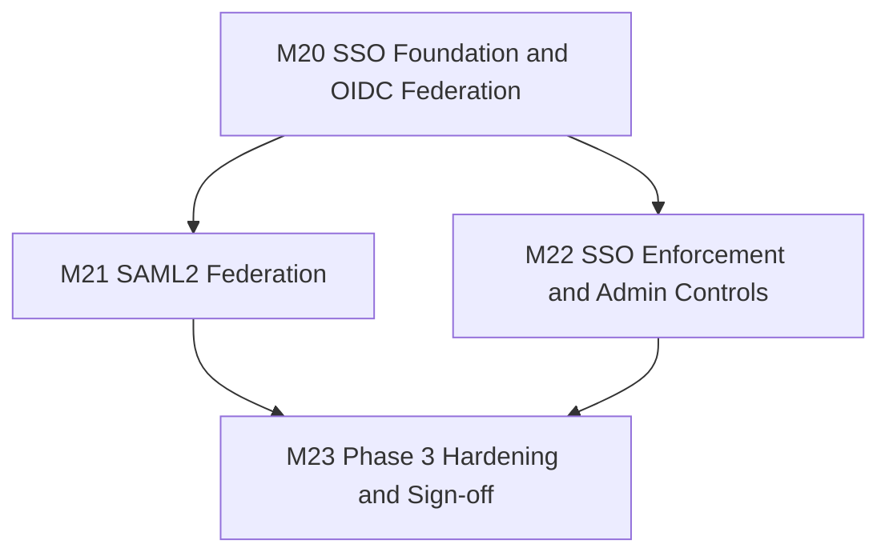

# eDMS — Implementation Plan (Phase 3: Federation)

| | |
|---|---|
| **Version** | 1.2 |
| **Status** | Active — update in place as work lands |
| **Date** | 2026-08-17 |
| **Audience** | AI coding agents (OpenCode + DeepSeek, Claude Code, or any other tool) implementing eDMS |
| **Companion documents** | `functional-spec.md` (what/why), `technical-design-spec.md` (how), `AGENTS.md` (repo rules & navigation), [`ImplementationPlan V1.1.md`](ImplementationPlan%20V1.1.md) (superseded — Phase 2's plan, historical reference only), [`ImplementationPlan V1.0.md`](ImplementationPlan%20V1.0.md) (archived — Phase 1's original plan, historical reference only) |

## 1. Purpose & Relationship to Other Docs

V1.1 closed out Phase 1's remaining gaps (M10–M11) and then implemented Phase 2 in full (M12–M19). As of this writing, **every milestone in V1.1 is marked `Done`**, and that status was spot-checked against actual source — `ApplicationUser`, `AuthController`, the admin settings surface, `docker-compose.yml`, and the ADR table in TDS §2.4 were all read directly, not assumed from the file's own claims (§3 below records what was found).

This document plans **Phase 3** (FS §15's third and — as the functional spec currently stands — final phase): federated authentication.

```
FR-AUTH-09  SAML2 federated login, JIT-provisioned
FR-AUTH-10  OIDC federated login, JIT-provisioned
FR-AUTH-11  SSO-enforcement admin controls (per-user or global)
```

That is the **entire** Phase 3 scope per FS §15 — three requirements, versus Phase 2's fifteen (FR-DOC-10/11/12, FR-VER-09, FR-META-03/04, FR-PERM-07, FR-NOTIF-01–05, FR-AUDIT-05, FR-ADMIN-06, FR-UI-08) across eight milestones (M12–M19). Don't let the small requirement count suggest a small plan, though: federated auth is unusually decision-dense per requirement (protocol nuances, a new library dependency with its own compatibility risk, a browser-redirect flow that must not leak a token, an enforcement model FS deliberately leaves for the implementer to design) and it is the **highest-blast-radius surface in the system** — every task below touches the login path, and a mistake here doesn't just break a feature, it can lock out every user or open an authentication bypass. This plan is sized and guarded accordingly: four milestones, nineteen tasks, five new ADRs (V1.1 needed six ADRs total — ADR-8 through ADR-13 — across its ten milestones, M10 through M19; Phase 3 needs five, ADR-14 through ADR-18, across four. Roughly double the ADR-per-milestone density, which is the expected shape for a protocol-integration phase rather than a feature-breadth phase).

FS §15 names two things beyond FR-AUTH-09/10/11 in its Phase 3 line — "candidates beyond this spec's scope: retention policies, legal hold, workflow/approval." Read that parenthetical literally: those are **not** Phase 3 scope, they're a note that such requests might come up later and would need their own spec change first (`AGENTS.md` §10, §11 rule 3). Nothing in this plan touches them.

**This document is self-contained.** You should not need to open V1.0 or V1.1 to work from this plan — §3 below carries forward everything from them that's still relevant to Phase 3 work. Open the earlier plans only if you want Phase 1/2's task-by-task history.

**The archive-and-repoint already happened.** Mirroring exactly how V1.0 was marked superseded the moment V1.1 was created (compare `ImplementationPlan V1.0.md`'s header — dated the same day as V1.1, not the day Phase 1's leftover work actually finished), `ImplementationPlan V1.1.md`'s header was updated to "Superseded by V1.2" and `AGENTS.md`/`README.md` were repointed to this file as part of *creating* this document, not deferred to Phase 3's sign-off. So don't be confused that the pointers already lead here while every task below still reads `Not Started` — that's expected, it's the same sequencing V1.0→V1.1 used. What M23.7 later updates is the *prose* in those files (flipping "federation planned" language to "federation done"), not the pointer itself.

## 2. How to Use This Plan

Unchanged from V1.0/V1.1 — the conventions worked for two phases, keep using them:

- **Start here every session.** Find the first task whose `Status` is not `Done` and whose `Depends on` tasks are all `Done`. That is your next task.
- **Update the Status column in the same commit that completes the task.** Valid values: `Not Started` (default), `In Progress`, `Done`, `Blocked` (+ a one-line reason in the Task cell).
- **Don't start a task whose dependencies aren't `Done`.**
- **If this file's Status looks stale, trust the repository over the file** — fix the file, then proceed.
- **One task, one commit (or a small tight series), referencing the task ID** — e.g. `feat: OIDC JIT provisioning + handoff-code exchange (M20.1)`.
- **A milestone is "done" only when every task in it is `Done` *and* its Demo-able outcome is actually true.**
- Every task links back to `FR-*` IDs and/or `TDS §*` sections — read those before implementing, per `AGENTS.md` §2.
- **New for this phase — read the ADR before writing the corresponding code.** Five tasks below (M20.1, M20.2, M20.3, M21.1, M22.1) each require recording a new ADR (ADR-14–18) *before* the implementation it governs, not after. These aren't paperwork — each one resolves a real ambiguity that FS/TDS leave open, and getting it wrong is expensive to unwind in an auth subsystem (§4 principle 9 explains why).

## 3. Current State Snapshot (as of 2026-08-17)

Verified directly against `server/` and `client/` source, the same discipline V1.1 §3 used — not inferred from README/AGENTS.md's own claims alone.

### 3.1 Phase 1 + Phase 2 — confirmed done

`README.md` and `AGENTS.md` both state Phase 2 (M0–M19) is complete. Spot-checks confirm it: `AuthController.cs`, `AdminController.cs`/`IAdminService.cs`, `AdminUsersController.cs`/`IUserManagementService.cs`, `docker-compose.yml` (6 services: postgres, mailhog, office-converter, text-extractor, api, web), and TDS §2.4's ADR table (ends at **ADR-13**) all match what V1.1 §10's history row claims was built. No open Phase 1/2 items were found. This plan's new ADRs are therefore **ADR-14** onward.

### 3.2 What already exists for this phase — don't rebuild it

Phase 1 deliberately reserved room for federation so Phase 3 wouldn't need a data-model rewrite. Confirmed still true today:

| Already in place | Where | Notes |
|---|---|---|
| `AuthProvider` enum with `Local`/`Saml`/`Oidc` values | `server/src/eDMS.Domain/AuthProvider.cs` | Only `Local` is ever assigned today — `Saml`/`Oidc` are unused until this plan |
| `ApplicationUser.AuthProvider` / `.ExternalId` columns | `server/src/eDMS.Domain/ApplicationUser.cs` | `ExternalId` is nullable, currently always null |
| `ITokenService.IssueTokenPairAsync` | `server/src/eDMS.Application/Common/Interfaces/ITokenService.cs` | TDS §5.5's explicit design intent: SSO must call this **same** method local login uses — don't build a parallel token-issuance path |
| `IAuthService` (`LoginAsync`, `RefreshAsync`, `RevokeRefreshTokenAsync`, `GetCurrentUserAsync`, password reset) | `server/src/eDMS.Application/Auth/IAuthService.cs` | This plan **extends** this interface with one new method (M20.1) rather than introducing a second auth service |
| `RefreshTokenCookie` helper (`.Append`/`.Clear`) | `server/src/eDMS.Api/Auth/` | Reused as-is by the new SSO exchange endpoint — same cookie, same rotation semantics |
| `AppSetting` key/value admin store + `IAdminService`/`AdminSettingsDto` | `server/src/eDMS.Domain/AppSetting.cs`, `server/src/eDMS.Application/Admin/IAdminService.cs` | Extended, not replaced, by M22.1 |
| Admin Settings / Admin Users pages | `client/src/pages/admin/settings.tsx`, `client/src/pages/admin/users.tsx` | Extended, not replaced, by M22.2 |
| `login.tsx` + `auth-context.tsx` | `client/src/pages/login.tsx`, `client/src/features/auth/auth-context.tsx` | Extended, not replaced, by M20.4 |

### 3.3 What does not exist yet — confirmed by direct search

Zero hits for `Saml`/`Oidc`/`SSO` package references or endpoints anywhere in `server/` or `client/` beyond the reserved enum/columns above. No SAML or OIDC NuGet package is referenced in any `.csproj`. No `/auth/sso/*` route exists. Neither `prototype(html)/` nor `Prototype(React)/` has any SSO/federated-login page to mirror — this is genuinely new UI territory; follow shadcn conventions and match `login.tsx`'s existing visual language instead (§4 principle 5 restates this).

### 3.4 Noted, not in scope for this plan

`.github/workflows/` currently has `ci.yml` and `deploy-staging.yml` only — TDS §11.3 describes a third workflow (`deploy-prod.yml`) that was never created; this predates this plan (V1.1's M11.6 scoped itself to staging only) and isn't blocking Phase 3 work. Flagged for awareness, not a task in this plan — don't silently fold a production-deploy workflow into a Phase 3 task under a different label.

## 4. Guiding Principles

Carried forward from V1.1 §4 — still correct:

1. **Vertical slices over horizontal layers** — with the same foundation-first exception V1.1's M10.5 established: a shared horizontal seam (M20.1) is built once, then OIDC and SAML are vertical slices on top of it.
2. **Backend before its corresponding frontend, but not all backend before any frontend.**
3. **Tests land with the code, not after it.**
4. **Don't build ahead of the roadmap.** FS §15 defines no Phase 4. This plan's scope is exactly FR-AUTH-09/10/11 — nothing past it belongs here (§1, §8 below).
5. **The prototype is a UX reference, never a code source** — with the caveat noted in §3.3: no prototype page covers SSO login/admin UI, so there is nothing to mirror here. Match the shadcn/Tailwind visual language already established in `login.tsx` and the admin pages instead.
6. **When in doubt, re-read `AGENTS.md` §7 (Non-Negotiable Rules)** before writing code, not after review flags it.
7. **Verify before trusting any status label — including this file's.** Every claim in §3 was checked against actual source, not copied from README/AGENTS.md's own claims. Repeat that discipline before starting any task here.
8. **Small, explicit steps — even more so this phase.** This is written for an agent (OpenCode + DeepSeek) that may run for hours unattended, committing and pushing milestone by milestone with no human reviewing each step. Auth code is the one place where "looked right, moved on" is not an acceptable bar. If a task still feels too large to finish confidently in one sitting, split it further.
9. **Record architecturally significant decisions as new ADRs.** This phase's five (ADR-14 through ADR-18, assigned to specific tasks below) resolve real ambiguities FS/TDS leave open: a library-compatibility risk TDS flags nowhere, a state-handoff mechanism TDS's existing sequence diagrams don't cover, and an enforcement model FR-AUTH-11 states as an outcome ("System Admin shall be able to enforce SSO-only login") without specifying the mechanism.
10. **No anonymous access, ever.** JIT-provisioning via SSO (FR-AUTH-09/10) is safe specifically *because* the IdP is the organization's own trusted internal identity system (FS §2.2) — a user who successfully authenticates against the org's Entra ID/Okta/etc. is, by definition, an internal user. This is not a path to external/unauthenticated access and must never become one. A JIT-provisioned account starts with **zero site memberships**, exactly like an admin-created local account (TDS §6.5) — SSO grants an identity, never permissions.
11. **NEW — auth is the highest-blast-radius surface in the system.** Every task below touches the login path. The "don't mark `Done` without X" callouts on M20.1, M21.1, M22.1, and M23.5 are load-bearing in the same way V1.1 treated its M10.1 permission-resolver callout — don't skip the specified tests to move faster.

## 5. Milestone Overview



M21 and M22 both depend only on M20 (its foundation task, specifically) and may be worked in either order or in parallel by separate sessions — same "fan out, converge on the hardening milestone" shape V1.1 used for M12–M18 converging on M19.

| Milestone | Goal | Demo-able outcome | Status |
|---|---|---|---|
| [M20](#m20--sso-foundation--oidc-federation) | Shared federation plumbing + OIDC (FR-AUTH-10) | A user clicks "Sign in with SSO" on the login page, authenticates against a real OIDC identity provider, and lands in eDMS signed in — with a brand-new account JIT-provisioned on first login and zero site access until an admin grants some | Not Started |
| [M21](#m21--saml2-federation) | SAML2 (FR-AUTH-09) | The same experience via SAML2 — a user authenticates against a SAML IdP and lands in eDMS signed in, reusing M20's shared exchange/callback UI | Not Started |
| [M22](#m22--sso-enforcement--admin-controls) | SSO enforcement (FR-AUTH-11) | A System Administrator turns on "Require SSO for all logins"; every non-exempt user's password login is then rejected with a clear message, while at least one designated account can still log in locally | Not Started |
| [M23](#m23--phase-3-hardening--sign-off) | Phase 3 sign-off | FS §15 Phase 3 checklist (FR-AUTH-09/10/11) fully satisfied; same hardening bar M11/M19 proved, re-run for federation's additions, plus a dedicated auth-specific security pass | Not Started |

## 6. Detailed Milestones — Phase 3 (FS §15)

Columns match V1.1: **Track** — `BE` backend, `FE` frontend, `INF` infra/tooling, `DOC` documentation, `Both` cross-cutting. **Size** — `S` small/mechanical, `M` moderate, `L` complex/high-stakes.

### M20 — SSO Foundation & OIDC Federation

| Status | ID | Track | Task | Depends on | Size | Refs |
|---|---|---|---|---|---|---|
| Not Started | M20.1 | BE | **Shared SSO foundation.** Add `Task<AuthResult?> CompleteSsoExchangeAsync(string code, string? ipAddress, CancellationToken ct)` to `IAuthService` (`server/src/eDMS.Application/Auth/IAuthService.cs`) — it must return the exact same `AuthResult` shape `LoginAsync` does so `AuthController` can share the cookie/response code (extract the current `Login` action's cookie-append + `LoginResponse` construction into a small private helper both actions call). Add `IJitProvisioningService.ProvisionOrLinkAsync(AuthProvider provider, string externalId, string email, string displayName, CancellationToken ct)`: look up `ApplicationUser` by `(AuthProvider, ExternalId)` first; if not found, fall back to a case-insensitive `Email` match against a `Local`-provider account and **link** it (update that row's `AuthProvider`/`ExternalId` in place, don't create a duplicate); if still not found, JIT-create a new `ApplicationUser` with `IsActive = true`, `IsSystemAdmin = false`, **no site memberships** (principle 10). Reject (return null / throw a typed exception the caller maps to 401) if the resolved user has `IsActive == false` — SSO must not resurrect a deactivated account (FR-AUTH-07). Add `ISsoHandoffCodeStore` backed by a **new DB table**, not `IMemoryCache` — see the note below — with `IssueAsync(Guid userId, ct) : Task<string>` (returns the opaque code; persists only its SHA-256 hash, mirroring `refresh_tokens.token_hash`) and `ConsumeAsync(string code, ct) : Task<Guid?>` implemented as a single atomic conditional `UPDATE ... SET consumed_at = now() WHERE code_hash = @hash AND consumed_at IS NULL AND expires_at > now() RETURNING user_id` — a naive read-then-write risks a replay race. Migration (all four provider sets per `AGENTS.md` §6) adds `sso_handoff_codes(id, code_hash UNIQUE, user_id FK, expires_at, consumed_at NULL)`, 60-second TTL. New endpoint `POST /auth/sso/exchange { code }` on `AuthController`, `[AllowAnonymous]`, calling the new service method, on success logs `AuditAction.Login` (reuse — don't add a new enum value) the same way local login does. **Record ADR-14** in TDS §2.4 explaining the DB-backed-not-IMemoryCache choice: TDS §5.3 already accepted `IMemoryCache` staleness for the *permission* cache because a stale read is low-risk and self-correcting within 30s; a handoff code is different — it's a one-time bearer credential for token issuance, the exchange call can legitimately land on a *different* API instance than the one that issued the code behind a load balancer (NFR: "API shall be stateless... to allow horizontal scaling", FS §7), and losing that state to a process-local cache would silently break login for a fraction of users the moment there's more than one instance. | M19 | L | ADR-14, TDS §5.5, §5.3 (contrast), FS §7 NFR — **highest-risk task in this plan; don't mark `Done` without: a replay test (consuming the same code twice, second call fails), an expiry test, a deactivated-user-rejection test, an existing-local-account-linking test (not a duplicate-user test), and a genuinely-new-user JIT test asserting zero site memberships** |
| Not Started | M20.2 | BE | **OIDC wiring.** Add `Microsoft.AspNetCore.Authentication.OpenIdConnect` to `eDMS.Api`. Register it in `Program.cs` alongside the existing `AddJwtBearer` registration (`Program.cs` already calls `.AddAuthentication(JwtBearerDefaults.AuthenticationScheme).AddJwtBearer(...)` — add `.AddCookie(...)` as the OIDC handler's sign-in scheme for the redirect-handshake correlation/nonce state, and `.AddOpenIdConnect(...)` as a **named, non-default** scheme so it doesn't interfere with the existing Bearer-token validation used by every other endpoint) sourced from a new `Oidc:{Authority, ClientId, ClientSecret, CallbackPath}` config section (env-var-sourced, same convention as `Jwt:*`/`Smtp:*`, TDS §11.4 — add placeholders to `.env.example`). Only register the OIDC scheme when `Oidc:Authority` is non-empty, so a deployment that hasn't configured it doesn't fail to start. New endpoints on a new `SsoController` (or extend `AuthController` — pick one and be consistent): `GET /auth/sso/oidc/challenge` issues a `ChallengeResult` for the OIDC scheme (redirects the browser to the IdP); the `OnTokenValidated` event extracts `sub`/`email`/`name` claims, calls `IJitProvisioningService.ProvisionOrLinkAsync` (M20.1), calls `ISsoHandoffCodeStore.IssueAsync`, and redirects to `{Client:BaseUrl}/sso/complete?code=...` (never the access token — see M20.4's non-negotiable). Add `GET /auth/sso/providers` returning which of `{oidc, saml}` are currently configured (config-section-present is sufficient signal for this milestone; M22 layers an admin on/off toggle on top). **Record ADR-15**: confirm `Microsoft.AspNetCore.Authentication.OpenIdConnect`'s currently-published version targets `net10.0` before depending on it (first-party Microsoft package — low risk, but verify, don't assume) and note the `.AddCookie()` correlation-scheme requirement explicitly, since it's the single most common OIDC-in-ASP.NET-Core setup mistake. | M20.1 | L | ADR-15, FR-AUTH-10, TDS §5.5 |
| Not Started | M20.3 | INF | **Containerized test/demo OIDC provider.** Add a mock OIDC provider (e.g. `ghcr.io/soluto/oidc-server-mock`, or an equivalent actively-maintained image — verify it still exists/is maintained before committing to it) to `docker-compose.yml` as its own service, mirroring the M13.1/M17.1 "heavyweight dependency gets its own container" pattern — pre-configured (via its config-mount or env vars) with one test client matching M20.2's `Oidc:ClientId`/`CallbackPath` and one demo user, so `docker compose up -d` gives a fully working, clickable SSO demo out of the box, the same way `mailhog` demos email today. Also wire the same image into `eDMS.IntegrationTests` via `Testcontainers` (the project already depends on `Testcontainers.PostgreSql` per M10.1 — add the generic `Testcontainers` container-builder for this image the same way) so the integration test in M20.5 exercises a real, cryptographically-signed OIDC round trip rather than a hand-mocked token. **Record ADR-16**: containerized test IdPs (this task, reused verbatim by M21.2 for SAML) over hand-mocking the protocol in test code — a hand-mocked "IdP" can't catch a real signature-validation or clock-skew bug, which is exactly the class of bug most likely to slip through in a rushed federation implementation. | M20.1 | M | ADR-16, TDS §12.1 |
| Not Started | M20.4 | FE | **Login page SSO entry + callback page.** In `login.tsx`, fetch `GET /auth/sso/providers` on mount and conditionally render a "Sign in with SSO" button per enabled provider — this must be a real browser navigation (`window.location.href = "/api/v1/auth/sso/oidc/challenge"`), **not** an `apiClient`/`fetch` call, since the IdP redirect chain isn't something an XHR can follow. Add a new route + page, `client/src/pages/sso-complete.tsx` at `/sso/complete`: reads `?code=` (and a `?error=` case for IdP-side failures) from the URL, calls the new `POST /auth/sso/exchange` (add it to `features/auth/api.ts` alongside the existing `login`/`logout`/`me` calls), and on success reuses `auth-context.tsx`'s token/user-setting logic (refactor `login()`'s internal state-setting into a small shared helper `completeAuth(response)` that both `login()` and a new `completeSso(code)` call, rather than duplicating the `setAccessToken`/`setUser`/`setStatus` lines) then navigates to `/`. On failure, show a friendly error with a link back to `/login` — don't leave a blank page. **Non-negotiable, not a style preference:** the access token must never appear in a URL, browser history entry, or any `GET` request's query string at any point in this flow — only the one-time opaque `code` does, and §M20.1 already made it single-use and 60-second-lived. Verify this by inspecting the actual network requests/URLs during manual testing, not just by reading the code. | M20.1, M20.2 | M | FR-AUTH-10, TDS §7.3 (access-token-in-memory-only rule) |
| Not Started | M20.5 | Both | **Tests for M20.** Unit: `IJitProvisioningService` (new user → zero site memberships; existing local user → linked, not duplicated; deactivated user → rejected; `(provider, externalId)` match takes precedence over email match on a second login). Integration: full `GET /auth/sso/oidc/challenge` → (drive the M20.3 container's login form) → callback → `POST /auth/sso/exchange` round trip using `WebApplicationFactory` + the M20.3 Testcontainer, asserting a real access token comes back. Frontend: `login.tsx` conditionally renders the SSO button based on `/auth/sso/providers`; `sso-complete.tsx` covers both the success and `?error=` paths. E2E (Playwright): one happy-path scenario — login page → click "Sign in with SSO" → complete the mock IdP's login form → land back in eDMS authenticated. | M20.2, M20.3, M20.4 | M | TDS §12.1–§12.3 |

> **M20.1 carries the same risk profile V1.1 flagged for its M10.1.** It's the seam every subsequent Phase 3 task builds on, and a subtle bug here (a replay-able handoff code, an account-linking bug that lets one email hijack another's local account, a JIT-provisioned user that somehow inherits permissions) is an authentication-bypass class of bug, not a feature bug. Don't mark it `Done` without the specific tests listed in its row.

### M21 — SAML2 Federation

| Status | ID | Track | Task | Depends on | Size | Refs |
|---|---|---|---|---|---|---|
| Not Started | M21.1 | BE | **SAML2 SP wiring**, reusing M20.1's shared `IJitProvisioningService`/`ISsoHandoffCodeStore`/exchange endpoint unchanged. Add a SAML2 SP library — FS §3 suggests `Sustainsys.Saml2` (`Sustainsys.Saml2.AspNetCore2`); **before locking this in, verify the currently-published version actually targets/supports `net10.0`** the same way ADR-8 had to verify Pomelo's EF Core 10 support and rejected it when it lagged. If `Sustainsys.Saml2.AspNetCore2` doesn't yet support `net10.0`, fall back to `ITfoxtec.Identity.Saml2` (the other actively-maintained .NET SAML2 SP library) — either is acceptable, but the choice actually made and why must be recorded, not silently guessed. New endpoints: `GET /auth/sso/saml/challenge` (SP-initiated redirect to the IdP), `POST /auth/sso/saml/acs` (Assertion Consumer Service — SAML responses arrive via **POST binding**, not a query-string redirect; this endpoint must be `[AllowAnonymous]` and is *not* covered by TDS §14's existing CSRF reasoning, which assumes Bearer-token same-origin calls — its protection is the assertion's XML signature, validated by the library, not CSRF tokens), and `GET /auth/sso/saml/metadata` (SP metadata document so the IdP side can be configured from ours — standard SAML practice). Extract `NameID` as `ExternalId`; extract email from a **configurable** attribute claim (`Saml:EmailAttributeName`, default the common `.../claims/emailaddress` URI) rather than a hardcoded one — the exact attribute name varies by IdP and hardcoding it is the single most common reason a SAML integration works against one IdP and silently fails against another. Config section `Saml:{IdpMetadataUrl-or-cert, EntityId, SigningCertificate, EmailAttributeName}`, env-var-sourced, same convention as `Oidc:*`/`Jwt:*`. **Record ADR-17**: the library choice actually made (and net10.0 verification outcome), plus the NameID/email-attribute extraction design. | M20.1 | L | ADR-17, FR-AUTH-09, TDS §5.5 — **second-highest-risk task in this plan; SAML's XML-signature validation is exactly the kind of thing that must be delegated to the library, never hand-rolled** |
| Not Started | M21.2 | INF | **Containerized test/demo SAML IdP**, mirroring M20.3's pattern (e.g. a SimpleSAMLphp-based test-IdP image such as `kristophjunge/test-saml-idp`, or equivalent — verify current maintenance status before committing) added to `docker-compose.yml`, pre-configured with an SP entry matching M21.1's metadata and a demo user; also wired into `eDMS.IntegrationTests` via `Testcontainers`, same shape as M20.3. Reuses ADR-16 — no new ADR needed, this is the same decision applied to the second protocol. | M21.1 | M | ADR-16 (reused), TDS §12.1 |
| Not Started | M21.3 | FE | Add the SAML "Sign in with SSO" button variant to `login.tsx` (`window.location.href` to `GET /auth/sso/saml/challenge`) — this is `S`, not `M`, specifically because it reuses M20.4's `/sso/complete` page and `POST /auth/sso/exchange` call verbatim; no new frontend plumbing is needed beyond the second button and updating `GET /auth/sso/providers`'s response to reflect SAML as configured. | M20.4, M21.1 | S | FR-AUTH-09 |
| Not Started | M21.4 | Both | **Tests for M21**, mirroring M20.5's shape for the SAML path: unit tests for assertion-claims → JIT-provisioning mapping (including the configurable email-attribute lookup); integration test for the full SP-initiated flow against the M21.2 container, **plus an explicit negative test asserting a tampered/unsigned assertion is rejected** (don't only test the happy path on a security-critical validation step); Playwright E2E happy path through the mock IdP's login form. | M21.1, M21.2, M21.3 | M | TDS §12.1–§12.3 |

### M22 — SSO Enforcement & Admin Controls

FR-AUTH-11 states the outcome ("System Admin shall be able to enforce SSO-only login... per user or globally") but not the mechanism — that's a real design gap this milestone has to fill, not an oversight to work around.

| Status | ID | Track | Task | Depends on | Size | Refs |
|---|---|---|---|---|---|---|
| Not Started | M22.1 | BE | **Enforcement data model + logic.** Migration (all four provider sets) adds two columns to `ApplicationUser`: `LocalLoginDisabled` (bool, default false — an admin has explicitly forced *this* user to SSO-only, independent of the global switch) and `SsoExempt` (bool, default false — this user may always use local login even when the global switch is on; the break-glass mechanism). Add `AppSettingKeys.SsoEnforcedGlobally` to the existing `AppSetting` store (`server/src/eDMS.Domain/AppSetting.cs`). Effective rule, evaluated in `LoginAsync`: `canUseLocalLogin = !user.LocalLoginDisabled && (!ssoEnforcedGlobally || user.SsoExempt)`; when false, reject with a **distinguishable** error — extend the Problem Details response (TDS §5.7's existing exception→status mapping) with a specific `type: urn:edms:sso-required` on this path rather than the bare `Unauthorized()` local login already returns for wrong credentials, so the frontend (M22.2) can tell the two apart and show the right message. Extend `UpdateAdminSettingsRequest`/`AdminSettingsDto` (`server/src/eDMS.Application/Admin/IAdminService.cs`) with `bool? SsoEnforcedGlobally` (nullable-partial-patch, matching that record's existing convention — **not** the same convention as the next change). Extend `UpdateUserRequest`/`AdminUsersController.Update` (`server/src/eDMS.Api/Controllers/AdminUsersController.cs`, `IUserManagementService`) with non-nullable `bool LocalLoginDisabled, bool SsoExempt` (matching *that* record's existing full-replace convention, alongside `DisplayName`/`IsSystemAdmin`) — the two endpoints use different patch semantics today; extend each in its own existing style rather than unifying them as part of this task. **Add a safety-rail beyond FR-AUTH-11's literal text**: the settings-update validator must reject turning `SsoEnforcedGlobally` from false→true if doing so would leave **zero** `IsSystemAdmin` users with `SsoExempt == true` — without this, an admin can accidentally lock out every administrator with one settings change, which costs nothing to prevent and a great deal to recover from. **Record ADR-18** covering this whole model (the two-flag design, why a third flag beyond FR-AUTH-11's literal "per user / globally" was needed, and the safety-rail's justification). | M20.1 | M | ADR-18, FR-AUTH-11 |
| Not Started | M22.2 | FE | Admin Settings page (`client/src/pages/admin/settings.tsx`) gets an "SSO" section: the global enforcement toggle (surfacing the M22.1 safety-rail's rejection as an inline form error when it fires, not a silent no-op) plus a read-only display of which providers are currently configured (from `GET /auth/sso/providers`). Admin Users page (`client/src/pages/admin/users.tsx`) gets the per-user `LocalLoginDisabled`/`SsoExempt` toggles in its existing edit surface. `login.tsx` surfaces the new `urn:edms:sso-required` error distinctly ("This account requires SSO — use the button above" or similar) instead of the generic "Invalid email or password." | M22.1 | M | FR-AUTH-11 |
| Not Started | M22.3 | Both | **Tests for M22.** Unit: the enforcement decision function across all four boolean combinations of `(LocalLoginDisabled, SsoEnforcedGlobally, SsoExempt)`, plus the safety-rail (attempting to enable global enforcement with zero exempt admins is rejected; with one, it succeeds). Integration: `PUT /admin/settings` rejecting the lockout scenario end-to-end. Frontend: the two new toggles and the distinct login error message. | M22.1, M22.2 | S | TDS §12.1–§12.2 |

> **M22.1's safety-rail is not optional scope-padding.** A System Administrator locking out every admin account is a severe, fully self-inflicted operational incident — the kind of thing `AGENTS.md`'s risk-awareness principles exist to prevent. Don't cut it to make the task smaller.

### M23 — Phase 3 Hardening & Sign-off

| Status | ID | Track | Task | Depends on | Size | Refs |
|---|---|---|---|---|---|---|
| Not Started | M23.1 | Both | Extend the Playwright E2E suite: full OIDC flow, full SAML flow, SSO-enforcement blocking local login while the break-glass exempt account still works, and the "provider not configured" case degrading gracefully (no button shown, no broken link) rather than erroring. | M20 (all), M21 (all), M22 (all) | L | TDS §12.2 |
| Not Started | M23.2 | BE | Validator-coverage re-audit (the parameterized test from V1.1's M11.1/M19.4) including every Phase 3 command. | M20 (all), M21 (all), M22 (all) | S | TDS §5.2 |
| Not Started | M23.3 | FE | Accessibility pass on all new SSO UI: login page's new buttons, `/sso/complete`'s loading/success/error states, the Admin Settings SSO section, the per-user toggles on Admin Users. | M20.4, M21.3, M22.2 | M | FS §7 NFR |
| Not Started | M23.4 | FE | Responsive/mobile re-verification on the same new UI. | M20.4, M21.3, M22.2 | S | FS §7 NFR |
| Not Started | M23.5 | Both | **Dedicated auth-specific security review pass** — narrower and more pointed than a generic code review, because this is the highest-blast-radius surface in the system (principle 11). Explicitly verify, and write down the result of each: (a) no access token, refresh token, or SAML assertion ever appears in a URL, browser history entry, or server log at any point in either flow; (b) a deactivated user cannot regain access via SSO (re-run FR-AUTH-07's deactivation test against both federated paths, not just local login); (c) a consumed or expired handoff code genuinely cannot be replayed (M20.1's test, re-verified here against both providers' real callback paths, not just the unit test's synthetic input); (d) the M22.1 safety-rail actually prevents total admin lockout under a real `PUT /admin/settings` call, not just the unit-level decision function; (e) a tampered/unsigned SAML assertion and an OIDC token with an invalid signature are both rejected (M21.4's negative test, confirmed still passing here). | M20 (all), M21 (all), M22 (all) | M | TDS §10, AGENTS.md §7 |
| Not Started | M23.6 | INF | Update `docker-compose.yml`, `.env.example`, and the deploy workflow(s) that exist (`deploy-staging.yml` — see §3.4) for the two new test-IdP containers and the new required secrets (OIDC client secret, SAML signing certificate/key) — resource sizing notes and health checks, following the same pattern M19.5 used for M13/M17's containers. | M20.3, M21.2 | S | TDS §11 |
| Not Started | M23.7 | DOC | `AGENTS.md`/`README.md` already point at this file (§1's note above) — this task updates their **prose**, not their pointers: flip "federation planned"/"in progress" language to "done" now that M20–M22 are actually `Done`, the same role V1.1's M19.6 played for Phase 2. This is the point where Phase 3, and the functional spec's entire currently-defined roadmap (FS §15), is actually, verifiably done — see §8. | M23.1–M23.6 | S | — |

## 7. Sequencing Risks

Distinct from TDS §14.1's technical risks — these are about order and handoff across many independent, stateless agent sessions, same framing V1.1 §8 used.

| Risk | Impact | Mitigation |
|---|---|---|
| M20.1's handoff-code/JIT-provisioning seam has a subtle bug (replay, account-linking hijack, permission leakage into a new account) | Authentication-bypass class of bug, discovered late, after M21/M22 have already built on top of it | Don't mark M20.1 `Done` without the specific tests in its row; M23.5 re-verifies the same properties end-to-end as a second, independent pass |
| A SAML or OIDC library doesn't actually support `net10.0` at implementation time, discovered mid-task | Wasted work if discovered after M21.1/M20.2 is partly built against it | ADR-15/ADR-17 explicitly require verifying current package support *before* committing to the dependency, mirroring the lesson ADR-8 already recorded for Pomelo/MySQL |
| The redirect-heavy SSO flow puts a token in a URL, log line, or browser-history entry by accident | Credential leakage — far more severe than a typical bug, and easy to miss because the happy path still "works" visually | M20.4 states the no-token-in-URL rule as non-negotiable, not a style note; M23.5 re-verifies it explicitly rather than trusting the original implementation review |
| M22.1's global SSO enforcement is shipped without the safety-rail, or the safety-rail is later removed "to simplify" | An admin locks out every administrator account in one settings change | Called out twice (M22.1's row and the callout beneath M22's table) specifically so it isn't quietly dropped under time pressure |
| Containerized test IdPs (M20.3/M21.2) are hard to get working in CI even though they work locally (redirect URI mismatches, clock skew, discovery-document caching) | M20.5/M21.4/M23.1's integration and E2E tests become flaky or get skipped, silently weakening the highest-risk milestone's actual test coverage | ADR-16 names the risk explicitly; if a specific test-IdP image proves unworkable, record why in the ADR and pick the alternative named in M20.3/M21.2's task text rather than dropping the integration test tier entirely |
| Two sessions work on M21 (SAML) and M22 (enforcement) in parallel, both correctly depending only on M20.1 | Low risk of conflict since they touch different files, but both may reasonably want to touch `login.tsx` and `GET /auth/sso/providers`'s response shape at the same time | Check recent git log before starting either — `GET /auth/sso/providers`'s shape is fixed by M20.2; M21.3 only adds a value to it, doesn't change its shape |
| This file's Status drifts from reality over many sessions | Wasted work re-doing or second-guessing already-finished tasks | "Trust the repo over the file" (§2) — fix the file, don't work around the discrepancy silently |

## 8. Beyond Phase 3

FS §15 does not define a Phase 4. Once M23 is `Done`, every phase the functional spec currently describes is complete. This is a deliberate stopping point, not an oversight to fill in — per `AGENTS.md` §11 rule 3, any further work (the retention/legal-hold/workflow candidates FS §15's Phase 3 line names as explicitly out of scope, or anything else) requires a new functional-spec decision first, the same way Phase 2 and Phase 3 each did, before it gets its own `ImplementationPlan V1.3.md`. Don't infer scope here; surface the question to the user instead, per `AGENTS.md` §11 rule 3.

## 9. Document History

| Version | Date | Change |
|---|---|---|
| 1.2 | 2026-08-17 | Phase 3 plan: M20 (SSO foundation + OIDC, FR-AUTH-10), M21 (SAML2, FR-AUTH-09), M22 (SSO enforcement, FR-AUTH-11), M23 (Phase 3 hardening/sign-off). Five new ADRs recorded (ADR-14–18): DB-backed SSO handoff-code exchange, OIDC library/flow, containerized test-IdP strategy, SAML library/flow, and the SSO-enforcement model with its lockout safety-rail. Verified Phase 1+2 (V1.1, M0–M19) fully `Done` against actual source before planning on top of it (§3). This is the functional spec's currently-final phase (§8) — no Phase 4 placeholder is included, unlike V1.1's Phase 3 placeholder, because FS §15 doesn't define one. |
