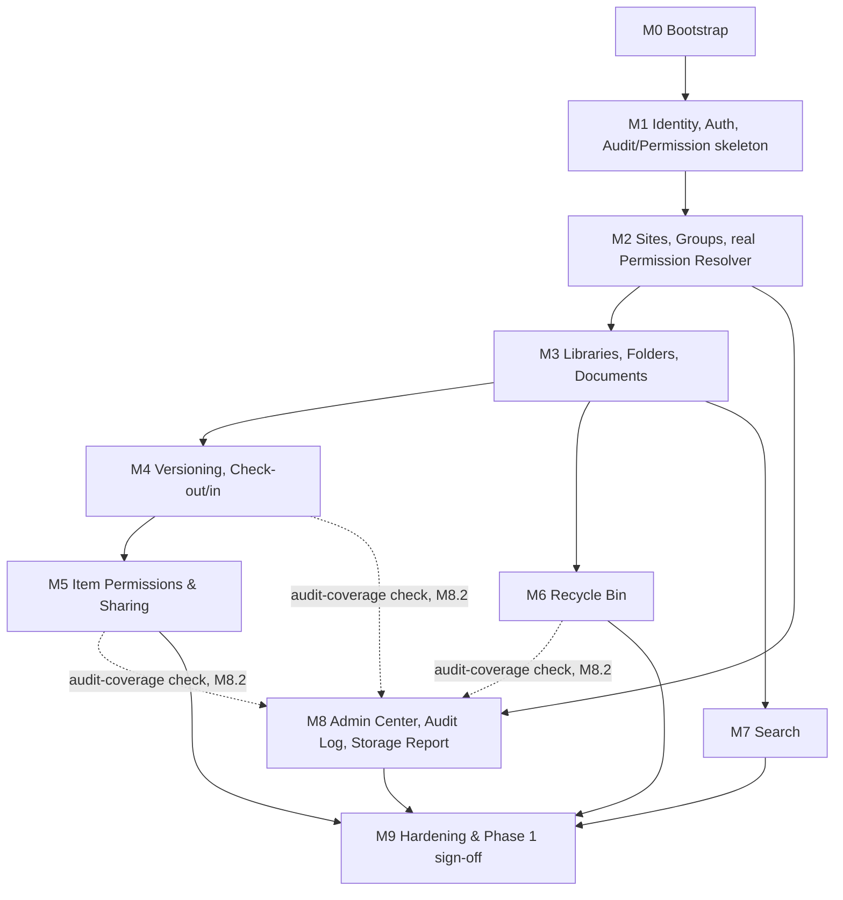

# eDMS — Implementation Plan

| | |
|---|---|
| **Version** | 1.0 |
| **Status** | Active — update in place as work lands |
| **Date** | 2026-08-15 |
| **Audience** | AI coding agents (OpenCode, DeepSeek-backed or otherwise, Claude Code, or any other tool) implementing eDMS |
| **Companion documents** | `functional-spec.md` (what/why), `technical-design-spec.md` (how), `AGENTS.md` (repo rules & navigation) |

## 1. Purpose & Relationship to Other Docs

`functional-spec.md` fixes **what** to build. `technical-design-spec.md` fixes **how** to build it. Neither says **in what order**, with **what dependencies**, or **when a step is actually done**. This document is that missing piece: a sequenced, checkable task list from an empty repository to a shippable Phase 1 (MVP, per FS §15).

This plan is written to survive being read by a different agent — possibly a different tool, possibly a different model — in every session. Nobody should need the full conversation history that produced this repo to pick up where the last session left off; the **Status column in this file is the shared memory** across sessions.

## 2. How to Use This Plan

- **Start here every session.** Find the first task whose `Status` is not `Done` and whose `Depends on` tasks are all `Done`. That is your next task.
- **Update the Status column in the same commit that completes the task.** Valid values: `Not Started` (default), `In Progress`, `Done`, `Blocked`. If you mark something `Blocked`, add a one-line reason in the Task cell — don't leave a silent `Blocked`.
- **Don't start a task whose dependencies aren't `Done`.** The dependency graph in §4 is load-bearing, not a suggestion — e.g. you cannot meaningfully build M5's break-inheritance UI against a stub `IPermissionResolver`.
- **If this file's Status looks stale** (e.g. code obviously exists for a task marked `Not Started`), trust the repository over the file, fix the file to match reality, and proceed. `git log --oneline --grep="M3\."`-style searches for a task ID are a fast way to check what already landed.
- **One task, one commit (or a small tight series), referencing the task ID** — e.g. `feat: real IPermissionResolver with recursive CTE (M2.5)`. This keeps the file's claims verifiable against history.
- **A milestone is "done" only when every task in it is `Done` *and* its "Demo-able outcome" is actually true**, not just when the tasks are checked off — the outcome line is the real acceptance test.
- Every task links back to `FR-*` IDs and/or `TDS §*` sections. Read those before implementing, per `AGENTS.md` §2's progressive-disclosure table — this plan tells you **what and when**, the specs tell you **exactly how**.

## 3. Guiding Principles

1. **Vertical slices over horizontal layers.** Within a milestone, get one thing working end-to-end (DB → API → UI) before broadening — matches TDS §3.1's vertical-slice folder structure and produces something demo-able at every milestone boundary, not just at the very end.
2. **Backend before its corresponding frontend, but not all backend before any frontend.** M0's frontend scaffold (shell, routing, design system) can proceed in parallel with M1's backend auth work — it just can't be wired to real data until M1 ships. Don't block the whole frontend track on the whole backend track.
3. **Tests land with the code, not after it.** Each task's acceptance criteria assumes the tests described in TDS §12 exist by the time the task is marked `Done` — "works when I clicked it once" is not the bar.
4. **Default to Phase 1 (MVP).** Every task below is Phase 1 unless explicitly marked P2/P3. Do not pull Phase 2/3 functional requirements forward without a reason recorded inline (§7 lists the two deliberate exceptions already pulled forward, and why).
5. **The prototype is a UX reference, never a code source.** Where a task says "mirror `prototype(html)/…`", it means match the interaction and information architecture — rebuild with the real stack, don't port the vanilla JS (`AGENTS.md` §8).
6. **When in doubt, re-read `AGENTS.md` §7 (Non-Negotiable Rules)** before writing the code, not after review flags it.

## 4. Milestone Overview

Once M3 is `Done`, M4, M6, and M7 have no dependency on each other and may be worked in any order (or in parallel by separate sessions/agents) — M5 is the exception, since breaking inheritance on a document is easiest to reason about once check-out/check-in (M4) already works on that document.

| Milestone | Goal | Demo-able outcome | Status |
|---|---|---|---|
| [M0](#m0--bootstrap) | Repo, solution, CI, local stack exist | `docker compose up` runs a Postgres-backed API and a Vite dev server; CI is green on an empty-but-structured repo | Done |
| [M1](#m1--identity-auth-audit--permission-skeleton) | Real login, tokens, audit trail, admin bypass | Can log in through the real UI, session survives an access-token expiry via silent refresh, a Login row appears in `audit_log_entries` | Not Started |
| [M2](#m2--sites-groups--real-permission-resolver) | Sites/Groups exist; permission resolution is real | Can create a Site, see its default groups, and have the hierarchy-walk permission check actually gate a request | Not Started |
| [M3](#m3--libraries-folders-documents) | Core document lifecycle (no versioning/ACLs/bin yet) | Can upload a file into a folder, see it listed, download it, rename/move/delete it | Not Started |
| [M4](#m4--versioning--check-outcheck-in) | Version history, check-out/in | Re-uploading creates v2; checking out blocks a second user's check-in; a prior version can be restored | Not Started |
| [M5](#m5--item-level-permissions--sharing) | Break-inheritance ACLs, sharing | Denying a user Read on one folder actually blocks them, while the rest of the library stays accessible | Not Started |
| [M6](#m6--recycle-bin) | Soft-delete lifecycle | Delete → appears in bin → restore works → purge job removes items past retention | Not Started |
| [M7](#m7--search) | Full-text, permission-filtered search | Searching returns only documents the current user can Read, ranked by relevance | Not Started |
| [M8](#m8--admin-center-completion-audit-log-storage-report) | Admin settings, full audit coverage, storage report | Every FR-AUDIT-01 action type has appeared in the audit log at least once in testing; storage report renders real per-site usage | Not Started |
| [M9](#m9--hardening--phase-1-sign-off) | NFRs, E2E coverage, sign-off | FS §15 Phase 1 checklist fully satisfied; CI green; ready for a staging deploy per TDS §11 | Not Started |

## 5. Detailed Milestones

Columns: **Track** — `BE` backend, `FE` frontend, `INF` infra/tooling, `DOC` documentation. **Size** — rough complexity, not a time estimate: `S` small/mechanical, `M` moderate/some design judgment, `L` complex or high-stakes, budget it its own session.

### M0 — Bootstrap

| Status | ID | Track | Task | Depends on | Size | Refs |
|---|---|---|---|---|---|---|
| Done | M0.1 | INF | Scaffold `server/` solution: 4 projects + 3 test projects, wired per the reference-direction rule (Domain ← Application ← Infrastructure/Api) | — | M | `AGENTS.md` §5, TDS §2.3, §3.1 |
| Done | M0.2 | INF | Scaffold `client/`: Vite + React + strict TS + React Router; install shadcn, Tailwind CSS 4, TanStack Query, Zustand, react-hook-form, zod | — | M | `AGENTS.md` §5, TDS §7.1 |
| Done | M0.3 | INF | `docker-compose.yml`: Postgres 17, Mailhog, API + Web service definitions (build succeeds even with placeholder app code) | M0.1, M0.2 | S | TDS §11.2 |
| Done | M0.4 | BE | Wire EF Core + Npgsql + `EFCore.NamingConventions`; empty `AppDbContext`; first migration applies cleanly against `docker-compose`'s Postgres | M0.1, M0.3 | S | TDS §6.1 |
| Done | M0.5 | BE | Register MediatR + FluentValidation + Mapster in DI; `ValidationBehavior` pipeline step wired (no-op until commands exist) | M0.1 | S | TDS §5.2 |
| Done | M0.6 | BE | Serilog structured logging; `GET /health` liveness endpoint | M0.1 | S | FS §7 (observability NFR) |
| Done | M0.7 | INF | `.github/workflows/ci.yml`: restore/build/test for both projects (green even with zero tests) | M0.1, M0.2 | S | TDS §11.3 |
| Done | M0.8 | INF | `.env.example` + `appsettings.json` structure documenting every required variable (connection string, JWT key pair, SMTP, seed admin) — no real values | M0.4 | S | TDS §11.4 |

### M1 — Identity, Auth, Audit & Permission Skeleton

> This milestone proves the JWT + rotating-refresh-cookie pattern end-to-end (TDS §9.1's sequence diagram). Nothing past M1 is meaningfully testable without it — don't move on until a browser session survives an access-token expiry via silent refresh, and until a **revoked** refresh token being replayed actually revokes the whole chain (TDS §5.5's reuse-detection callout).

| Status | ID | Track | Task | Depends on | Size | Refs |
|---|---|---|---|---|---|---|
| Done | M1.1 | BE | `ApplicationUser : IdentityUser<Guid>` + Identity migration (`IsSystemAdmin`, `AuthProvider`, `ExternalId`, `AvatarUrl`, `IsActive`, `CreatedAt`, `LastLoginAt`) | M0.4 | S | FS §8.2 ApplicationUser, TDS §5.5 |
| Done | M1.2 | BE | First-run seed: one System Administrator from `Seed:AdminEmail`/`Seed:AdminTempPassword` env vars, forced password reset flag | M1.1 | S | TDS §6.5 |
| Done | M1.3 | BE | `refresh_tokens` table/migration; `ITokenService` — RS256 access token issuance + opaque refresh token with hash-only storage + rotation-with-reuse-detection | M1.1 | M | TDS §5.5 |
| Done | M1.4 | BE | `POST /auth/login`, `POST /auth/logout`, `POST /auth/refresh`, `GET /auth/me` | M1.3 | M | FR-AUTH-01/02/03, TDS §8.2 DTOs |
| Done | M1.5 | BE | Account lockout after 5 failed logins / 15 min cooldown via Identity's built-in `AccessFailedCount`/`LockoutEnd` | M1.4 | S | FR-AUTH-06 |
| Done | M1.6 | BE | `audit_log_entries` table/migration incl. `REVOKE UPDATE, DELETE` grant; `AuditLoggingBehavior` wired for Login/Logout actions | M0.5, M1.4 | M | FR-AUDIT-01 (partial), TDS §6.2, §5.2 |
| Done | M1.7 | BE | `IPermissionResolver` interface + stub implementation (System Administrator bypass only — no hierarchy to walk yet); `AuthorizationBehavior` pipeline step wired | M0.5, M1.1 | M | TDS §5.3, §5.6 |
| Done | M1.8 | BE | Rate limiting on `/auth/login`, `/auth/forgot-password`; `POST /auth/forgot-password` + `/auth/reset-password` (email via `IEmailSender` → Mailhog in dev) | M1.4 | S | FR-AUTH-04, TDS §10.3, §5.7 |
| Done | M1.9 | FE | `lib/api-client.ts` with the 401 → refresh → retry flow; auth context/hook wrapping `GET /auth/me` | M0.2, M1.4 | M | TDS §7.3, §9.1 |
| Done | M1.10 | FE | Login + Forgot Password pages wired to the real API — mirror `prototype(html)/index.html`, `forgot-password.html` | M1.9, M1.8 | M | FS §11.1 routes |
| Done | M1.11 | FE | `AppShell` auth route guard; static topbar/sidebar shell (no live data yet) | M1.9 | M | FS §11.1, `prototype(html)/assets/app.js` shell functions |

### M2 — Sites, Groups & Real Permission Resolver

| Status | ID | Track | Task | Depends on | Size | Refs |
|---|---|---|---|---|---|---|
| Not Started | M2.1 | BE | `Group`, `GroupMember`, `Site`, `SitePermission` entities + migration | M1.1 | S | FS §8.2, TDS §6.2 |
| Not Started | M2.2 | BE | Site create/edit/soft-delete/list; creation auto-provisions a default "Documents" library + Owners/Members/Visitors groups | M2.1 | M | FR-SITE-01..04 |
| Not Started | M2.3 | BE | Site permission management (add/remove members of the 3 default groups) | M2.2 | S | FR-SITE-06 |
| Not Started | M2.4 | BE | Group CRUD — custom org-wide groups and site-scoped groups | M2.1 | S | FR-ADMIN-02 |
| Not Started | M2.5 | BE | **Real** `IPermissionResolver`: recursive CTE hierarchy walk (Folder → Library → Site) + `IMemoryCache` (30s TTL) + invalidation on every `ItemPermission`/`SitePermission`/`GroupMember` mutation | M1.7, M2.2 | L | TDS §5.3, §6.3 — see callout below |
| Not Started | M2.6 | BE | `GET /sites` (permission-filtered), `GET/PUT /sites/{id}`, `DELETE /sites/{id}` | M2.5 | S | FR-SITE-05 |
| Not Started | M2.7 | BE | Admin: `GET/POST /users`, `PUT /users/{id}`, deactivate/reactivate (deactivation immediately revokes all outstanding refresh tokens) | M1.1, M1.3 | M | FR-ADMIN-01, FR-AUTH-07 |
| Not Started | M2.8 | FE | Home page ("My Sites" grid, stat tiles) wired to real API | M1.11, M2.6 | M | mirror `prototype(html)/home.html` |
| Not Started | M2.9 | FE | Site Home page (library list, permission groups panel, manage-access dialog) | M2.8 | M | mirror `prototype(html)/site-home.html` |
| Not Started | M2.10 | FE | Admin → Users, Groups, Sites pages wired to real API | M2.7, M2.4, M2.6 | M | mirror `prototype(html)/admin-users.html`, `admin-groups.html`, `admin-sites.html` |

> **M2.5 is the highest-risk task in the whole plan up to this point.** It backs every authorization decision the system will ever make. Do not mark it `Done` without: a unit test per level of the hierarchy (unique ACL at the target object, at a parent, at the Site only), a test proving group-membership grants are additive across multiple group memberships, and an integration test hitting the real recursive CTE against Testcontainers Postgres (TDS §12.1, §12.3).

### M3 — Libraries, Folders, Documents

| Status | ID | Track | Task | Depends on | Size | Refs |
|---|---|---|---|---|---|---|
| Not Started | M3.1 | BE | `Library` entity/migration; CRUD + settings (`EnableVersioning`, `EnableMinorVersions`, `RequireCheckout`) | M2.2 | S | FR-LIB-01..04 |
| Not Started | M3.2 | BE | `Folder` entity/migration (materialized path); create/rename/move/soft-delete (recursive) | M3.1 | M | FR-FLD-01..06 |
| Not Started | M3.3 | BE | `Document` + `DocumentVersion` entities/migration; `IFileStorageProvider` + `LocalDiskFileStorageProvider` | M3.1 | M | TDS §5.4 |
| Not Started | M3.4 | BE | Upload endpoint: stream to temp file, SHA-256 checksum, magic-byte content-type sniffing, size/extension enforcement, commit-then-move ordering | M3.3 | L | FR-DOC-01/02/03, TDS §5.4, §10.2 |
| Not Started | M3.5 | BE | Download, rename, move, copy, soft-delete endpoints | M3.4 | M | FR-DOC-04/05/06/07 |
| Not Started | M3.6 | BE | Document metadata (title/description) + `Tag`/`DocumentTag` | M3.3 | S | FR-DOC-08, FR-META-01/02 |
| Not Started | M3.7 | BE | Inline preview endpoint for PDF/image types | M3.4 | S | FR-DOC-09 |
| Not Started | M3.8 | BE | `OrphanedUploadSweepService` background job (hourly temp-file cleanup) | M3.4 | S | TDS §5.8 |
| Not Started | M3.9 | FE | Library browser: table view, breadcrumbs, new-folder dialog, upload dialog with progress | M2.9, M3.5 | L | mirror `prototype(html)/library.html` |
| Not Started | M3.10 | FE | Document details Sheet — Properties tab only (Versions/Permissions/Activity tabs arrive in M4/M5) | M3.9, M3.6 | M | mirror `prototype(html)` doc-sheet Properties tab |
| Not Started | M3.11 | FE | Grid/list toggle, column sort, multi-select + bulk delete/download | M3.9 | M | FR-UI-02, FR-DOC-11 *(P2 item pulled forward — see §7)* |

### M4 — Versioning & Check-out/Check-in

| Status | ID | Track | Task | Depends on | Size | Refs |
|---|---|---|---|---|---|---|
| Not Started | M4.1 | BE | Re-upload-to-same-name creates a new `DocumentVersion` (major/minor per library setting) instead of a duplicate `Document` | M3.4 | M | FR-VER-01/02 |
| Not Started | M4.2 | BE | `GET /documents/{id}/versions`, restore-prior-version-as-new-version | M4.1 | S | FR-VER-03/04 |
| Not Started | M4.3 | BE | Check-out / check-in / discard-checkout; `RequireCheckout` library setting enforcement | M4.1 | M | FR-VER-05..08 |
| Not Started | M4.4 | FE | Versions tab: history table, restore button, check-out/in controls | M3.10, M4.3 | M | mirror `prototype(html)` doc-sheet Versions tab |
| Not Started | M4.5 | FE | Checked-out-by indicator on library listing rows | M4.4 | S | matches prototype's checkout badge |

### M5 — Item-level Permissions & Sharing

> This is the second highest-risk milestone. An authorization bug here means real documents are either leaked to people who shouldn't see them or blocked from people who should. Every case in TDS §12.3's non-negotiable test list must pass before this milestone is `Done`, not just the happy path.

| Status | ID | Track | Task | Depends on | Size | Refs |
|---|---|---|---|---|---|---|
| Not Started | M5.1 | BE | `ItemPermission` entity/migration (Library/Folder/Document) | M2.5, M3.5 | S | FS §8.2 |
| Not Started | M5.2 | BE | Break-inheritance / reset-to-inherited / grant / revoke commands, plus the `GET .../permissions` query (effective + unique entries, `Direct`/`Inherited` source) backing M5.4's panel — exercises `AuthorizationBehavior` against real unique ACLs for the first time | M5.1 | L | FR-PERM-01..05, TDS §5.3, §5.6, §8.2 |
| Not Started | M5.3 | BE | Share endpoint (grant access + notify via `IEmailSender`) | M5.2 | S | FR-PERM-06 |
| Not Started | M5.4 | FE | Permissions tab: inherited-view, break-inheritance flow, grant/revoke UI | M4.4, M5.2 | M | mirror `prototype(html)` `permissionsTabHtml` pattern |
| Not Started | M5.5 | FE | Share dialog | M5.3 | S | mirror `prototype(html)/library.html` share dialog |

### M6 — Recycle Bin

| Status | ID | Track | Task | Depends on | Size | Refs |
|---|---|---|---|---|---|---|
| Not Started | M6.1 | BE | `GET /sites/{id}/recycle-bin`, restore, permanent-delete endpoints | M3.5 | S | FR-BIN-01/02/03/05 |
| Not Started | M6.2 | BE | `RecycleBinPurgeService` background job, configurable retention (default 90 days) | M6.1 | S | FR-BIN-04, TDS §5.8 |
| Not Started | M6.3 | FE | Recycle Bin page | M6.1 | S | mirror `prototype(html)/recycle-bin.html` |

### M7 — Search

| Status | ID | Track | Task | Depends on | Size | Refs |
|---|---|---|---|---|---|---|
| Not Started | M7.1 | BE | `GET /search` with site/library/type/date filters against the `search_vector` GIN index | M3.4, M3.6 | M | FR-SRCH-01/02/03/05/06 |
| Not Started | M7.2 | BE | Permission-filter results through `IPermissionResolver` — a result must never reveal the existence of an item the caller can't Read | M2.5, M7.1 | S | FR-SRCH-04 — needs its own dedicated test |
| Not Started | M7.3 | FE | Search page with filters | M7.1 | M | mirror `prototype(html)/search.html` |

### M8 — Admin Center Completion, Audit Log, Storage Report

| Status | ID | Track | Task | Depends on | Size | Refs |
|---|---|---|---|---|---|---|
| Not Started | M8.1 | BE | Admin settings endpoints (upload size/extension limits, recycle-bin retention, session lifetimes, app branding) | M2.7 | S | FR-ADMIN-04 |
| Not Started | M8.2 | BE | Close audit-coverage gaps — every `FR-AUDIT-01` action type must be logged somewhere by now (including check-out/check-in/discard-checkout from M4.3); add a parameterized test over the action enum | M1.6, M4.3, M5.2, M6.1 | M | FR-AUDIT-01, TDS §12.3 |
| Not Started | M8.3 | BE | `GET /sites/{id}/audit-log` (filtered) + `GET /admin/storage` | M8.2 | S | FR-AUDIT-03, FR-ADMIN-06 |
| Not Started | M8.4 | FE | Admin Settings page | M8.1 | S | mirror `prototype(html)/admin-settings.html` |
| Not Started | M8.5 | FE | Audit Log page (filters, CSV export) | M8.3 | M | mirror `prototype(html)/admin-audit-log.html` |
| Not Started | M8.6 | FE | Storage Report page — port the SVG chart approach from `prototype(html)/assets/app.js` (`renderSiteStorageBarChart`, `renderFileTypeDonut`, `renderStorageTrendChart`) or introduce a charting library; no ADR constrains this choice | M8.3 | M | FR-ADMIN-06, mirror `prototype(html)/admin-storage.html` |

### M9 — Hardening & Phase 1 Sign-off

| Status | ID | Track | Task | Depends on | Size | Refs |
|---|---|---|---|---|---|---|
| Not Started | M9.1 | BE | CORS locked to the real SPA origin(s); security headers (HSTS, etc.) in non-dev environments | M1.4 | S | TDS §10.1 |
| Not Started | M9.2 | BE | Validator-coverage audit — every command/query has a FluentValidation validator, no exceptions | all BE tasks | M | TDS §5.2, §10.2 |
| Not Started | M9.3 | Both | Playwright E2E suite covering TDS §9's flows: login → browse → upload → check-out/in → share → search | M5.5, M6.3, M7.3 | L | TDS §12.2 |
| Not Started | M9.4 | BE | Load/perf check on the permission CTE at FR-FLD-06's 20-level nesting cap with realistic group sizes | M2.5 | M | TDS §14.1 (open risk) |
| Not Started | M9.5 | FE | Accessibility pass — keyboard navigation, contrast, ARIA on icon-only controls (WCAG 2.1 AA) | M8.6 | M | FS §7 NFR |
| Not Started | M9.6 | FE | Responsive/mobile verification against the breakpoints already proven in `prototype(html)` | M8.6 | S | FS §7 NFR |
| Not Started | M9.7 | INF | Staging deploy dry run | M9.1 | M | TDS §11.1, §11.3 |
| Not Started | M9.8 | DOC | Update root `README.md`; finalize `.env.example`; update `AGENTS.md`'s repository-state table to reflect that `server/`/`client/` now exist | M9.7 | S | — |

## 6. Phase 2 / Phase 3 Backlog

Not broken into tasks yet — detailed task planning for work that hasn't started tends to go stale before it's picked up, and Phase 1 learnings will likely reshape some of this. Treat this as a placeholder to expand into milestone tables (M10+) once Phase 1 (M0–M9) is `Done`.

| Phase | FR groups | Rough scope |
|---|---|---|
| P2 | `FR-DOC-10` (Office preview), `FR-META-03/04` (Content Types), `FR-NOTIF-*` (notifications/alerts), `FR-PERM-07` (org-wide links), `FR-SRCH-07` (content-text indexing), `FR-AUDIT-05` (CSV export — already delivered early in M8.5), `FR-ADMIN-06` (storage dashboard — already delivered early in M8.6), `FR-UI-08` (dark theme — the prototype's 4-theme system already proves this is cheap to port whenever picked up) | See FS §15 Phase 2 |
| P3 | `FR-AUTH-09/10/11` (SAML2/OIDC federation) | See FS §15 Phase 3 — TDS §5.5 already describes the JIT-provisioning design so the SPA's auth handling doesn't change when this lands |

## 7. Deliberate Deviations from FS §15's Phasing

Two Phase 2 items were pulled into Phase 1 milestones above because the prototype already demonstrates them cheaply and leaving them out would make the shipped UI feel materially thinner than the already-approved UX reference:

- **`FR-DOC-11` (bulk actions)** → M3.11. Multi-select was already built into the prototype's core interaction model (`prototype(html)/assets/app.js` selection-bar pattern); implementing it alongside the base library view is cheaper than bolting it on later.
- **`FR-AUDIT-05` (CSV export)** and **`FR-ADMIN-06` (storage dashboard)** → M8.5/M8.6. These are small, self-contained additions to work already happening in M8, and the prototype already has working versions of both to mirror.

Everything else stays exactly on the phase FS §15 assigned it. Don't take this section as license to pull more forward without recording the same kind of justification here.

## 8. Sequencing Risks

Distinct from TDS §14.1's technical risks — these are about the *order and handoff* of work, which matters more here because implementation spans many independent, stateless agent sessions.

| Risk | Impact | Mitigation |
|---|---|---|
| A session marks a task `Done` without the tests implied by its acceptance criteria | Later milestones build on a false foundation | Treat "tests exist and pass" as part of every task's definition of done (§3 principle 3), not a separate M9-only concern |
| Two sessions work on overlapping tasks without checking `Depends on` | Merge conflicts, or a session builds against a stubbed dependency that changes underneath it | Check the Status column *and* recent git log before starting; don't start a task whose dependencies aren't `Done` |
| M2.5 (real permission resolver) or M5.2 (break-inheritance) get scoped down under time pressure | Silent authorization bugs — the most expensive category of bug to find after the fact | Both are marked `L` and called out explicitly above; don't let a session mark either `Done` without the specific tests listed in their callouts |
| This file's Status drifts from reality over many sessions | Wasted work re-doing or second-guessing already-finished tasks | The "trust the repo over the file" rule in §2 exists specifically for this — fix the file, don't work around the discrepancy silently |

## 9. Document History

| Version | Date | Change |
|---|---|---|
| 1.0 | 2026-08-15 | Initial implementation plan, Phase 1 (M0–M9) fully detailed; Phase 2/3 left as an expansion placeholder. |
