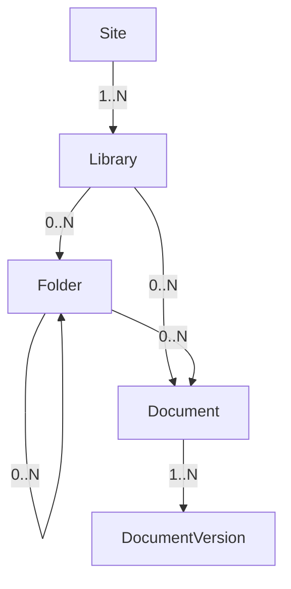
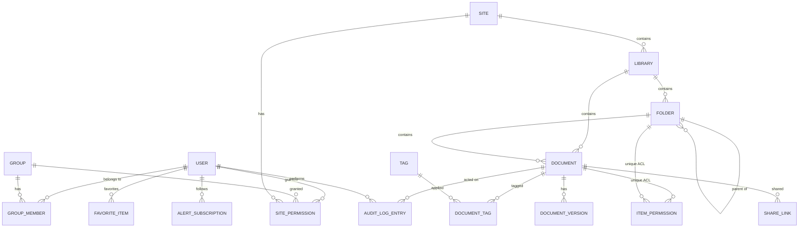
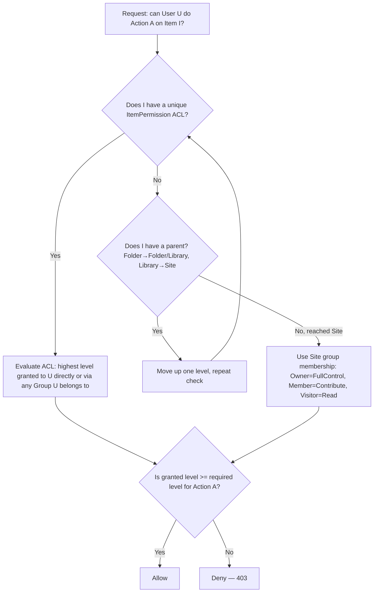

# eDMS — Enterprise Document Management System

## Functional Specification

| | |
|---|---|
| **Version** | 1.0 |
| **Status** | Draft for review |
| **Date** | 2026-08-15 |
| **Product name** | eDMS |
| **Audience** | Engineering (human + coding agent), Product, Security review |

> This document is the machine/agent-oriented companion to `functional-spec.html` (human-readable). Content is equivalent; this version favors tables, IDs, and code blocks for direct use as build input. Requirement IDs (e.g. `FR-DOC-03`) are stable identifiers — reference them in commits, PRs, and tickets.

---

## 1. Introduction & Purpose

eDMS is an internal enterprise document management system modeled on the **key functions** of SharePoint Online document libraries: sites, libraries, folders, documents, versioning, check-out/check-in, metadata, permissions, search, recycle bin, and audit history. It is **not** a full SharePoint clone — collaboration surfaces outside document management (pages, lists, Teams integration, Power Automate, real-time co-authoring) are explicitly out of scope.

The system is for **internal organizational use only**. There is no concept of anonymous/external guest access anywhere in this spec — every principal is an authenticated internal user or a group of internal users.

## 2. Goals & Non-Goals

### 2.1 Goals

- Provide a familiar, SharePoint-like experience for storing, organizing, and governing documents inside the organization.
- Enforce enterprise-grade access control (role + item-level permissions), versioning, and auditability.
- Ship an MVP fast with a clear, additive path to feature parity enhancements (Phase 2/3) without re-architecting.
- Keep the system self-hostable on-prem with no mandatory cloud dependency.

### 2.2 Non-Goals (explicitly out of scope for this spec)

- Real-time co-authoring / simultaneous multi-user editing of Office documents.
- Desktop sync client (OneDrive-style) or mobile native apps.
- Workflow/approval engine (Power Automate equivalent), e-signature.
- Retention labels, legal hold, DLP, compliance/eDiscovery tooling.
- Anonymous or external (guest/B2B) sharing of any kind.
- Wiki pages, lists, news, Teams/Slack integration, intranet portal features.
- Multi-tenant SaaS concerns (billing, tenant isolation) — single organization deployment.

## 3. Tech Stack (given)

| Layer | Choice |
|---|---|
| Frontend | React + Vite, strict TypeScript, React Router |
| Design system | shadcn/ui |
| Styling | Tailwind CSS 4 |
| Backend | .NET 10, ASP.NET Core Web API, Entity Framework Core |
| Database | EF Core, provider-selected via configuration (`Database:Provider`): PostgreSQL (production), SQL Server, MySQL, SQLite (local-development default) — TDS ADR-8 |
| Authentication | Database (local) auth first; SAML2 and OIDC federation in a later phase |

Recommended supporting libraries (not mandated by the user, flagged as **assumptions** — see §17):

| Concern | Recommendation |
|---|---|
| Backend auth | ASP.NET Core Identity (`ApplicationUser : IdentityUser<Guid>`) issuing JWT access + rotating refresh tokens |
| DB provider | `Npgsql.EntityFrameworkCore.PostgreSQL` (production); `Microsoft.EntityFrameworkCore.SqlServer` / `MySql.EntityFrameworkCore` / `Microsoft.EntityFrameworkCore.Sqlite` behind the same `Database:Provider` switch — TDS ADR-8 |
| Naming convention | `EFCore.NamingConventions` (snake_case in Postgres, PascalCase in C#) |
| Validation | FluentValidation |
| Object mapping | Mapster or manual extension methods (avoid heavy AutoMapper conventions) |
| Background jobs | `BackgroundService` (MVP) → Quartz.NET if scheduling grows complex |
| Logging | Serilog, structured JSON, console + file sink |
| API docs | `Microsoft.AspNetCore.OpenApi` + Swagger UI (dev only) |
| Frontend server state | TanStack Query |
| Frontend client/UI state | Zustand (small, e.g. panel open/closed, view mode) |
| Forms | react-hook-form + zod, wired to shadcn `Form` |
| File storage | Pluggable `IFileStorageProvider`; local disk implementation for MVP |

## 4. User Roles & Personas

### 4.1 System-level

| Role | Description |
|---|---|
| **System Administrator** | Full access to Admin Center: users, groups, sites, system settings, storage, audit log export. Implicit Full Control everywhere. |
| **User** | Standard authenticated internal employee. Access to any given Site/Library/Folder/Document is governed entirely by the permission model in §7.7. |

### 4.2 Site-level (default groups, auto-created per Site — mirrors SharePoint's Owners/Members/Visitors)

| Group | Default permission level |
|---|---|
| **Site Owners** | Full Control (manage site, libraries, permissions, delete) |
| **Site Members** | Contribute (upload, edit, delete content) |
| **Site Visitors** | Read (view, download) |

## 5. Information Architecture



- A **Site** is a workspace for a team/department/project (e.g. "Finance", "Project Phoenix"). Every Site auto-provisions one default Library named "Documents".
- A **Library** is a document container with its own versioning/check-out settings.
- **Folders** nest arbitrarily (soft cap: 20 levels, to keep paths and UI breadcrumbs sane).
- A **Document** is a logical file identity; its bytes live in one or more **DocumentVersions**.

## 6. Functional Requirements

Each requirement has a stable ID, a phase tag, and a testable "shall" statement. Phase legend:

- **MVP** — Phase 1, required for first usable release.
- **P2** — Phase 2, fast-follow enhancement.
- **P3** — Phase 3, later/optional.

### 6.1 Authentication & Authorization (`AUTH`)

| ID | Phase | Requirement |
|---|---|---|
| FR-AUTH-01 | MVP | The system shall authenticate users via email + password against the local database (ASP.NET Core Identity). |
| FR-AUTH-02 | MVP | On successful login, the system shall issue a short-lived JWT access token (default 15 min) and a rotating refresh token stored in an httpOnly, secure cookie (default 7 days). |
| FR-AUTH-03 | MVP | The system shall provide logout, which revokes the current refresh token server-side. |
| FR-AUTH-04 | MVP | The system shall provide self-service "Forgot password" via a time-limited (default 1 hour), single-use emailed reset link. |
| FR-AUTH-05 | MVP | Authenticated users shall be able to change their own password by re-entering their current password. |
| FR-AUTH-06 | MVP | The system shall lock an account for a configurable cool-down period (default 15 min) after 5 consecutive failed login attempts. |
| FR-AUTH-07 | MVP | A System Administrator shall be able to deactivate a user account; deactivation immediately revokes all outstanding refresh tokens. |
| FR-AUTH-08 | MVP | Passwords shall be stored using ASP.NET Core Identity's default hasher (PBKDF2, per-user salt); plaintext or reversible storage is prohibited. |
| FR-AUTH-09 | P3 | The system shall support SAML2 federated login (via e.g. `Sustainsys.Saml2`), just-in-time provisioning a local `ApplicationUser` on first login, mapped by email/NameID. |
| FR-AUTH-10 | P3 | The system shall support OIDC federated login (via `Microsoft.AspNetCore.Authentication.OpenIdConnect`) with the same JIT provisioning behavior as FR-AUTH-09. |
| FR-AUTH-11 | P3 | When SAML2/OIDC is enabled for the org, System Admin shall be able to enforce SSO-only login (disable local password login per user or globally). |

**Design note:** federated logins (P3) terminate at the identity provider, then the backend still issues its own internal JWT — the SPA's token handling and API auth do not change between local and federated auth. This is why local-auth-first does not require a rewrite later.

### 6.2 Sites (`SITE`)

| ID | Phase | Requirement |
|---|---|---|
| FR-SITE-01 | MVP | A System Administrator or user with site-creation rights shall be able to create a Site with Name, Description, and URL slug. |
| FR-SITE-02 | MVP | Creating a Site shall auto-provision a default Library ("Documents") and the three default groups (§4.2), with the creator added to Site Owners. |
| FR-SITE-03 | MVP | Site Owners shall be able to edit site Name, Description, and storage quota. |
| FR-SITE-04 | MVP | Site Owners/Admin shall be able to soft-delete (archive) a Site; this cascades to its libraries/folders/documents (they become inaccessible but are DB-recoverable by Admin, not exposed in a self-service recycle bin). |
| FR-SITE-05 | MVP | The Home page shall list all Sites the current user has any level of access to ("My Sites"). |
| FR-SITE-06 | MVP | Site Owners shall be able to add/remove Users and Groups to the Owners/Members/Visitors groups. |

### 6.3 Libraries (`LIB`)

| ID | Phase | Requirement |
|---|---|---|
| FR-LIB-01 | MVP | Users with Contribute+ on a Site shall be able to create additional Libraries (Name, Description). |
| FR-LIB-02 | MVP | Each Library shall have independent settings: `EnableVersioning` (default true), `EnableMinorVersions` (default false), `RequireCheckout` (default false). |
| FR-LIB-03 | MVP | Library Owners shall be able to rename or soft-delete a Library. |
| FR-LIB-04 | MVP | The Site home shall list its Libraries with item count and last-activity date. |

### 6.4 Folders (`FLD`)

| ID | Phase | Requirement |
|---|---|---|
| FR-FLD-01 | MVP | Users with Contribute+ shall be able to create folders and subfolders within a Library. |
| FR-FLD-02 | MVP | Folders shall support rename, without affecting descendant document version history. |
| FR-FLD-03 | MVP | Folders shall support move (including drag-and-drop in the UI) between folders/libraries within the same Site; descendant paths and permissions-by-reference update accordingly. |
| FR-FLD-04 | MVP | Deleting a folder shall soft-delete the folder and all descendants (recursive), placing them in the Recycle Bin (§6.8). |
| FR-FLD-05 | MVP | The UI shall render breadcrumb navigation reflecting the current folder's full path. |
| FR-FLD-06 | MVP | Folder nesting depth shall be limited to 20 levels; the system shall reject creation beyond this depth with a clear error. |

### 6.5 Documents (`DOC`)

| ID | Phase | Requirement |
|---|---|---|
| FR-DOC-01 | MVP | Users with Contribute+ shall be able to upload one or more files via file picker or drag-and-drop onto the current folder. |
| FR-DOC-02 | MVP | Multi-file upload shall show a per-file progress indicator and continue-on-error (one failed file does not abort the batch). |
| FR-DOC-03 | MVP | The system shall enforce a configurable max file size (default 250 MB) and an optional block-list of file extensions (e.g. `.exe`, `.bat`), configurable in Admin Center. |
| FR-DOC-04 | MVP | Users with Read+ shall be able to download the current version of a document's original bytes with original filename. |
| FR-DOC-05 | MVP | Users with Contribute+ shall be able to rename a document (extension is preserved). |
| FR-DOC-06 | MVP | Users with Contribute+ shall be able to move or copy a document between folders/libraries within the same Site; copy creates a new Document with a fresh version history (v1.0) and no link to the source's future changes. |
| FR-DOC-07 | MVP | Deleting a document shall soft-delete it (and all its versions) into the Recycle Bin. |
| FR-DOC-08 | MVP | The document properties panel shall show: Title, Description, Tags, file size, content type, created/modified by+at, current version, checked-out status. |
| FR-DOC-09 | MVP | The system shall support in-browser preview for PDF and common image formats (PNG/JPG/GIF/SVG) without requiring download. |
| FR-DOC-10 | P2 | The system shall support in-browser preview of Office formats (docx/xlsx/pptx) by converting to PDF server-side (e.g. LibreOffice headless) for preview-only rendering (no editing). |
| FR-DOC-11 | P2 | Users shall be able to select multiple items in a library view and bulk delete, bulk move, or download-as-zip. |
| FR-DOC-12 | P2 | Large files (>100 MB) shall use chunked/resumable upload to tolerate network interruption. |

### 6.6 Versioning & Check-out/Check-in (`VER`)

| ID | Phase | Requirement |
|---|---|---|
| FR-VER-01 | MVP | Uploading a file with the same name to a location that already has a document by that name shall create a new `DocumentVersion` rather than a duplicate `Document`. |
| FR-VER-02 | MVP | When `EnableMinorVersions` is false (default), every save creates a new major version (1.0, 2.0, 3.0 …). When true, in-progress saves create minor versions (1.1, 1.2 …) until explicitly published as the next major version. |
| FR-VER-03 | MVP | Users with Read+ shall be able to view a document's full version history: version number, author, timestamp, size, and optional comment. |
| FR-VER-04 | MVP | Users with Contribute+ shall be able to restore a prior version; this creates a **new** version with the old content (history is never destroyed by a restore). |
| FR-VER-05 | MVP | Users with Contribute+ shall be able to check out a document, setting `CheckedOutBy`/`CheckedOutAt`. While checked out, other users see a "checked out by {user}" indicator and cannot upload a new version. |
| FR-VER-06 | MVP | Check-in shall accept an optional comment and (if minor versions enabled) a major/minor choice, clearing the checkout lock. |
| FR-VER-07 | MVP | The original checker-out, the Library Owner, or a System Admin shall be able to discard a checkout, reverting to the last checked-in version and clearing the lock. |
| FR-VER-08 | MVP | If a Library has `RequireCheckout` enabled, uploading a new version without an active checkout by the current user shall be rejected. |
| FR-VER-09 | P2 | Libraries shall support an optional cap on retained minor versions (auto-trim oldest minor versions on check-in, majors are never auto-trimmed). |

### 6.7 Metadata, Tags & Content Types (`META`)

| ID | Phase | Requirement |
|---|---|---|
| FR-META-01 | MVP | Every document shall support editable Title, Description, and a free-text list of Tags. |
| FR-META-02 | MVP | Library views shall support filtering by Tag. |
| FR-META-03 | P2 | Admins shall be able to define reusable **Content Types** per Library, each with a named set of typed **Columns** (Text, Number, Date, Choice, Boolean, User, Lookup). |
| FR-META-04 | P2 | A Content Type may mark Columns as required; the system shall block upload/check-in completion until required columns are filled. |

### 6.8 Recycle Bin (`BIN`)

| ID | Phase | Requirement |
|---|---|---|
| FR-BIN-01 | MVP | Deleted Folders/Documents shall appear in the Site's Recycle Bin, showing name, original location, deleted-by, and deleted-at. |
| FR-BIN-02 | MVP | Users shall be able to restore an item to its original location; if the original parent folder was also deleted, the system shall recreate the folder path (or prompt to choose a new location). |
| FR-BIN-03 | MVP | Users may permanently delete their own recycled items; Site Owners/Admin may permanently delete any item in the Site's Recycle Bin. |
| FR-BIN-04 | MVP | A background job shall permanently purge Recycle Bin items older than a configurable retention period (default 90 days). |
| FR-BIN-05 | MVP | Site Owners/Admin shall see all deleted items in the Site, including those deleted by other users. |

### 6.9 Search (`SRCH`)

| ID | Phase | Requirement |
|---|---|---|
| FR-SRCH-01 | MVP | A global search box in the top nav shall query file/folder name, Title, Description, and Tags across all Sites the user can access. |
| FR-SRCH-02 | MVP | Search shall use PostgreSQL full-text search (`tsvector`/`tsquery` with a GIN index) over the indexed fields in FR-SRCH-01. |
| FR-SRCH-03 | MVP | Results shall show the containing Site/Library/path, a type icon, last-modified date, and be ranked by relevance. |
| FR-SRCH-04 | MVP | Results shall respect the searching user's effective permissions — no result may leak the existence of an item the user cannot at least Read. |
| FR-SRCH-05 | MVP | Users shall be able to scope search to the current Library/folder. |
| FR-SRCH-06 | MVP | Results shall be filterable by Site, Library, file type, and modified-date range. |
| FR-SRCH-07 | P2 | Search shall additionally index extracted text content of PDF/Office documents (e.g. via Apache Tika or `iText`) for full-text-in-content search. |

### 6.10 Permissions & Sharing (`PERM`)

| ID | Phase | Requirement |
|---|---|---|
| FR-PERM-01 | MVP | Every Site, Library, Folder, and Document shall resolve an **effective permission** for a given user by walking up the hierarchy to the nearest node with a unique (non-inherited) ACL, defaulting to Site group membership (§4.2) if none is set. |
| FR-PERM-02 | MVP | Users with Full Control shall be able to "break inheritance" on a Library/Folder/Document, assigning a unique ACL of `{Principal (User or Group), Level}` entries. |
| FR-PERM-03 | MVP | Permission levels shall be: **Full Control** (manage permissions + all Contribute rights), **Contribute** (upload/edit/delete/move/copy), **Read** (view/download), **No Access**. |
| FR-PERM-04 | MVP | Users with Full Control shall be able to reset a Folder/Document back to inherited permissions, discarding its unique ACL. |
| FR-PERM-05 | MVP | A "Manage Access" panel shall show the effective permission list for an item (inherited + unique), distinguishing the source of each grant. |
| FR-PERM-06 | MVP | A "Share" action shall grant Read or Contribute to chosen internal Users/Groups on the target item in one step, optionally sending an email notification containing a direct link. |
| FR-PERM-07 | P2 | The system shall support an "anyone in the organization with the link" mode: a non-anonymous, authentication-required link (`ShareLink` token) usable by any internal user without an individual ACL entry, optionally with an expiry date. |

### 6.11 Notifications & Alerts (`NOTIF`) — Phase 2

| ID | Phase | Requirement |
|---|---|---|
| FR-NOTIF-01 | P2 | The system shall send an email notification when an item is shared with a user (FR-PERM-06). |
| FR-NOTIF-02 | P2 | Users shall be able to "Follow" a Folder/Document to receive alerts on changes (new version, delete, permission change). |
| FR-NOTIF-03 | P2 | Alert delivery frequency shall be configurable per subscription: Immediate, Daily digest, Weekly digest. |
| FR-NOTIF-04 | P2 | An in-app notification bell shall list recent notifications (shared-with-me, followed-item activity). |
| FR-NOTIF-05 | P2 | Users shall have a preferences page to manage/unsubscribe from alerts. |

### 6.12 Audit Log & Activity (`AUDIT`)

| ID | Phase | Requirement |
|---|---|---|
| FR-AUDIT-01 | MVP | The system shall record an immutable audit entry for: upload, download, view, metadata edit, delete, restore, rename, move, copy, check-out, check-in, discard-checkout, permission change, and share. |
| FR-AUDIT-02 | MVP | Each Document/Folder shall have an "Activity" tab showing its chronological history. |
| FR-AUDIT-03 | MVP | Site Owners/Admin shall be able to view/filter the full Site audit log by user, action type, object, and date range. |
| FR-AUDIT-04 | MVP | Audit entries shall not be editable or deletable via any API surface. |
| FR-AUDIT-05 | P2 | Admin shall be able to export a filtered audit log to CSV. |

### 6.13 Admin Center (`ADMIN`)

| ID | Phase | Requirement |
|---|---|---|
| FR-ADMIN-01 | MVP | System Admin shall be able to list, search, deactivate, and reactivate user accounts. |
| FR-ADMIN-02 | MVP | System Admin shall be able to create/edit/delete Groups and manage their membership. |
| FR-ADMIN-03 | MVP | System Admin shall be able to list all Sites with storage usage, and archive/delete any Site. |
| FR-ADMIN-04 | MVP | System Admin shall be able to configure system-wide settings: max upload size, blocked extensions, recycle bin retention days, session/token lifetime, app name/logo. |
| FR-ADMIN-05 | MVP | System Admin shall be able to grant/revoke the System Administrator role for another user. |
| FR-ADMIN-06 | P2 | Admin Center shall show a storage usage dashboard (per Site and total), against configured quotas. |

### 6.14 Navigation & UI/UX (`UI`)

| ID | Phase | Requirement |
|---|---|---|
| FR-UI-01 | MVP | The app shell shall have a top bar (global search, notifications icon, user menu) and a left nav (My Sites, Recycle Bin, Admin Center if authorized). |
| FR-UI-02 | MVP | Library views shall support both list and grid layouts, sortable by name/modified/size, with multi-select checkboxes. |
| FR-UI-03 | MVP | Every item row/tile shall expose a context ("...") menu with the actions applicable to the user's permission level. |
| FR-UI-04 | MVP | Drag-and-drop of files from the OS file explorer onto a library view shall trigger upload into the current folder. |
| FR-UI-05 | MVP | A document details side panel shall organize Properties / Versions / Permissions / Activity into tabs. |
| FR-UI-06 | MVP | The UI shall show empty states, loading skeletons, and toast confirmations for all mutating actions. |
| FR-UI-07 | MVP | Layout shall be responsive down to tablet width; mobile viewing shall be usable (editing/admin flows are not mobile-optimized). |
| FR-UI-08 | P2 | The UI shall support light/dark theme, following shadcn theming conventions. |

## 7. Non-Functional Requirements

| Category | Requirement |
|---|---|
| **Security** | TLS in transit everywhere; passwords hashed (never reversible); JWT access tokens short-lived; refresh tokens httpOnly+secure+SameSite; CSRF protection on cookie-based endpoints; strict input validation on all DTOs; parameterized queries only (EF Core default); file-type/size allow/deny list enforced server-side (not just client); rate limiting on `/auth/*` endpoints. |
| **Authorization** | Every API endpoint shall re-check effective permission server-side; the frontend hiding a button is UX only, never a security boundary. |
| **Performance** | Folder listings paginated/virtualized beyond ~200 items; uploads show progress and do not block the UI thread; search queries return in <1s p95 for a library with 100k items. |
| **Scalability** | API shall be stateless (JWT-based) to allow horizontal scaling behind a load balancer; file storage abstracted behind `IFileStorageProvider` so local disk can later be swapped for S3-compatible/Azure Blob without API changes. |
| **Availability** | Target 99.5% during business hours for an internal single-org deployment; no HA requirement mandated for MVP. |
| **Accessibility** | WCAG 2.1 AA target: keyboard navigable, sufficient contrast, ARIA labels on icon-only controls (shadcn/Radix primitives provide most of this by default). |
| **Browser support** | Latest two versions of Chrome, Edge, Firefox, Safari. |
| **Observability** | Structured logging (Serilog) with request correlation IDs; `/health` liveness/readiness endpoints; audit log doubles as a security-relevant event trail. |
| **Internationalization** | English only for MVP; UI copy shall not be hard-baked into logic in a way that blocks future i18n (use resource-friendly string placement). |
| **Data retention** | Recycle bin purge and audit log retention are both configurable, not hardcoded (§6.8, §6.12). |

## 8. Data Model

### 8.1 Entity-relationship diagram



### 8.2 Entities

Timestamps are `timestamptz` (UTC). Primary keys are app-generated `uuid` (`Guid.NewGuid()`) unless noted. `jsonb` columns use PostgreSQL's native JSON type.

#### ApplicationUser (extends ASP.NET Core Identity `IdentityUser<Guid>`)

| Field | Type | Notes |
|---|---|---|
| Id | uuid | PK (from Identity) |
| Email | text | unique (recommend `citext` extension for case-insensitive uniqueness) |
| DisplayName | text | |
| IsActive | bool | default true; false blocks login + revokes sessions |
| AuthProvider | enum | `Local` \| `Saml` \| `Oidc` (default `Local`) |
| ExternalId | text, nullable | subject/NameID from SAML/OIDC (P3) |
| AvatarUrl | text, nullable | |
| IsSystemAdmin | bool | default false |
| CreatedAt | timestamptz | |
| LastLoginAt | timestamptz, nullable | |
| *(+ standard Identity columns: PasswordHash, SecurityStamp, LockoutEnd, AccessFailedCount, etc.)* | | |

#### Group

| Field | Type | Notes |
|---|---|---|
| Id | uuid | PK |
| Name | text | unique |
| Description | text, nullable | |
| IsSystem | bool | true for built-in per-Site Owners/Members/Visitors groups |
| SiteId | uuid, nullable | non-null for Site-scoped default groups; null for org-wide custom groups |
| CreatedBy | uuid (FK User) | |
| CreatedAt | timestamptz | |

#### GroupMember

| Field | Type | Notes |
|---|---|---|
| GroupId | uuid (FK Group) | composite PK |
| UserId | uuid (FK User) | composite PK |
| AddedAt | timestamptz | |

#### Site

| Field | Type | Notes |
|---|---|---|
| Id | uuid | PK |
| Name | text | |
| Description | text, nullable | |
| UrlSlug | text | unique |
| StorageQuotaBytes | bigint, nullable | null = unlimited |
| StorageUsedBytes | bigint | denormalized counter, updated on upload/delete |
| IsDeleted | bool | soft delete |
| DeletedAt / DeletedBy | timestamptz / uuid, nullable | |
| CreatedBy | uuid (FK User) | |
| CreatedAt | timestamptz | |

#### SitePermission

| Field | Type | Notes |
|---|---|---|
| Id | uuid | PK |
| SiteId | uuid (FK Site) | |
| PrincipalType | enum | `User` \| `Group` |
| PrincipalId | uuid | FK User or Group depending on PrincipalType |
| Role | enum | `Owner` \| `Member` \| `Visitor` |

#### Library

| Field | Type | Notes |
|---|---|---|
| Id | uuid | PK |
| SiteId | uuid (FK Site) | |
| Name | text | |
| Description | text, nullable | |
| EnableVersioning | bool | default true |
| EnableMinorVersions | bool | default false |
| RequireCheckout | bool | default false |
| IsDeleted | bool | soft delete |
| CreatedBy / CreatedAt | uuid / timestamptz | |

#### Folder

| Field | Type | Notes |
|---|---|---|
| Id | uuid | PK |
| LibraryId | uuid (FK Library) | |
| ParentFolderId | uuid, nullable (FK Folder) | null = library root |
| Name | text | |
| Path | text | materialized path, e.g. `/Contracts/2026/` for fast breadcrumb/listing |
| IsDeleted / DeletedAt / DeletedBy | bool / timestamptz / uuid | soft delete |
| CreatedBy / CreatedAt | uuid / timestamptz | |
| ModifiedBy / ModifiedAt | uuid / timestamptz | |

#### Document

| Field | Type | Notes |
|---|---|---|
| Id | uuid | PK |
| LibraryId | uuid (FK Library) | |
| FolderId | uuid, nullable (FK Folder) | null = library root |
| Name | text | includes extension |
| Title | text, nullable | metadata (FR-META-01) |
| Description | text, nullable | metadata |
| ContentType | text | MIME type of current version |
| CurrentVersionId | uuid (FK DocumentVersion) | |
| CheckedOutBy | uuid, nullable (FK User) | |
| CheckedOutAt | timestamptz, nullable | |
| IsDeleted / DeletedAt / DeletedBy | bool / timestamptz / uuid | soft delete |
| CreatedBy / CreatedAt | uuid / timestamptz | |
| ModifiedBy / ModifiedAt | uuid / timestamptz | |
| SearchVector | tsvector, generated | GIN-indexed over Name + Title + Description (FR-SRCH-02) |

#### DocumentVersion

| Field | Type | Notes |
|---|---|---|
| Id | uuid | PK |
| DocumentId | uuid (FK Document) | |
| VersionMajor | int | |
| VersionMinor | int | 0 when minor versioning disabled |
| StorageKey | text | opaque key resolved by `IFileStorageProvider` |
| SizeBytes | bigint | |
| Checksum | text | SHA-256 of content |
| Comment | text, nullable | check-in comment |
| IsMajor | bool | |
| CreatedBy / CreatedAt | uuid / timestamptz | |

#### ContentType *(P2)*

| Field | Type | Notes |
|---|---|---|
| Id | uuid | PK |
| LibraryId | uuid, nullable (FK Library) | null = org-wide reusable type |
| Name | text | |
| Description | text, nullable | |

#### ColumnDefinition *(P2)*

| Field | Type | Notes |
|---|---|---|
| Id | uuid | PK |
| ContentTypeId | uuid (FK ContentType) | |
| Name | text | |
| DataType | enum | `Text` \| `Number` \| `Date` \| `Choice` \| `Boolean` \| `User` \| `Lookup` |
| IsRequired | bool | |
| ChoiceOptions | jsonb, nullable | for `Choice` type |
| DefaultValue | text, nullable | |

#### Tag / DocumentTag

| Field | Type | Notes |
|---|---|---|
| Tag.Id | uuid | PK |
| Tag.Name | text | unique |
| DocumentTag.DocumentId | uuid (FK Document) | composite PK |
| DocumentTag.TagId | uuid (FK Tag) | composite PK |

#### ItemPermission (unique ACL entries — Library/Folder/Document)

| Field | Type | Notes |
|---|---|---|
| Id | uuid | PK |
| ObjectType | enum | `Library` \| `Folder` \| `Document` |
| ObjectId | uuid | polymorphic FK |
| PrincipalType | enum | `User` \| `Group` |
| PrincipalId | uuid | |
| Level | enum | `FullControl` \| `Contribute` \| `Read` \| `NoAccess` |
| GrantedBy / GrantedAt | uuid / timestamptz | |

#### ShareLink *(P2)*

| Field | Type | Notes |
|---|---|---|
| Id | uuid | PK |
| ObjectType | enum | `Folder` \| `Document` |
| ObjectId | uuid | |
| Token | text | unique, unguessable (256-bit) |
| PermissionLevel | enum | `Read` \| `Contribute` |
| RequiresAuthentication | bool | always `true` — no anonymous access (see §2.2) |
| ExpiresAt | timestamptz, nullable | |
| IsRevoked | bool | |
| CreatedBy / CreatedAt | uuid / timestamptz | |

#### AuditLogEntry

| Field | Type | Notes |
|---|---|---|
| Id | uuid | PK |
| Timestamp | timestamptz | indexed |
| UserId | uuid (FK User) | indexed |
| Action | enum | Upload/Download/View/EditMetadata/Delete/Restore/Rename/Move/Copy/CheckOut/CheckIn/DiscardCheckout/PermissionChange/Share/Login/Logout |
| ObjectType | enum | `Site` \| `Library` \| `Folder` \| `Document` |
| ObjectId | uuid | |
| ObjectName | text | denormalized snapshot (survives object rename/delete) |
| SiteId | uuid | indexed, for scoped log views |
| Details | jsonb, nullable | action-specific extra data (e.g. old/new permission level) |
| IpAddress | text, nullable | |

*Immutable: no `UPDATE`/`DELETE` API exists for this table (FR-AUDIT-04).*

#### AlertSubscription / FavoriteItem *(P2)*

| Field | Type | Notes |
|---|---|---|
| AlertSubscription.Id | uuid | PK |
| AlertSubscription.UserId | uuid (FK User) | |
| AlertSubscription.ObjectType/ObjectId | enum/uuid | Folder or Document |
| AlertSubscription.Frequency | enum | `Immediate` \| `Daily` \| `Weekly` |
| FavoriteItem.UserId | uuid (FK User) | composite PK |
| FavoriteItem.ObjectType/ObjectId | enum/uuid | composite PK |

## 9. Permission Resolution Algorithm



- **System Administrators** bypass this check entirely (implicit Full Control everywhere) but every bypass is still written to the audit log.
- Permission checks are **additive across group memberships** — if a user is in two groups with different levels on the same object, the higher level wins. There is no explicit `Deny` level in MVP (only `NoAccess`, meaning "no grant found"), keeping resolution simple and avoiding SharePoint's confusing deny-override edge cases.
- This resolution must run **server-side on every request**; the frontend's rendering of disabled/hidden buttons is a UX convenience only.

## 10. API Design

### 10.1 Conventions

- Base path: `/api/v1`.
- JSON request/response bodies; `Content-Type: application/json` except upload endpoints (`multipart/form-data`) and download endpoints (binary stream).
- Auth: `Authorization: Bearer <access_token>` header; refresh token flows via httpOnly cookie only.
- Pagination: `?page=1&pageSize=50` query params; response envelope `{ "items": [...], "page": 1, "pageSize": 50, "totalCount": 137 }`.
- Errors: RFC 7807 `application/problem+json` (`{ type, title, status, detail, errors? }`).
- All timestamps: ISO-8601 UTC.
- Every mutating endpoint enforces the permission model in §9 and writes an `AuditLogEntry`.

### 10.2 Endpoints

| Method | Path | Description | Min. permission |
|---|---|---|---|
| POST | `/auth/login` | Local email+password login | Public |
| POST | `/auth/logout` | Revoke refresh token | Authenticated |
| POST | `/auth/refresh` | Exchange refresh cookie for new access token | Refresh cookie |
| POST | `/auth/forgot-password` | Send reset email | Public |
| POST | `/auth/reset-password` | Complete reset via token | Public |
| POST | `/auth/change-password` | Self-service change | Authenticated |
| GET | `/auth/me` | Current user profile + site memberships | Authenticated |
| GET | `/users` | List/search users | Admin |
| POST | `/users` | Create user | Admin |
| GET/PUT | `/users/{id}` | View/edit user | Admin |
| POST | `/users/{id}/deactivate` \| `/reactivate` | Toggle account | Admin |
| GET | `/groups` | List groups | Authenticated |
| POST | `/groups` | Create group | Admin |
| GET/PUT/DELETE | `/groups/{id}` | Manage group | Admin |
| POST/DELETE | `/groups/{id}/members/{userId}` | Add/remove member | Admin (or Group owner if delegated, P2) |
| GET | `/sites` | List sites visible to caller | Authenticated |
| POST | `/sites` | Create site | Authenticated (site-creation right) |
| GET/PUT | `/sites/{id}` | View/edit site | Read / Owner |
| DELETE | `/sites/{id}` | Soft-delete site | Owner/Admin |
| GET/PUT | `/sites/{id}/permissions` | View/manage site group membership | Owner |
| GET | `/sites/{siteId}/libraries` | List libraries in site | Read |
| POST | `/sites/{siteId}/libraries` | Create library | Contribute |
| GET/PUT/DELETE | `/libraries/{id}` | Manage library | Read / FullControl |
| GET | `/libraries/{id}/items` | List folder root contents (folders+docs, paginated) | Read |
| POST | `/libraries/{libraryId}/folders` | Create folder | Contribute |
| GET | `/folders/{id}` | Folder details + breadcrumb | Read |
| GET | `/folders/{id}/items` | List folder contents | Read |
| PUT | `/folders/{id}` | Rename/move folder | Contribute |
| DELETE | `/folders/{id}` | Soft-delete folder (recursive) | Contribute |
| POST | `/folders/{id}/documents` | Upload document(s), multipart | Contribute |
| GET | `/documents/{id}` | Document metadata | Read |
| GET | `/documents/{id}/download` | Download current version bytes | Read |
| GET | `/documents/{id}/preview` | Inline preview stream (PDF/image; converted PDF for Office in P2) | Read |
| PUT | `/documents/{id}` | Update metadata (title/description/tags) or rename | Contribute |
| DELETE | `/documents/{id}` | Soft-delete document | Contribute |
| POST | `/documents/{id}/move` | Move to another folder/library | Contribute (both locations) |
| POST | `/documents/{id}/copy` | Copy to another folder/library | Contribute (target) + Read (source) |
| POST | `/documents/{id}/checkout` | Check out / lock | Contribute |
| POST | `/documents/{id}/checkin` | Upload new version + release lock | Contribute (must hold lock) |
| POST | `/documents/{id}/discard-checkout` | Release lock, revert | Contribute (owner of lock) or FullControl |
| GET | `/documents/{id}/versions` | Version history | Read |
| POST | `/documents/{id}/versions/{versionId}/restore` | Restore prior version as new version | Contribute |
| GET/PUT | `/documents/{id}/permissions` | View/set unique ACL | Read / FullControl |
| POST | `/documents/{id}/permissions/reset` | Reset to inherited | FullControl |
| POST | `/documents/{id}/share` | Grant access + notify | Contribute+ (per FR-PERM-06) |
| GET | `/sites/{id}/recycle-bin` | List deleted items in site | Read (own items) / Owner (all items) |
| POST | `/recycle-bin/{itemId}/restore` | Restore item | Contribute (own) / Owner (any) |
| DELETE | `/recycle-bin/{itemId}` | Permanently delete | Contribute (own) / Owner (any) |
| GET | `/search` | `?q=&siteId=&libraryId=&type=&modifiedFrom=&modifiedTo=` | Authenticated (results filtered by permission) |
| GET | `/sites/{id}/audit-log` | Filtered audit log | Owner/Admin |
| GET | `/documents/{id}/activity` \| `/folders/{id}/activity` | Item-scoped activity | Read |
| GET | `/admin/settings` \| PUT | System-wide settings | Admin |
| GET | `/admin/storage` | Storage usage dashboard | Admin |

## 11. Frontend Architecture

### 11.1 Routes

| Route | Page | Notes |
|---|---|---|
| `/login`, `/forgot-password`, `/reset-password` | Auth pages | Unauthenticated layout |
| `/` | Home — "My Sites" | Redirects to last-visited site (optional, P2) |
| `/sites/:siteSlug` | Site home — library list | |
| `/sites/:siteSlug/libraries/:libraryId/*` | Library browser | `*` captures nested folder path for deep-linkable breadcrumbs |
| `/search` | Search results | `?q=` |
| `/recycle-bin/:siteSlug` | Site recycle bin | |
| `/admin/*` | Admin Center (users, groups, sites, settings, storage) | Admin-only, route-guarded |
| `/me/notifications` | Notification preferences (P2) | |

### 11.2 Project structure

```
src/
  app/                 # routes, layouts, router config
  components/
    ui/                # shadcn primitives (generated)
    common/             # app-specific composites (FileIcon, Breadcrumbs, EmptyState…)
  features/
    auth/
    sites/
    libraries/
    documents/           # upload, version history, checkout, properties panel
    permissions/
    search/
    recycle-bin/
    admin/
  lib/
    api-client.ts        # typed fetch wrapper, attaches bearer token, handles 401 refresh
    query-keys.ts
  hooks/
  stores/                # Zustand: ui-state only, never server data
  types/                 # generated/shared DTO types (mirrors backend contracts)
```

### 11.3 State management

- **Server state** (sites, libraries, documents, permissions, search results): TanStack Query — cache keyed by resource, invalidated on mutation.
- **Client/UI state** (selected items, view mode list/grid, side panel open, active tab): Zustand or local component state — never duplicated server data.
- **Forms**: react-hook-form + zod schemas matching backend DTO validation, rendered via shadcn `Form`.

## 12. Backend Architecture

### 12.1 Solution layout (Clean Architecture)

```
eDMS.sln
src/
  eDMS.Api/              # Controllers, Program.cs, middleware, DI wiring
  eDMS.Application/      # Use-case services, DTOs, FluentValidation validators
  eDMS.Domain/           # Entities, enums, domain invariants (no EF/infra deps)
  eDMS.Infrastructure/   # EF Core DbContext + migrations, IFileStorageProvider impls,
                          # Identity setup, email sender, background jobs
tests/
  eDMS.UnitTests/
  eDMS.IntegrationTests/  # WebApplicationFactory + Testcontainers Postgres
```

### 12.2 Key interfaces

```csharp
public interface IFileStorageProvider
{
    Task<string> SaveAsync(Stream content, string suggestedKey, CancellationToken ct);
    Task<Stream> OpenReadAsync(string storageKey, CancellationToken ct);
    Task DeleteAsync(string storageKey, CancellationToken ct);
}
// MVP: LocalDiskFileStorageProvider (files under a configured root, keyed by
// {siteId}/{libraryId}/{documentId}/{versionId}/{originalFileName}).
// Swappable later for S3-compatible/Azure Blob without touching callers.
```

```csharp
public interface IPermissionResolver
{
    Task<PermissionLevel> GetEffectiveLevelAsync(Guid userId, ObjectType type, Guid objectId, CancellationToken ct);
}
// Implements the walk-up-the-hierarchy algorithm in §9. Single source of truth,
// called from every controller action via an [Authorize]-style filter/attribute —
// never duplicated inline in controllers.
```

### 12.3 Migrations & seed data

- EF Core Code-First; `dotnet ef migrations add <Name>` / `dotnet ef database update`.
- Seed on first run: one System Administrator account (from configuration/env, password reset forced on first login), and the `Everyone`-equivalent is **not** a global implicit group — every Site's default groups are explicit and empty until populated, avoiding accidental over-sharing.

## 13. File Storage Strategy

- MVP: local disk under a configured root path, one file per `DocumentVersion` (no in-place overwrite — new version = new file), addressed by `StorageKey`. Physical delete only happens when Recycle Bin purge (§6.8) permanently removes the last reference.
- Storage abstraction (`IFileStorageProvider`, §12.2) is mandatory from day one even though only the local-disk implementation ships in MVP — this is what lets Phase 2/3 add S3-compatible or Azure Blob storage as a config change, not a rewrite.
- Checksums (SHA-256) stored per version to detect corruption and support future dedup.

## 14. Security Considerations

- All endpoints require authentication except `/auth/login`, `/auth/forgot-password`, `/auth/reset-password`.
- Authorization is enforced server-side per §9 on every request — never inferred from UI state.
- Uploaded file **content-type sniffing** server-side (don't trust the client-supplied MIME type) to block disguised executables.
- Antivirus scanning hook: `IFileStorageProvider.SaveAsync` shall have a pluggable pre-save scan step (e.g. ClamAV via socket) — stub/no-op in MVP, documented as a P2 integration point, not left as an afterthought to bolt on later.
- CSRF: since the SPA uses a Bearer token in an `Authorization` header for all state-changing calls (not ambient cookie auth), CSRF risk is limited to the refresh-token cookie endpoint, which should be `SameSite=Strict`.
- Rate limiting (ASP.NET Core built-in rate limiting middleware) on `/auth/login`, `/auth/forgot-password`.
- All audit-relevant actions (§6.12) are logged with actor, action, object, and timestamp, and are immutable.

## 15. Roadmap / Phasing Summary

### Phase 1 — MVP (build first)

Local DB authentication · Sites/Libraries/Folders/Documents CRUD · drag-drop & bulk upload · major/minor versioning · check-out/check-in · role-based + item-level permissions with inheritance breaking · internal "Share" (direct grant, no anonymous links) · Recycle Bin with auto-purge · PostgreSQL full-text search (name/title/description/tags) · full audit log · Admin Center (users, groups, sites, settings) · responsive SharePoint-like UI shell.

### Phase 2 — Enhancements

Content Types & custom metadata columns · Office document preview (server-side PDF conversion) · bulk actions & zip download · chunked upload for large files · email + in-app notifications/alerts ("Follow") · org-wide (non-anonymous) share links · full-text content indexing (PDF/Office text extraction) · CSV audit export · storage usage dashboard · dark theme.

### Phase 3 — Federation & later

SAML2 SSO · OIDC SSO · SSO-enforcement admin controls · (candidates beyond this spec's scope: retention policies, legal hold, workflow/approval).

## 16. Assumptions

Flagged explicitly since they were not specified by the user and were decided to keep the spec concrete and buildable. Revisit any of these freely.

1. Deployment is single-organization, on-prem/self-hosted — no multi-tenancy.
2. Auth token strategy is JWT access + rotating refresh cookie (not ASP.NET Core Identity's default cookie auth), to suit a decoupled SPA and to make future SSO federation a drop-in.
3. File storage defaults to local disk for MVP behind a provider abstraction; no cloud storage dependency is required to run the system.
4. "Share" in this internal-only system means granting explicit permission to internal users/groups, not generating anonymous public links — anonymous/external sharing is out of scope entirely (§2.2).
5. No explicit `Deny` permission level in MVP — only additive grants plus `NoAccess` (absence of a grant), to avoid SharePoint's confusing deny-precedence rules.
6. Default file size limit 250 MB, recycle bin retention 90 days, access token TTL 15 min, refresh token TTL 7 days — all configurable, not hardcoded.
7. Site-creation rights default to any authenticated user; Admin can restrict this later via a settings flag if desired (not itemized as its own FR, covered by FR-ADMIN-04's general settings surface).
8. Database choice is a configuration concern, not a code fork: PostgreSQL is the production database; SQL Server and MySQL are supported for enterprise deployments; SQLite is the local-development default (no DB install required). PostgreSQL-specific schema (e.g. `citext`, `tsvector`) is Postgres-only; other providers get equivalent portable behavior (TDS ADR-8).

## 17. Glossary

| Term | Meaning |
|---|---|
| Site | Top-level workspace (team/department/project) containing Libraries. |
| Library | A document container within a Site with its own versioning settings. |
| Item | Generic term for a Folder or Document. |
| Principal | A User or a Group — the subject of a permission grant. |
| Break inheritance | Assign a unique ACL to an item instead of inheriting from its parent. |
| Check-out | Lock a document for exclusive editing. |
| Major/minor version | Published (X.0) vs. in-progress (X.Y) version numbering. |
| Effective permission | The resolved permission level for a user on an item after walking the inheritance chain. |

## 18. Document History

| Version | Date | Change |
|---|---|---|
| 1.0 | 2026-08-15 | Initial draft functional specification. |
