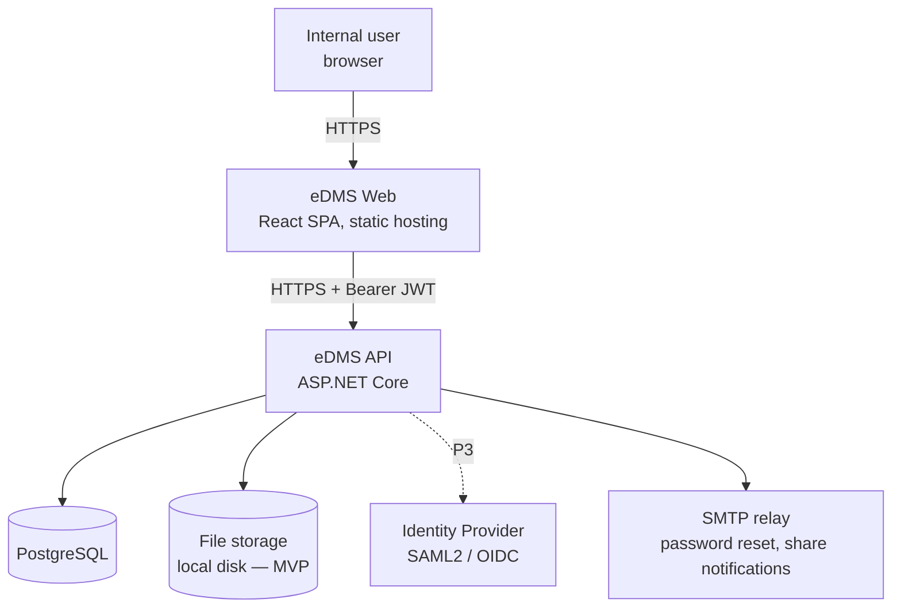
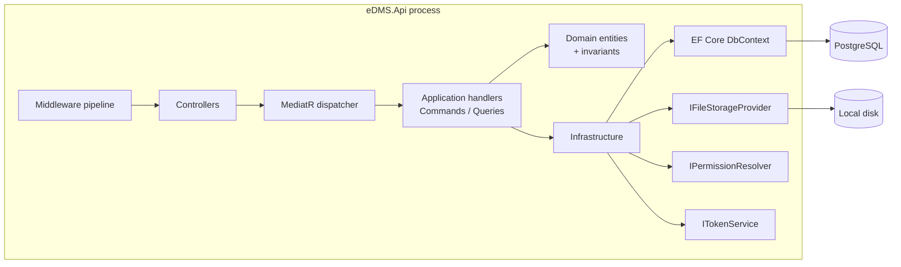
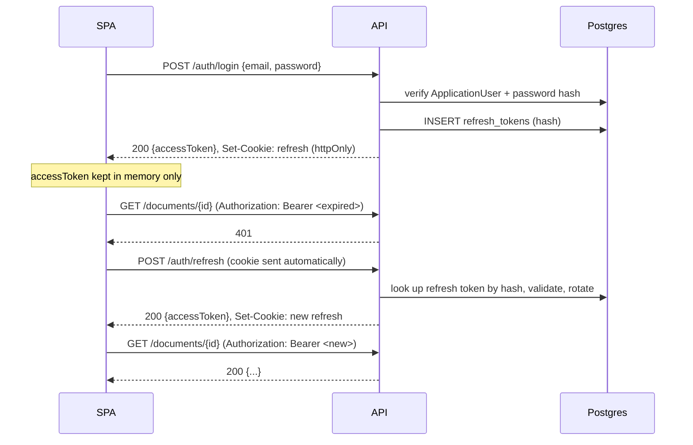
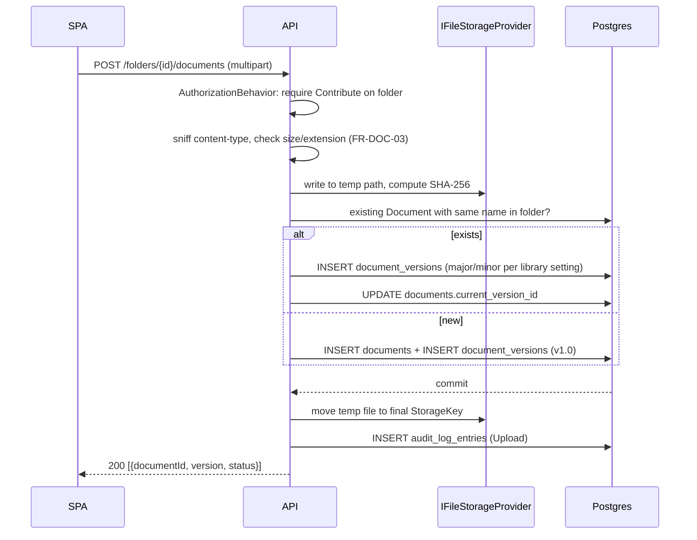
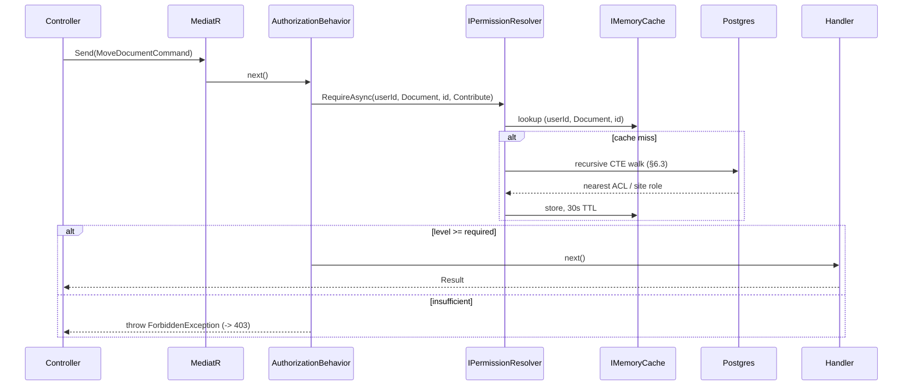

# eDMS — Enterprise Document Management System

## Technical Design Specification

| | |
|---|---|
| **Version** | 1.0 |
| **Status** | Draft for review |
| **Date** | 2026-08-15 |
| **Product name** | eDMS |
| **Audience** | Engineering (human + coding agent) |
| **Companion documents** | `functional-spec.md` / `.html` (requirements, data model, API surface, roadmap) — this document assumes that content and does not repeat it |

> This document is the machine/agent-oriented companion to `technical-design-spec.html` (human-readable). Content is equivalent; this version favors code blocks, tables, and DDL for direct use as build input.

---

## 1. Introduction & Purpose

The functional spec answers **what** eDMS does and **why**. This document answers **how** it is built: solution structure, physical database schema, class/interface-level design, request flows, deployment topology, testing strategy, and coding conventions.

Where the functional spec already fixes a decision (tech stack in its §3, data model in its §8, API surface in its §10, permission algorithm in its §9), this document treats that as given and adds the implementation layer underneath it. Every section below that depends on a functional-spec decision links back to it by section number (e.g. "FS §8.2") instead of re-describing it.

### 1.1 How to use this document

- **Building the backend?** Start at §5 (Backend Technical Design) and §6 (Database Technical Design).
- **Building the frontend?** Start at §7 (Frontend Technical Design).
- **Wiring CI/CD or an environment?** Start at §11 (Deployment & Infrastructure).
- **Writing tests?** Start at §12 (Testing Strategy).
- Requirement IDs from the functional spec (e.g. `FR-VER-05`) are referenced throughout so a change to one document's obligations is traceable to the other.

## 2. Architecture Overview

### 2.1 Architectural style

eDMS is a **modular monolith**: one ASP.NET Core Web API process, one PostgreSQL database, one React SPA — not a microservices decomposition. This is a deliberate choice for the scale described in the functional spec (single organization, five-ish sites growing to dozens, no stated requirement for independent team deployability). The backend is internally layered using **Clean Architecture** (Domain → Application → Infrastructure/API, FS §12.1) so that a future extraction into services remains possible without a rewrite, but nothing here should be over-engineered toward that future — YAGNI applies.

Within the Application layer, use cases follow a **CQRS-lite** pattern (commands and queries as discrete, named objects dispatched through MediatR) rather than one implicit "service" class per entity. This keeps authorization, validation, and audit-logging concerns attachable per use case via MediatR pipeline behaviors instead of being duplicated in every controller action.

### 2.2 System context



- The SPA is a static build (Vite output) served independently of the API — from a CDN, static web app host, or the same reverse proxy on a different path. It never talks to Postgres or file storage directly.
- The API is the single write/read gateway and the only component that enforces authorization (FS §9) — this is non-negotiable; see §10.1.
- SMTP is used for password-reset emails (FR-AUTH-04) and share notifications (FR-PERM-06); an `IEmailSender` abstraction keeps the concrete provider swappable (local dev uses a fake sender that logs to console/Mailhog, §11.2).

### 2.3 Container / component view



Dependency direction is enforced by project references, not convention: `Domain` has zero project references; `Application` references only `Domain`; `Infrastructure` references `Application` + `Domain`; `Api` references all three. A build-time check (see §13.1) fails CI if this is violated.

### 2.4 Key architecture decisions (ADR summary)

| # | Decision | Rationale | Alternatives considered |
|---|---|---|---|
| ADR-1 | Modular monolith, not microservices | Team size and scale don't justify service-boundary overhead; Clean Architecture layering preserves an extraction path later | Microservices per bounded context — rejected as premature |
| ADR-2 | CQRS-lite with MediatR, no full event sourcing | Gives per-use-case pipeline hooks (validation, auth, audit) without the operational cost of an event store | Plain service classes — rejected, leads to cross-cutting concerns duplicated per method; full ES — rejected, no requirement for temporal queries beyond the audit log |
| ADR-3 | Controllers, not Minimal APIs | ~50 endpoints (FS §10.2) benefit from attribute-based grouping, shared model binding, and filter reuse; Minimal APIs shine at smaller surface area | Minimal APIs — reconsider if the API surface stays under ~15 endpoints |
| ADR-4 | JWT (RS256) access token + rotating refresh token, not cookie-session auth | Decouples SPA from same-origin cookie constraints, gives a clean seam for SAML2/OIDC (P3) to federate into the same token issuance path (FS §6.1 design note) | ASP.NET Core Identity cookie auth — rejected for an API consumed by a separately-hosted SPA |
| ADR-5 | PostgreSQL full-text search (`tsvector`/GIN), not Elasticsearch | Meets FR-SRCH-01…06 without an extra service to operate; revisit only if FR-SRCH-07 (content-text indexing) plus corpus size pushes past what GIN indexes handle well | Elasticsearch/OpenSearch — deferred, not justified at MVP scale |
| ADR-6 | Local disk storage behind `IFileStorageProvider`, not S3/Blob from day one | Matches FS §13's on-prem, no-mandatory-cloud-dependency goal; the interface is the actual deliverable, not the local implementation | Direct S3 SDK calls — rejected, would leak a vendor dependency into Application layer |
| ADR-7 | Mapster over AutoMapper | Comparable capability, materially faster, no runtime reflection-heavy convention magic to debug | AutoMapper — acceptable substitute if the team has stronger prior familiarity |
| ADR-8 | EF Core supports four database providers behind the `Database:Provider` config key — PostgreSQL (production default), SQL Server, MySQL, SQLite (**default for local Development**) | PostgreSQL stays the production database, but no-install local dev should not require Docker/Postgres; enterprise deployments may sit on SQL Server/MySQL | Provider-locked to PostgreSQL — rejected: blocking a working dev loop on a local Postgres install; rejected *for now*: Pomelo for MySQL, because it lags EF Core 10 (official `MySql.EntityFrameworkCore` used instead — revisit if it blocks a needed feature) |
| ADR-9 | Content-type column values (FR-META-03) live in a portable `document_column_values` table (DocumentId + ColumnDefinitionId composite key, text values), not a `jsonb` bag on `Document` | `jsonb` is Postgres-only (ADR-8); a values table works identically on all four providers, keeps per-column constraints/validation simple, and mirrors the `column_definitions` metadata shape. Choice options are stored as JSON text in `column_definitions.choice_options`. Required-column enforcement happens at upload (metadata supplied in the same multipart request) and at check-in (FR-META-04) | `jsonb` bag on Document — rejected: Postgres-only, no per-column typing; separate EAV-style table — same as chosen, but with typed value columns (unnecessary complexity for MVP) |
| ADR-10 | Resumable uploads (FR-DOC-12) use a custom session-based protocol, not the tus standard | A custom protocol keeps the API surface consistent with the rest of the app (~4 endpoints), needs no extra client library, and the append-only session semantics (offset must continue exactly where the last chunk ended) give resume without per-chunk server state beyond a counter and a temp file. Chunks are 8 MiB; sessions expire after 24h and are swept by the orphaned-upload background job | tus — rejected: full tus server implementation is heavyweight for an internal tool; S3 multipart — rejected: local-disk storage (ADR-6) has no native multipart |
| ADR-11 | Office preview (FR-DOC-10) converts via a dedicated LibreOffice-headless HTTP container, behind `IOfficeConversionService` | Keeps the heavyweight native dependency out of the API process (mirrors ADR-6's interface pattern; the converter container is a separate compose service). The API falls back to serving the original bytes when the converter is unreachable, so preview never breaks the request | Shelling out to a locally-installed LibreOffice binary inside the API container — rejected: fragile, hard to deploy, couples API lifecycle to a heavyweight dependency; in-process .NET converters (e.g. Aspose) — rejected: licensing and binary size |
| ADR-12 | Notifications use on-write fan-out into a durable `notifications` inbox row per recipient; subscription frequency is snapshotted on each followed-item event, and a scoped background worker sends rows due for daily/weekly digest delivery | The bell can read durable state without reconstructing historical events, share notifications are visible immediately, and digest delivery is bounded and restart-safe because `email_sent_at` is the delivery watermark | On-read fan-out — rejected: it makes inbox pagination and read state expensive; a separate message broker — deferred: the modular monolith does not yet justify another operational dependency |
| ADR-13 | PDF/Office text extraction runs asynchronously through a dedicated Apache Tika HTTP container; extracted text and the source version ID are persisted on `documents`, and a bounded hosted-worker pass retries versions whose text is stale or unavailable | Keeps upload/check-in latency independent of heavyweight parsing, avoids a native/JVM dependency inside the API process, and makes indexing restart-safe because `extracted_text_version_id` is the durable work watermark. Postgres' generated `search_vector` includes the persisted text while the application query remains portable across all four providers | Synchronous inline extraction — rejected: large files would block writes and couple request availability to Tika; shelling out from the API — rejected: fragile process lifecycle and deployment coupling; a separate search engine — deferred: PostgreSQL GIN remains sufficient for the current corpus |

**ADR-8 implementation rules** (normative, not prose):

1. **One migrations assembly per provider** (`eDMS.Infrastructure.Migrations.Postgres|SqlServer|MySql|Sqlite`). EF applies *every* migration in a single assembly to any database, so mixing provider migrations in one assembly would apply the wrong set. The runtime selects the assembly via `MigrationsAssembly(...)`; `dotnet ef` selects it via `-p <project>` + `Database__Provider=<provider>` (see §6.4).
2. **Provider-specific schema is quarantined in `AppDbContext.ApplyProviderSpecificColumnTypes`**: Postgres keeps `citext` (case-insensitive unique email) and `jsonb` (audit details) plus `now()` defaults; SQLite uses a `NOCASE` collation on `email` (its lack of citext) and app-set timestamps (no `now()`); SqlServer/MySQL rely on their default case-insensitive collations and use `SYSDATETIMEOFFSET()`/`CURRENT_TIMESTAMP(6)` defaults. Nothing else in the model may branch on provider.
3. **SQLite has no `DateTimeOffset`** — `ConfigureConventions` applies `DateTimeOffsetToBinaryConverter` (UTC ticks) for SQLite only. Other providers map it natively.
4. **No provider-specific LINQ in query code.** `EF.Functions.ILike` (Npgsql-only) was replaced by portable `ToLower().Contains()`; provider-agnostic LINQ only, else the other three providers break at runtime.
5. **SQLite is a development convenience, not a production target.** Its file DB lives in the API content root (`edms-dev.db`, gitignored); the Postgres-specific `tsvector` full-text migration stays Postgres-only (search falls back to `ToLower().Contains()` elsewhere, per ADR-5's MVP scope).
6. The dev default is applied by the host (`Program.cs`: no `Database:Provider` config + `Development` ⇒ Sqlite; otherwise Postgres), not by the parser, so infrastructure code stays environment-agnostic.

## 3. Solution & Repository Structure

Single repository (monorepo). Top-level layout once implementation begins:

```
eDMS/
  doc/                        # this document, functional-spec.*
  prototype(html)/            # clickable UX prototype (reference only, not shipped)
  server/                     # .NET solution — see §3.1
  client/                     # React/Vite app — see §3.2
  .github/workflows/          # CI/CD — see §11.3
  docker-compose.yml          # local dev stack — see §11.2
```

### 3.1 Backend layout

```
server/
  eDMS.sln
  src/
    eDMS.Domain/               # entities, enums, value objects, domain invariants — no package refs beyond BCL
    eDMS.Application/          # commands, queries, handlers, validators, DTOs, interfaces (IFileStorageProvider, IPermissionResolver, IEmailSender, ITokenService, ICurrentUser)
    eDMS.Infrastructure/       # EF Core DbContext + entity configs, concrete implementations of Application interfaces, background services
    eDMS.Infrastructure.Migrations.Postgres/    # PostgreSQL migration set (ADR-8)
    eDMS.Infrastructure.Migrations.SqlServer/   # SQL Server migration set (ADR-8)
    eDMS.Infrastructure.Migrations.MySql/       # MySQL migration set (ADR-8)
    eDMS.Infrastructure.Migrations.Sqlite/      # SQLite migration set — local dev default (ADR-8)
    eDMS.Api/                  # controllers, Program.cs, middleware, DI composition, appsettings*.json
  tests/
    eDMS.Domain.UnitTests/
    eDMS.Application.UnitTests/
    eDMS.IntegrationTests/     # WebApplicationFactory + Testcontainers PostgreSQL — see §12.1
```

Each `Application` use case lives as a **vertical slice** rather than being split across generic "Service"/"Repository" folders:

```
eDMS.Application/
  Documents/
    Commands/
      CheckOutDocument/
        CheckOutDocumentCommand.cs
        CheckOutDocumentHandler.cs
        CheckOutDocumentValidator.cs
      CheckInDocument/
      UploadDocument/
      MoveDocument/
      ...
    Queries/
      GetDocumentById/
      ListFolderItems/
      ...
    DocumentDto.cs
  Folders/
  Sites/
  Libraries/
  Permissions/
  Search/
  Admin/
  Common/
    Behaviors/                 # MediatR pipeline behaviors: ValidationBehavior, AuthorizationBehavior, AuditLoggingBehavior
    Interfaces/                # IFileStorageProvider, IPermissionResolver, IEmailSender, ITokenService, ICurrentUser, IAppDbContext
```

Rationale: a coding agent implementing "check-out a document" touches one folder (command + handler + validator), not four generic layers scattered across the codebase — this keeps generated code additive and low-risk to review.

### 3.2 Frontend layout

See §7.1 (kept there since it's read together with the rest of the frontend design).

## 4. Cross-Cutting Conventions

These apply across both backend and frontend and are referenced rather than repeated in later sections.

| Concern | Convention |
|---|---|
| IDs | `Guid` (PostgreSQL `uuid`) everywhere, generated application-side via `Guid.CreateVersion7()` (.NET 9+, time-ordered — keeps B-tree PK indexes append-friendly, avoiding the random-UUID index-fragmentation problem) |
| Timestamps | UTC only, `timestamptz` in Postgres, ISO-8601 over the wire (FS §10.1); never store local time. Other providers map this via their migration sets (SQLite stores UTC binary ticks — ADR-8) |
| Soft delete | `IsDeleted` + `DeletedAt` + `DeletedBy` on every entity that appears in the Recycle Bin (Folder, Document per FS §6.8); enforced via an EF Core global query filter, never a manual `WHERE` clause per query |
| Audit fields | `CreatedBy` / `CreatedAt` on every entity; `ModifiedBy` / `ModifiedAt` where the functional spec's data model (FS §8.2) lists them |
| Nullability | C# nullable reference types **enabled** solution-wide (`<Nullable>enable</Nullable>`); TypeScript `strict: true` (already required by the user's stack choice) |
| Money/size | Byte counts as `bigint`/`number`, never floating point; display formatting (`"2.4 MB"`) is a frontend-only concern, never stored |

## 5. Backend Technical Design

### 5.1 Domain layer

Contains entities matching FS §8.2 field-for-field, plus base types that remove repetition:

```csharp
public abstract class AuditableEntity
{
    public Guid Id { get; protected set; }
    public Guid CreatedBy { get; protected set; }
    public DateTimeOffset CreatedAt { get; protected set; }
}

public abstract class SoftDeletableEntity : AuditableEntity
{
    public bool IsDeleted { get; private set; }
    public DateTimeOffset? DeletedAt { get; private set; }
    public Guid? DeletedBy { get; private set; }

    public void MarkDeleted(Guid byUserId, DateTimeOffset at)
    {
        if (IsDeleted) return;
        IsDeleted = true;
        DeletedAt = at;
        DeletedBy = byUserId;
    }

    public void Restore()
    {
        IsDeleted = false;
        DeletedAt = null;
        DeletedBy = null;
    }
}
```

`Document`, `Folder` : `SoftDeletableEntity`. `Site`, `Library` also derive from it (FS §8.2 lists `IsDeleted` on both). `DocumentVersion`, `SitePermission`, `ItemPermission`, `AuditLogEntry` : `AuditableEntity` only (no soft delete — versions are immutable once created; permissions are removed outright, not soft-deleted; audit entries are immutable per FR-AUDIT-04).

Domain entities own their invariants — e.g. `Document.CheckOut(Guid userId)` throws `DocumentAlreadyCheckedOutException` if `CheckedOutBy` is already set to a different user, rather than leaving that check to be re-implemented (or forgotten) in every caller.

### 5.2 Application layer

**Pattern for every use case** (illustrated with check-out, FR-VER-05):

```csharp
public sealed record CheckOutDocumentCommand(Guid DocumentId) : IRequest<Result>;

public sealed class CheckOutDocumentValidator : AbstractValidator<CheckOutDocumentCommand>
{
    public CheckOutDocumentValidator() =>
        RuleFor(x => x.DocumentId).NotEmpty();
}

public sealed class CheckOutDocumentHandler(
    IAppDbContext db, ICurrentUser currentUser, IPermissionResolver permissions, IAuditLogger audit)
    : IRequestHandler<CheckOutDocumentCommand, Result>
{
    public async Task<Result> Handle(CheckOutDocumentCommand cmd, CancellationToken ct)
    {
        var document = await db.Documents.FindAsync([cmd.DocumentId], ct)
            ?? throw new NotFoundException(nameof(Document), cmd.DocumentId);

        // Belt-and-suspenders: the AuthorizationBehavior pipeline step (below)
        // already blocked this request if the caller lacks Contribute; this
        // second check exists only to translate a race (permission revoked
        // between pipeline check and handler execution) into a clean 403
        // rather than a stale-state bug.
        await permissions.RequireAsync(currentUser.UserId, ObjectType.Document, document.Id, PermissionLevel.Contribute, ct);

        document.CheckOut(currentUser.UserId);
        await db.SaveChangesAsync(ct);
        await audit.LogAsync(AuditAction.CheckOut, ObjectType.Document, document.Id, document.Name, ct);
        return Result.Success();
    }
}
```

**MediatR pipeline behaviors** (registered once, applied to every command/query, in this order):

1. `ValidationBehavior<TRequest, TResponse>` — runs the FluentValidation validator for the request, short-circuits with a 400 Problem Details response on failure.
2. `AuthorizationBehavior<TRequest, TResponse>` — for any request implementing `IAuthorizableRequest` (exposes `ObjectType`, `ObjectId`, `RequiredLevel`), calls `IPermissionResolver` before the handler runs. This is what makes "every mutating endpoint enforces the permission model" (FS §10.1) structurally true instead of aspirational — a handler cannot be wired up without either implementing `IAuthorizableRequest` or being explicitly marked `[AllowAnonymousCheck]` for the handful of endpoints that are legitimately public (login, forgot-password).
3. `AuditLoggingBehavior<TRequest, TResponse>` — for requests implementing `IAuditableRequest`, writes the `AuditLogEntry` (FS §8.2) after a successful handler execution. Centralizing this here is why FR-AUDIT-01's action list is complete by construction rather than by developers remembering to log at each call site.

### 5.3 `IPermissionResolver` — the permission-resolution algorithm (FS §9)

```csharp
public interface IPermissionResolver
{
    Task<PermissionLevel> GetEffectiveLevelAsync(Guid userId, ObjectType type, Guid objectId, CancellationToken ct);
    Task RequireAsync(Guid userId, ObjectType type, Guid objectId, PermissionLevel required, CancellationToken ct); // throws ForbiddenException
}
```

Implementation walks the hierarchy exactly as specified in FS §9, with two implementation details the functional spec deliberately leaves open:

- **Bypass**: `ICurrentUser.IsSystemAdmin` short-circuits to `PermissionLevel.FullControl` immediately — but the caller (`AuthorizationBehavior`) still lets the `AuditLoggingBehavior` run normally, so admin bypass is always audited (FS §9 bullet 1).
- **Caching**: effective-permission lookups are cached in `IMemoryCache` keyed by `(userId, objectType, objectId)` with a 30-second TTL. Any command that mutates `ItemPermission`, `SitePermission`, or `GroupMember` calls `IPermissionCacheInvalidator.InvalidateForObjectAsync(...)` (walks the same hierarchy downward to invalidate descendants) in the same handler, immediately after `SaveChangesAsync`. This bounds staleness to at most 30s even if an invalidation path is ever missed, while keeping the common case (repeated reads while browsing a library) fast without a query per row. Revisit with a distributed cache (Redis) only if/when the API scales beyond one instance (FS NFR "stateless API... horizontal scaling").

Physical query for the hierarchy walk uses a recursive CTE (one round-trip instead of N) — see §6.3.

### 5.4 `IFileStorageProvider` and versioning

```csharp
public interface IFileStorageProvider
{
    Task<string> SaveAsync(Stream content, string suggestedKey, CancellationToken ct);
    Task<Stream> OpenReadAsync(string storageKey, CancellationToken ct);
    Task DeleteAsync(string storageKey, CancellationToken ct);
}
```

`LocalDiskFileStorageProvider` (MVP implementation) keys files as:

```
{StorageRoot}/{siteId}/{libraryId}/{documentId}/{versionId}/{originalFileName}
```

Upload flow (`UploadDocumentHandler`, backing FR-DOC-01/FR-VER-01):

1. Compute SHA-256 of the incoming stream while writing to a temp file (avoids buffering the whole file in memory for the 250 MB ceiling in FR-DOC-03).
2. Sniff content-type from the file's magic bytes (not the client-supplied `Content-Type` header — see §10.3) and reject if it doesn't match an allow-listed type or matches a blocked extension (FR-DOC-03).
3. If a `Document` with the same `Name` already exists in the target folder: create a new `DocumentVersion` (major/minor per FS FR-VER-02), update `Document.CurrentVersionId`. Otherwise create a new `Document` at version 1.0.
4. Move the temp file to its final `StorageKey` only after the DB transaction that creates the `DocumentVersion` row commits (avoids orphaned blobs on a failed transaction; an orphan-sweep background job, §5.8, cleans up temp files older than 24h as a backstop).

### 5.5 Authentication implementation

- **User store**: ASP.NET Core Identity (`ApplicationUser : IdentityUser<Guid>`, FS §3 recommendation) provides password hashing (PBKDF2, `IPasswordHasher<T>` default), lockout tracking (`AccessFailedCount`, `LockoutEnd` — backs FR-AUTH-06), and the `AspNetUsers`/`AspNetUserRoles` tables. `IsSystemAdmin` is a plain bool column on `ApplicationUser`, not an Identity Role — the functional spec's permission model (FS §4.1) treats "System Administrator" as a single global flag, not a role hierarchy, so mapping it onto Identity's role system would add indirection with no benefit.
- **Token issuance** (`ITokenService`):
  - Access token: JWT, **RS256**, 15 min default lifetime (FR-AUTH-02, configurable per FS §16 assumption 6). Claims: `sub` (user id), `email`, `is_admin`, `jti`. Signing key pair stored in configuration (`Jwt:PrivateKey`/`Jwt:PublicKey`), sourced from environment/secret store in every environment above local dev (§11.4) — never checked into source.
  - Refresh token: opaque random 256-bit value, **never stored raw** — only its SHA-256 hash is persisted (so a DB read alone can't be replayed as a live token). Delivered to the browser as an `httpOnly`, `Secure`, `SameSite=Strict` cookie, never touched by frontend JS.
- **Refresh rotation with reuse detection** — table not enumerated in FS §8.2 because it's auth plumbing, not a domain entity; defined here:

```sql
CREATE TABLE refresh_tokens (
    id                uuid PRIMARY KEY,
    user_id           uuid NOT NULL REFERENCES "AspNetUsers"(id),
    token_hash        text NOT NULL UNIQUE,
    expires_at        timestamptz NOT NULL,
    created_at        timestamptz NOT NULL DEFAULT now(),
    created_by_ip     text,
    revoked_at        timestamptz,
    replaced_by_token_id uuid REFERENCES refresh_tokens(id)
);
CREATE INDEX ix_refresh_tokens_user_id ON refresh_tokens(user_id);
```

  `POST /auth/refresh` flow: look up by hash of the presented cookie value → if not found or expired or revoked, fail closed (401) → if found and valid, mark it revoked, issue a new refresh token row with `replaced_by_token_id` pointing at the new row, issue a new access token. If a **revoked** token is presented (meaning it was already rotated once — a signal of token theft/replay), revoke the *entire* token chain for that user and force re-authentication. This is the standard rotation-with-reuse-detection pattern and is the reason the schema keeps a `replaced_by_token_id` chain rather than just an `is_revoked` flag.
- **SAML2 / OIDC (P3, FR-AUTH-09/10)**: both terminate at `POST /auth/sso/{provider}/callback`, which performs JIT provisioning (create `ApplicationUser` with `AuthProvider` = `Saml`/`Oidc`, `ExternalId` = the IdP's subject/NameID, matched by email on first login) and then calls the **same** `ITokenService.IssueTokenPairAsync` used by local login. This is why the SPA's auth handling never needs to change when SSO ships (FS §6.1 design note) — the token contract is identical regardless of how the user authenticated upstream.

### 5.6 Authorization implementation

Two layers, deliberately not one:

1. **Coarse-grained, ASP.NET Core policy-based**: `[Authorize]` (any authenticated user) and `[Authorize(Policy = "SystemAdmin")]` (checks `is_admin` claim) on controllers/actions — cheap, no DB round-trip, filters out unauthenticated/non-admin traffic before it reaches MediatR at all.
2. **Fine-grained, resource-based**: the `AuthorizationBehavior` MediatR pipeline step described in §5.2, backed by `IPermissionResolver` (§5.3) — this is what implements FS §9's actual walk-the-hierarchy algorithm and cannot be expressed as a static ASP.NET Core policy because the required level depends on which specific `Document`/`Folder`/`Library`/`Site` the request targets.

### 5.7 API layer

- **Controllers**: one per aggregate root area (`DocumentsController`, `FoldersController`, `LibrariesController`, `SitesController`, `SearchController`, `AdminController`, …), thin — each action constructs a MediatR command/query from route/query/body parameters, sends it, maps the result to an HTTP response. No business logic in controllers.
- **Global exception → Problem Details mapping** (`IExceptionHandler`, .NET's built-in exception-handling middleware):

| Exception | HTTP status | `type` |
|---|---|---|
| `ValidationException` (FluentValidation) | 400 | `urn:edms:validation-error`, `errors` dict populated |
| `NotFoundException` | 404 | `urn:edms:not-found` |
| `ForbiddenException` | 403 | `urn:edms:forbidden` |
| `ConflictException` (e.g. checked-out-by-someone-else) | 409 | `urn:edms:conflict` |
| anything else | 500 | `urn:edms:internal-error` — message is generic in non-dev environments; full detail goes to Serilog only |

Matches the RFC 7807 envelope fixed in FS §10.1.

- **API docs**: `Microsoft.AspNetCore.OpenApi` generates the OpenAPI document; Swagger UI mounted only when `ASPNETCORE_ENVIRONMENT=Development`.
- **Rate limiting**: built-in `Microsoft.AspNetCore.RateLimiting` middleware, fixed-window limiter on `/auth/login` and `/auth/forgot-password` (FS §14 — 10 requests/minute/IP, returns 429).
- **CORS**: explicit allow-list of the SPA's origin(s) from configuration; credentials allowed (needed for the refresh cookie) but wildcard origins are never permitted alongside `AllowCredentials`.

### 5.8 Background services

`IHostedService`/`BackgroundService` implementations (FS §3 recommendation — `BackgroundService` for MVP):

| Service | Schedule | Responsibility |
|---|---|---|
| `RecycleBinPurgeService` | Daily, 02:00 local | Hard-deletes soft-deleted Folders/Documents past the configured retention window (default 90 days, FR-BIN-04) and their blobs via `IFileStorageProvider.DeleteAsync` |
| `OrphanedUploadSweepService` | Hourly | Removes temp upload files older than 24h that never completed a transaction (§5.4 step 4 backstop) |
| `ContentTextIndexingService` | Every minute, bounded batch | Sends current PDF/Office versions through Apache Tika and persists extracted text; a version mismatch remains pending for retry (FR-SRCH-07, ADR-13) |
| `PermissionCacheWarmupService` *(optional, P2)* | On startup | Pre-populates the permission cache for active sessions after a deploy, to avoid a cold-cache latency spike |

## 6. Database Technical Design

### 6.1 Conventions

- Naming: snake_case in Postgres, PascalCase in C#, bridged by `EFCore.NamingConventions` (FS §3) — this document's DDL therefore shows snake_case table/column names as the physical truth.
- Primary keys: `uuid`, generated application-side (§4), not `gen_random_uuid()` — keeps ID generation testable without a DB round-trip and avoids depending on the `pgcrypto` extension.
- `citext` extension enabled for `AspNetUsers.email` (case-insensitive uniqueness, FS §8.2 note).
- Every FK is `ON DELETE RESTRICT` by default; the few intentional cascades (e.g. `document_versions` cascading from `documents`) are called out explicitly below.

### 6.2 Core physical schema

Full field semantics are in FS §8.2; this is the physical DDL derived from it for the tables needed to ship the MVP (FS §15 Phase 1). P2 tables (`content_types`, `column_definitions`, `share_links`, `alert_subscriptions`, `favorite_items`) follow the same conventions and are deferred to when Phase 2 work begins, to keep this section focused.

```sql
CREATE EXTENSION IF NOT EXISTS citext;

-- Sites -----------------------------------------------------------------
CREATE TABLE sites (
    id                  uuid PRIMARY KEY,
    name                text NOT NULL,
    description         text,
    url_slug            text NOT NULL UNIQUE,
    storage_quota_bytes bigint,
    storage_used_bytes  bigint NOT NULL DEFAULT 0,
    is_deleted          boolean NOT NULL DEFAULT false,
    deleted_at          timestamptz,
    deleted_by          uuid,
    created_by          uuid NOT NULL REFERENCES "AspNetUsers"(id),
    created_at          timestamptz NOT NULL DEFAULT now()
);

CREATE TABLE site_permissions (
    id             uuid PRIMARY KEY,
    site_id        uuid NOT NULL REFERENCES sites(id) ON DELETE CASCADE,
    principal_type smallint NOT NULL,        -- 0=User, 1=Group
    principal_id   uuid NOT NULL,
    role           smallint NOT NULL,        -- 0=Owner, 1=Member, 2=Visitor
    UNIQUE (site_id, principal_type, principal_id)
);

-- Groups ------------------------------------------------------------------
CREATE TABLE groups (
    id          uuid PRIMARY KEY,
    name        text NOT NULL UNIQUE,
    description text,
    is_system   boolean NOT NULL DEFAULT false,
    site_id     uuid REFERENCES sites(id) ON DELETE CASCADE,
    created_by  uuid NOT NULL REFERENCES "AspNetUsers"(id),
    created_at  timestamptz NOT NULL DEFAULT now()
);

CREATE TABLE group_members (
    group_id uuid NOT NULL REFERENCES groups(id) ON DELETE CASCADE,
    user_id  uuid NOT NULL REFERENCES "AspNetUsers"(id) ON DELETE CASCADE,
    added_at timestamptz NOT NULL DEFAULT now(),
    PRIMARY KEY (group_id, user_id)
);

-- Libraries / Folders / Documents ------------------------------------------
CREATE TABLE libraries (
    id                     uuid PRIMARY KEY,
    site_id                uuid NOT NULL REFERENCES sites(id) ON DELETE CASCADE,
    name                   text NOT NULL,
    description            text,
    enable_versioning      boolean NOT NULL DEFAULT true,
    enable_minor_versions  boolean NOT NULL DEFAULT false,
    require_checkout       boolean NOT NULL DEFAULT false,
    is_deleted             boolean NOT NULL DEFAULT false,
    created_by             uuid NOT NULL REFERENCES "AspNetUsers"(id),
    created_at             timestamptz NOT NULL DEFAULT now()
);

CREATE TABLE folders (
    id               uuid PRIMARY KEY,
    library_id       uuid NOT NULL REFERENCES libraries(id) ON DELETE CASCADE,
    parent_folder_id uuid REFERENCES folders(id),
    name             text NOT NULL,
    path             text NOT NULL,          -- materialized path, e.g. '/Contracts/2026/'
    is_deleted       boolean NOT NULL DEFAULT false,
    deleted_at       timestamptz,
    deleted_by       uuid,
    created_by       uuid NOT NULL REFERENCES "AspNetUsers"(id),
    created_at       timestamptz NOT NULL DEFAULT now(),
    modified_by      uuid,
    modified_at      timestamptz
);
CREATE INDEX ix_folders_library_parent ON folders(library_id, parent_folder_id) WHERE NOT is_deleted;

CREATE TABLE documents (
    id                  uuid PRIMARY KEY,
    library_id          uuid NOT NULL REFERENCES libraries(id) ON DELETE CASCADE,
    folder_id           uuid REFERENCES folders(id),
    name                text NOT NULL,
    title               text,
    description         text,
    content_type        text NOT NULL,
    current_version_id  uuid,                -- FK added after document_versions exists (see ALTER below)
    checked_out_by      uuid REFERENCES "AspNetUsers"(id),
    checked_out_at      timestamptz,
    is_deleted          boolean NOT NULL DEFAULT false,
    deleted_at          timestamptz,
    deleted_by          uuid,
    created_by          uuid NOT NULL REFERENCES "AspNetUsers"(id),
    created_at          timestamptz NOT NULL DEFAULT now(),
    modified_by         uuid,
    modified_at         timestamptz,
    extracted_text      text,
    extracted_text_version_id uuid,
    search_vector       tsvector GENERATED ALWAYS AS (
        setweight(to_tsvector('english', coalesce(name, '')), 'A') ||
        setweight(to_tsvector('english', coalesce(title, '')), 'A') ||
        setweight(to_tsvector('english', coalesce(description, '')), 'B') ||
        setweight(to_tsvector('english', coalesce(extracted_text, '')), 'C')
    ) STORED
);
CREATE INDEX ix_documents_folder ON documents(library_id, folder_id) WHERE NOT is_deleted;
CREATE INDEX ix_documents_search_vector ON documents USING GIN(search_vector);
CREATE INDEX ix_documents_checked_out_by ON documents(checked_out_by) WHERE checked_out_by IS NOT NULL;

CREATE TABLE document_versions (
    id            uuid PRIMARY KEY,
    document_id   uuid NOT NULL REFERENCES documents(id) ON DELETE CASCADE,
    version_major int NOT NULL,
    version_minor int NOT NULL DEFAULT 0,
    storage_key   text NOT NULL,
    size_bytes    bigint NOT NULL,
    checksum      text NOT NULL,             -- SHA-256, hex
    comment       text,
    is_major      boolean NOT NULL,
    created_by    uuid NOT NULL REFERENCES "AspNetUsers"(id),
    created_at    timestamptz NOT NULL DEFAULT now(),
    UNIQUE (document_id, version_major, version_minor)
);
ALTER TABLE documents ADD CONSTRAINT fk_documents_current_version
    FOREIGN KEY (current_version_id) REFERENCES document_versions(id);

-- Tags ----------------------------------------------------------------------
CREATE TABLE tags (
    id   uuid PRIMARY KEY,
    name text NOT NULL UNIQUE
);
CREATE TABLE document_tags (
    document_id uuid NOT NULL REFERENCES documents(id) ON DELETE CASCADE,
    tag_id      uuid NOT NULL REFERENCES tags(id) ON DELETE CASCADE,
    PRIMARY KEY (document_id, tag_id)
);

-- Item-level ACLs (Library / Folder / Document) ------------------------------
CREATE TABLE item_permissions (
    id             uuid PRIMARY KEY,
    object_type    smallint NOT NULL,        -- 0=Library, 1=Folder, 2=Document
    object_id      uuid NOT NULL,
    principal_type smallint NOT NULL,        -- 0=User, 1=Group
    principal_id   uuid NOT NULL,
    level          smallint NOT NULL,        -- 0=FullControl, 1=Contribute, 2=Read, 3=NoAccess
    granted_by     uuid NOT NULL REFERENCES "AspNetUsers"(id),
    granted_at     timestamptz NOT NULL DEFAULT now(),
    UNIQUE (object_type, object_id, principal_type, principal_id)
);
CREATE INDEX ix_item_permissions_object ON item_permissions(object_type, object_id);

-- Audit log (immutable — no application code ever issues UPDATE/DELETE) -----
CREATE TABLE audit_log_entries (
    id          uuid PRIMARY KEY,
    "timestamp" timestamptz NOT NULL DEFAULT now(),
    user_id     uuid NOT NULL REFERENCES "AspNetUsers"(id),
    action      smallint NOT NULL,
    object_type smallint NOT NULL,
    object_id   uuid NOT NULL,
    object_name text NOT NULL,
    site_id     uuid,
    details     jsonb,
    ip_address  text
);
CREATE INDEX ix_audit_log_timestamp ON audit_log_entries("timestamp" DESC);
CREATE INDEX ix_audit_log_site_timestamp ON audit_log_entries(site_id, "timestamp" DESC);
CREATE INDEX ix_audit_log_user ON audit_log_entries(user_id);
```

Enforcing audit-log immutability (FR-AUDIT-04) at the database level, not just by omitting `UPDATE`/`DELETE` from the API: revoke those grants from the application's runtime role —

```sql
REVOKE UPDATE, DELETE ON audit_log_entries FROM edms_app;
```

so a bug (or a future developer who didn't read this doc) cannot silently start mutating history; the failure is a hard DB error, not a policy someone forgot to enforce.

### 6.3 The permission-hierarchy query

Backing `IPermissionResolver` (§5.3), a single recursive CTE resolves the nearest unique ACL up the Folder → Library → Site chain in one round trip instead of N+1 queries:

```sql
WITH RECURSIVE chain AS (
    -- anchor: the requested object itself
    SELECT :object_type AS object_type, :object_id AS object_id, 0 AS depth
    UNION ALL
    -- recursive step: walk Folder -> parent Folder or Library; Library -> Site
    SELECT
        CASE WHEN f.parent_folder_id IS NOT NULL THEN 1 ELSE 0 END,   -- 1=Folder, 0=Library
        COALESCE(f.parent_folder_id, f.library_id),
        c.depth + 1
    FROM chain c
    JOIN folders f ON c.object_type = 1 AND f.id = c.object_id
    WHERE c.depth < 20                                                -- matches FR-FLD-06's max nesting
)
SELECT c.object_type, c.object_id, c.depth
FROM chain c
ORDER BY c.depth;
```

The resolver walks this result set in order, stopping at the first `object_type`/`object_id` pair that has a row in `item_permissions` for the caller (directly or via any `group_members` row); if none match, it falls through to `site_permissions` for the Site at the end of the chain. This query pattern — not a loop of separate queries per level — is what keeps FS's NFR ("permission checks run server-side on every request") affordable at the stated scale.

### 6.4 Migrations

EF Core Code-First, **one migration set per database provider** (ADR-8), each in its own project so a database never sees another provider's migrations. Select the set with the `Database__Provider` environment variable and the matching `-p` project:

```bash
# bash — PostgreSQL (production):
Database__Provider=Postgres dotnet ef migrations add <Name> -p server/src/eDMS.Infrastructure.Migrations.Postgres -s server/src/eDMS.Api
# PowerShell:
#   $env:Database__Provider='Postgres'; dotnet ef migrations add <Name> -p server/src/eDMS.Infrastructure.Migrations.Postgres -s server/src/eDMS.Api
# SqlServer / MySql / Sqlite: swap the value and the project accordingly.
```

Every model change requires a migration **in all four sets** — verify nothing is missed with `dotnet ef migrations has-pending-model-changes -p <project> -s server/src/eDMS.Api` per provider. Migrations run automatically on API startup **only** in `Development`/`Testing`; in every other environment they run as an explicit CI/CD pipeline step before the new API version is deployed (§11.3) — auto-migrating a production database from application startup is exactly the kind of implicit, easy-to-get-wrong behavior this document exists to rule out explicitly.

### 6.5 Seed data

On first run against an empty database, a seed step (idempotent, checks `AspNetUsers` is empty before doing anything) creates exactly one System Administrator account from configuration (`Seed:AdminEmail`, `Seed:AdminTempPassword`, both required env vars with no baked-in default), with `IsSystemAdmin = true` and a forced-password-reset flag. No sample Sites, Libraries, or documents are seeded outside of local development (`docker-compose.yml`, §11.2, seeds the demonstration data that matches `prototype(html)/assets/data.js` so manual testing has realistic content without reusing production-shaped fixtures in prod).

## 7. Frontend Technical Design

### 7.1 Project structure

```
client/
  src/
    app/
      routes.tsx              # React Router route tree, see §7.2
      AppShell.tsx             # topbar + sidebar layout, mirrors prototype(html) IA
      providers.tsx            # QueryClientProvider, theme provider, toast provider
    components/
      ui/                      # shadcn-generated primitives — do not hand-edit generated files
      common/                  # FileIcon, Breadcrumbs, EmptyState, DataTable, CommandPalette
    features/
      auth/
      sites/
      libraries/
        components/
        hooks/
        api.ts                 # feature-scoped API calls, thin wrapper over lib/api-client
      documents/
      permissions/
      search/
      recycle-bin/
      admin/
    lib/
      api-client.ts             # §7.3
      query-keys.ts              # §7.4
    hooks/
    stores/                     # Zustand — UI state only, see §7.4
    types/
      api.ts                    # DTO types generated/hand-mirrored from backend contracts, §8.2
    main.tsx
  vite.config.ts
  .env.example
```

Each `features/*` folder is a vertical slice mirroring the backend's Application folders (§3.1) — `features/documents` calls the `/documents/*` endpoints and owns the document-details Sheet component; it does not reach into `features/permissions`' internals directly, only through its exported hooks.

### 7.2 Routing

React Router route tree (data router). Matches the prototype's information architecture (`prototype(html)/assets/app.js` sidebar) one-to-one so the eventual real app and the stakeholder prototype never diverge in navigation shape:

```tsx
const router = createBrowserRouter([
  { path: "/login", element: <LoginPage /> },
  { path: "/forgot-password", element: <ForgotPasswordPage /> },
  {
    element: <AppShell />,                    // requires auth — redirects to /login if no valid session
    children: [
      { path: "/", element: <HomePage /> },
      { path: "/sites/:siteSlug", element: <SiteHomePage /> },
      { path: "/sites/:siteSlug/libraries/:libraryId/*", element: <LibraryBrowserPage /> },
      { path: "/search", element: <SearchPage /> },
      { path: "/recycle-bin/:siteSlug", element: <RecycleBinPage /> },
      { path: "/me/profile", element: <ProfilePage /> },
      {
        path: "/admin",
        element: <RequireAdmin />,             // client-side gate; server is the real enforcement point
        children: [
          { path: "users", element: <AdminUsersPage /> },
          { path: "groups", element: <AdminGroupsPage /> },
          { path: "sites", element: <AdminSitesPage /> },
          { path: "storage", element: <AdminStorageReportPage /> },
          { path: "audit-log", element: <AdminAuditLogPage /> },
          { path: "settings", element: <AdminSettingsPage /> },
        ],
      },
    ],
  },
]);
```

`RequireAdmin` and the auth-gated layout are UX affordances only (hide the nav item, redirect proactively) — every one of these routes' underlying API calls is independently authorized server-side per §5.6; the frontend gate is never the actual security boundary (FS §9 closing bullet).

### 7.3 API client

One typed wrapper, not per-feature `fetch` calls, so the 401-retry-after-refresh flow (§9.1) is implemented exactly once:

```ts
// lib/api-client.ts
let accessToken: string | null = null;
let refreshPromise: Promise<void> | null = null;

async function request<T>(path: string, init: RequestInit = {}): Promise<T> {
  const res = await fetch(`${API_BASE}${path}`, {
    ...init,
    credentials: "include",                 // sends the httpOnly refresh cookie
    headers: { ...init.headers, ...(accessToken && { Authorization: `Bearer ${accessToken}` }) },
  });

  if (res.status === 401 && !path.startsWith("/auth/")) {
    refreshPromise ??= refreshAccessToken().finally(() => (refreshPromise = null));
    await refreshPromise;                    // de-duped: concurrent 401s trigger exactly one refresh call
    return request<T>(path, init);           // retry once with the new token
  }

  if (!res.ok) throw await ApiError.fromResponse(res);
  return res.status === 204 ? (undefined as T) : res.json();
}
```

`accessToken` lives in module-level memory only — never `localStorage`/`sessionStorage` (an XSS payload that can read `localStorage` can read a token that lives there; keeping it in memory means a page reload requires one silent `/auth/refresh` round-trip on boot, which is a deliberately acceptable trade for not persisting a bearer token to disk).

### 7.4 State management

| State category | Tool | Convention |
|---|---|---|
| Server data (sites, libraries, documents, permissions, search results, everything the API owns) | TanStack Query | Query keys are hierarchical arrays from a single factory (`queryKeys.documents.detail(id)`, `queryKeys.libraries.list(siteId, libraryId, folderId)`) so invalidation after a mutation (e.g. check-in invalidates the containing folder's list + the document's own detail) is exhaustive and grep-able, not stringly-typed |
| Client/UI-only state (selected row ids, list-vs-grid toggle, side panel open/closed, command palette open) | Zustand | One small store per feature area (`useLibrarySelectionStore`, `useCommandPaletteStore`) — never mirrors server data; if a value can be derived from a query, it is derived, not duplicated into a store |
| Theme selection | Zustand + `localStorage` persistence middleware | Matches the 4-theme mechanism already proven in `prototype(html)/assets/app.js` (`applyTheme`/`THEME_META`) — the production implementation ports that logic rather than redesigning it |
| Auth/session | React context wrapping TanStack Query's `/auth/me` query | Not Zustand — session state is server-owned data (is it valid right now?), not client UI state |

### 7.5 Forms

`react-hook-form` + `zod`, with the zod schema for each form colocated with (and structurally matching) the DTO it submits, so validation rules can't silently drift from what the API actually accepts:

```ts
const checkInSchema = z.object({
  comment: z.string().max(1000).optional(),
  versionType: z.enum(["major", "minor"]),
});
type CheckInFormValues = z.infer<typeof checkInSchema>;
```

Rendered via shadcn's `Form` primitives (`FormField`, `FormItem`, `FormMessage`) exclusively — no ad hoc `<input>` + manual error-state wiring, so every form in the app has identical error/disabled/loading affordances.

### 7.6 Build & environment

| Variable | Purpose |
|---|---|
| `VITE_API_BASE_URL` | Base URL the API client targets; differs per environment (§11.1) |
| `VITE_APP_NAME` | Overrides the branding shown in the topbar (mirrors Admin → Settings' "Application name", FS admin settings) |

`vite.config.ts` enables the React plugin, path alias `@/*` → `src/*`, and (production build only) manual chunk-splitting for the `shadcn`/Radix primitive bundle vs. feature code, since the former changes far less often than the latter and benefits from independent long-term caching.

## 8. API Contract Details

### 8.1 Conventions

Recap of FS §10.1 (base path, pagination envelope, Problem Details errors, auth header) — not repeated here. This section adds the concrete request/response shapes for the endpoints with the most implementation-relevant nuance.

### 8.2 Selected DTOs

```ts
// POST /auth/login
interface LoginRequest { email: string; password: string; }
interface LoginResponse { accessToken: string; expiresInSeconds: number; user: CurrentUserDto; }
// refresh token never appears in the JSON body — it's set as an httpOnly cookie by the server

interface CurrentUserDto {
  id: string; email: string; displayName: string;
  isSystemAdmin: boolean;
  siteMemberships: { siteId: string; siteSlug: string; role: "Owner" | "Member" | "Visitor" }[];
}

// POST /folders/{id}/documents  (multipart/form-data)
// fields: files[] (binary, repeatable)
interface UploadDocumentResponseItem {
  documentId: string; name: string; versionId: string; version: string; // "1.0"
  sizeBytes: number; status: "created" | "new-version" | "rejected";
  rejectionReason?: "file-too-large" | "blocked-extension" | "checked-out-by-other-user";
}
type UploadDocumentResponse = UploadDocumentResponseItem[];   // one entry per uploaded file, partial success allowed (FR-DOC-02)

// GET /documents/{id}/permissions
interface PermissionEntryDto {
  principalType: "User" | "Group"; principalId: string; principalName: string;
  level: "FullControl" | "Contribute" | "Read";
  source: "Direct" | "Inherited";                 // FR-PERM-05: distinguish grant source in the UI
  inheritedFrom?: { objectType: "Library" | "Folder"; objectId: string; name: string };
}
interface GetPermissionsResponse { hasUniqueAcl: boolean; entries: PermissionEntryDto[]; }

// GET /search?q=&siteId=&libraryId=&type=&modifiedFrom=&modifiedTo=&page=&pageSize=
interface SearchResultItemDto {
  documentId: string; name: string; ext: string; sizeBytes: number;
  siteId: string; siteName: string; libraryId: string; libraryName: string; folderPath: string;
  modifiedAt: string; modifiedBy: string; rank: number;      // ts_rank, for relevance ordering (FR-SRCH-03)
}
```

Every list-returning endpoint uses the pagination envelope from FS §10.1 (`{ items, page, pageSize, totalCount }`); the DTOs above show the shape of one `item`, not the envelope, to avoid repeating it 40 times.

### 8.3 Validation error shape

Extends the base Problem Details envelope (FS §10.1) with an `errors` map, matching ASP.NET Core's conventional validation-problem shape so the frontend's generic form-error mapper needs no per-endpoint special-casing:

```json
{
  "type": "urn:edms:validation-error",
  "title": "One or more validation errors occurred.",
  "status": 400,
  "errors": { "Email": ["'Email' must not be empty."] }
}
```

## 9. Key Flows — Sequence Diagrams

### 9.1 Local login, silent refresh, and 401 recovery



### 9.2 Document upload with automatic versioning



### 9.3 Permission-checked request (illustrating the AuthorizationBehavior)



## 10. Security Design

### 10.1 Authorization is server-authoritative

Restated because it is the single most important invariant in this system: the SPA's route guards, disabled buttons, and hidden menu items (§7.2) are UX polish. The `AuthorizationBehavior` (§5.2, §5.6) is the only thing that actually decides whether a mutation is allowed, and it runs on every command with no opt-out short of the explicit `[AllowAnonymousCheck]` marker used only for `/auth/login`, `/auth/forgot-password`, `/auth/reset-password`.

### 10.2 Transport & secrets

- TLS terminated at the reverse proxy (§11.1); Kestrel itself does not hold the certificate in any environment above local dev.
- `Strict-Transport-Security` header added via middleware in non-dev environments.
- Secrets (JWT signing keys, DB connection string, SMTP credentials) come from environment variables / the host's secret manager (§11.4) — never from `appsettings.json` committed to source. Local dev uses `dotnet user-secrets`.

### 10.3 Input validation & file safety

- Every command/query has a FluentValidation validator (§5.2 pipeline step 1); there is no endpoint that skips validation because "the frontend already checks this."
- File content-type is sniffed from magic bytes server-side (§5.4 step 2), independent of the client-supplied `Content-Type` header, closing the disguised-executable gap called out in FS §14.
- `IFileStorageProvider.SaveAsync` has a pluggable pre-save scan hook (`IAntivirusScanner`, no-op implementation in MVP) — the seam exists now specifically so a ClamAV integration in P2 is a new implementation registered in DI, not a change to every call site (FS §14).

### 10.4 Rate limiting & account lockout

`/auth/login` and `/auth/forgot-password`: 10 requests/minute/IP (§5.7). Account lockout after 5 consecutive failed logins, 15-minute cooldown (FR-AUTH-06), enforced by ASP.NET Core Identity's built-in lockout tracking — not reimplemented.

### 10.5 Audit logging

Implementation detail beyond FS §6.12/§8.2: the `AuditLoggingBehavior` (§5.2) writes **after** the handler's transaction commits, in the same logical unit of work but as a separate `SaveChangesAsync` call — a failure to write the audit row does not roll back the business mutation (an audit-logging outage should not stop the product from functioning), but it is itself logged at `Error` level to Serilog so an audit-gap is operationally visible.

## 11. Deployment & Infrastructure

### 11.1 Environments

| Environment | Purpose | Notes |
|---|---|---|
| Local dev | Individual development | `docker-compose.yml` (§11.2) |
| Staging | Pre-prod validation, UAT | Mirrors production topology at smaller scale |
| Production | Live | Single organization deployment (FS §16 assumption 1) — no multi-region requirement |

### 11.2 Containerization & local dev stack

```yaml
# docker-compose.yml (local dev)
services:
  postgres:
    image: postgres:17
    environment:
      POSTGRES_DB: edms
      POSTGRES_PASSWORD: devonly
    ports: ["5432:5432"]
    volumes: ["pgdata:/var/lib/postgresql/data"]

  api:
    build: ./server
    environment:
      ConnectionStrings__Default: "Host=postgres;Database=edms;Password=devonly"
      Seed__AdminEmail: "admin@edms.local"
      Seed__AdminTempPassword: "ChangeMe123!"
    ports: ["5080:8080"]
    depends_on: [postgres]

  web:
    build: ./client
    environment:
      VITE_API_BASE_URL: "http://localhost:5080/api/v1"
    ports: ["5173:5173"]
    depends_on: [api]

  mailhog:                     # local IEmailSender target — captures outbound mail for inspection
    image: mailhog/mailhog
    ports: ["8025:8025"]

volumes:
  pgdata:
```

`server/Dockerfile` and `client/Dockerfile` are standard multi-stage builds (SDK image → runtime image for the API; Node build → static Nginx/serve image for the SPA) — omitted here as boilerplate, not because they're undecided.

### 11.3 CI/CD (GitHub Actions, matching the repo's existing GitHub remote)

```
.github/workflows/
  ci.yml            # on: pull_request — restore, build, unit + integration tests (both projects), lint, format-check
  deploy-staging.yml # on: push to main — build images, run EF Core migrations against staging DB, deploy, smoke test
  deploy-prod.yml    # on: manual approval after deploy-staging succeeds — same steps against production
```

Migration step in each deploy workflow runs `dotnet ef database update` (with `Database__Provider` + `-p` matching the deployment's database, §6.4) as its own job **before** the new API image is rolled out — never `EnsureCreated()`/auto-migrate-on-boot outside local dev.

### 11.4 Configuration & secrets management

`appsettings.json` holds only non-secret defaults; every environment above local dev supplies `ConnectionStrings__Default`, `Jwt__PrivateKey`, `Jwt__PublicKey`, `Smtp__*` via the hosting platform's secret manager (e.g. GitHub Actions encrypted secrets → injected as environment variables at deploy time). This document intentionally does not name a specific cloud secret store, since FS §16 assumption 1 keeps eDMS deployment-target-agnostic (on-prem/self-hosted) — whichever platform is chosen, the contract is "secrets arrive as environment variables," which every mainstream option satisfies.

## 12. Testing Strategy

### 12.1 Backend

| Layer | Tool | What's covered |
|---|---|---|
| `eDMS.Domain.UnitTests` | xUnit | Entity invariants (e.g. soft-delete idempotency, `SiteRoleExtensions` fallback) — no mocks needed, pure domain logic |
| `eDMS.Application.UnitTests` | xUnit | Pipeline behaviors (authorization, audit logging, validation) with fakes |
| `eDMS.IntegrationTests` | xUnit + `WebApplicationFactory<Program>` | Full HTTP round-trip per controller group, direct service tests (document/permission/recycle-bin/search/admin), auth/refresh flows, permission-hierarchy resolution, SQLite boot test, provider-specific model config |

CI gate: unit + integration suites both green, plus a **90% minimum line-coverage threshold across the real-code assemblies** (`eDMS.Domain`, `eDMS.Application`, `eDMS.Infrastructure`, `eDMS.Api`) enforced by `coverlet.collector` via `server/coverlet.runsettings` (run with `--collect:"XPlat Code Coverage" --settings server/coverlet.runsettings`). Excluded from measurement: the four generated EF migrations assemblies (`eDMS.Infrastructure.Migrations.*`) and tool-generated files (`*.generated.cs`) — they are generated code, not hand-written logic.

### 12.2 Frontend

| Layer | Tool | What's covered |
|---|---|---|
| Unit/component | Vitest + React Testing Library + MSW | Pages, feature API clients, auth context, `api-client.ts` refresh/retry logic — jsdom + msw mocking HTTP. **90% line/statement/function/branch thresholds** on `src` (excluding generated `components/ui`, wiring files, and `types`) enforced via `npm run test:coverage` (`vitest run --coverage --coverage.all`) |
| E2E | Playwright | The flows enumerated in §9 driven through a real browser against a full docker-compose stack (§11.2): login → browse library → upload → check-out/check-in → share → search — this is the automated equivalent of the manual walkthrough the `prototype(html)` deliverable enables for stakeholders today. Database provider is selectable via `E2E_DATABASE_PROVIDER` (default `Postgres`, or `Sqlite` to run locally with no Postgres server — ADR-8); the harness resets the E2E database before each run |

### 12.3 Non-negotiable test cases

Regardless of overall coverage numbers, these specific behaviors must have an explicit test given how easy they are to silently regress:

- Permission resolution returns the correct level at every point in the hierarchy walk (unique ACL at each level, inheritance from Site, group-membership-derived grants, additive-across-groups).
- Refresh-token reuse detection actually revokes the full chain (§5.5).
- Soft-deleted rows never appear in a default query (the EF Core global query filter, §4, is easy to accidentally bypass with `IgnoreQueryFilters()` left in by mistake).
- Audit log entry is written for every action in FR-AUDIT-01's list — a parameterized test iterating that enum, not one test per action, so a newly added action can't be forgotten.

## 13. Coding Standards & Conventions

### 13.1 C# / .NET

- Nullable reference types enabled solution-wide (§4); a build warning for a possible null dereference is treated as an error in CI (`<WarningsAsErrors>Nullable</WarningsAsErrors>`).
- File-scoped namespaces, primary constructors for DI (as shown in §5.2's handler example), `sealed` on classes not designed for inheritance.
- Project-reference direction (§2.3) is enforced by a CI step (`dotnet list package --include-transitive` diffed against an allow-list, or an architecture test using `NetArchTest.Rules` in `eDMS.Application.UnitTests` asserting `Domain` has no outward dependencies) — a rule stated only in prose gets violated eventually.

### 13.2 TypeScript / React

- `strict: true` (already implied by the user's stack choice); no `any` without an inline comment explaining why it's unavoidable.
- Function components + hooks only; no class components.
- ESLint (`eslint-config-airbnb-typescript` or equivalent) + Prettier, both run in CI as a blocking check, not just an editor suggestion.
- Co-locate a component's test file next to it (`Component.tsx` + `Component.test.tsx`), not in a parallel `__tests__` tree — keeps the two from silently drifting apart when one is renamed.

### 13.3 Git workflow

- Trunk-based: short-lived feature branches off `main`, merged via PR with the `ci.yml` checks required to pass.
- Conventional Commits style messages (`feat:`, `fix:`, `refactor:`, …) — not enforced by tooling at MVP, but adopted as convention so a future changelog-generation step is a config change, not a history rewrite.
- No direct pushes to `main`; branch protection requires at least one review + green CI.

## 14. Appendix

### 14.1 Open technical risks

| Risk | Impact if unaddressed | Mitigation / owner action |
|---|---|---|
| Permission cache (§5.3) staleness window (30s) could theoretically let a just-revoked user complete one more request | Low — bounded window, and every such request is still audit-logged | Acceptable for MVP; revisit if a compliance requirement demands immediate revocation |
| Local-disk file storage (§5.4) has no built-in redundancy | Data loss if the disk fails and there's no separate backup job | Out of scope for this document (infra/ops concern) — flag explicitly to whoever owns production infrastructure before go-live |
| Recursive CTE (§6.3) performance at deep folder nesting combined with very large group memberships is untested | Possible latency regression at scale | **Measured (M11.2, 2026-08-16):** 1.70 ms average per resolution (uncached) and 0.001 ms (cached) at the FR-FLD-06 20-level cap with 10k group memberships and 50 groups — `PermissionCtePerformanceTests` asserts <500 ms uncached / <5 ms cached as regression bounds. The initial run also exposed and fixed a real bug: the recursion cap truncated chains before reaching Library/Site at max nesting (raised 20 → 25) |

### 14.2 Glossary

See FS §17 — no terms specific to this document beyond what's already defined there.

### 14.3 Document history

| Version | Date | Change |
|---|---|---|
| 1.0 | 2026-08-15 | Initial draft technical design specification. |
